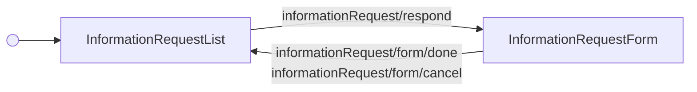

---
# Autogenerated by TypeDoc from TSDoc comments in the source code.
# To update content: edit TSDoc comments in src/.
# To update structure: edit docs-site/typedoc.config.ts or docs-site/plugins/typedoc-custom/.
# Then run `npm run docs:api:generate` to regenerate.
title: InformationRequestsFlow
description: InformationRequestsFlow reference.
sidebar_position: 2
generated_by: typedoc
custom_edit_url: null
---

# InformationRequestsFlow

Hub for viewing and responding to outstanding information requests from Gusto.

## Remarks

Renders the list of open and submitted information requests for a company and hosts the response form in a modal.
On successful submit, a dismissible success alert appears at the top of the list (when `withAlert` is `true`) and the modal closes.

Information requests can also block payroll processing; in that case they are surfaced inline within
`Payroll.PayrollBlockerList`, which embeds this flow with `withAlert={false}` so the blocker list owns the alert UX.

## Example

```tsx title="App.tsx"
import { InformationRequests } from '@gusto/embedded-react-sdk'

function MyApp() {
  return (
    <InformationRequests.InformationRequestsFlow
      companyId="a007e1ab-3595-43c2-ab4b-af7a5af2e365"
      onEvent={() => {}}
    />
  )
}
```

## InformationRequestsFlowProps

<a id="informationrequestsflowprops"></a>

Props for InformationRequestsFlow.

| Property | Type | Description |
| ------ | ------ | ------ |
| `companyId` | `string` | The associated company identifier. |
| `dictionary?` | `Record`\<`"en"`, [`DeepPartial`](../../Translations/index.md#deeppartial)\<[`InformationRequests`](../../Translations/index.md#informationrequests)\>\> | Overrides for the component's i18n strings. Supply a partial object whose keys match the component's resource namespace — any omitted keys fall back to SDK defaults. See the [Translation guide](https://docs.gusto.com/embedded-payroll/docs/translation) for details. |
| `onEvent?` | [`OnEventType`](../../events.md#oneventtype)\<[`EventType`](../../events.md#eventtype), `unknown`\> | Callback invoked when the flow or its blocks emit an event. |
| `withAlert?` | `boolean` | When `true` (default), the submission success alert is rendered at the top of this component. Set to `false` when embedding in a parent that renders the alert elsewhere. |

_Inherits `children`, `className`, `defaultValues`, `FallbackComponent`, `LoaderComponent` from Omit._

## Events

| Event | Description | Data |
| ----- | ----------- | ---- |
| `informationRequest/respond` | Fired when the user clicks "Respond" on a request and the form modal opens | `{ requestId: string }` |
| `informationRequest/form/done` | Fired when an information request is successfully submitted | Response from the Submit information request endpoint |
| `informationRequest/form/cancel` | Fired when the user cancels the response form (closes the modal without submitting) | — |

Each piece is also exported as a standalone block (see the Blocks
table) for composing a custom workflow when this orchestration is the wrong
fit. See the
[Composition guide](https://sdk.gusto.com/docs/guides/integration-guide/composition)
for how to recompose these blocks into your own flow.

## Sub-components

| Component | Description |
| ------ | ------ |
| [InformationRequestList](blocks.md#informationrequestlist) | Displays the list of outstanding information requests for a company with a "Respond" CTA on each open request. |
| [InformationRequestForm](blocks.md#informationrequestform) | Dynamic response form for a single information request. |

<!-- guide-source: src/components/InformationRequests/GUIDE.md (slot: appendix) -->
## Step flow

The flow opens on the list of open and submitted information requests for the company, each open request carrying a "Respond" action. Selecting "Respond" opens the response form in a modal over the list. Submitting the form returns to the list (and, when `withAlert` is `true`, shows a dismissible success alert at the top); cancelling closes the modal and returns to the list without submitting.



The response form is rendered dynamically from the request's required questions. Supported response types and their input behavior are documented on the `InformationRequestForm` block.

Each piece is also exported as a standalone block (see the Sub-components table) for composing a custom workflow when this orchestration is the wrong fit. See the [Composition guide](https://sdk.gusto.com/docs/guides/integration-guide/composition) for how to recompose these blocks into your own flow.
<!-- /guide-source (slot: appendix) -->

## Endpoints

| Method | Path |
| --- | --- |
| GET | [`/v1/companies/:companyUuid/information_requests`](https://docs.gusto.com/embedded-payroll/v2026-02-01/reference/get-information-requests) |
| PUT | `/v1/information_requests/:informationRequestUuid/submit` |
