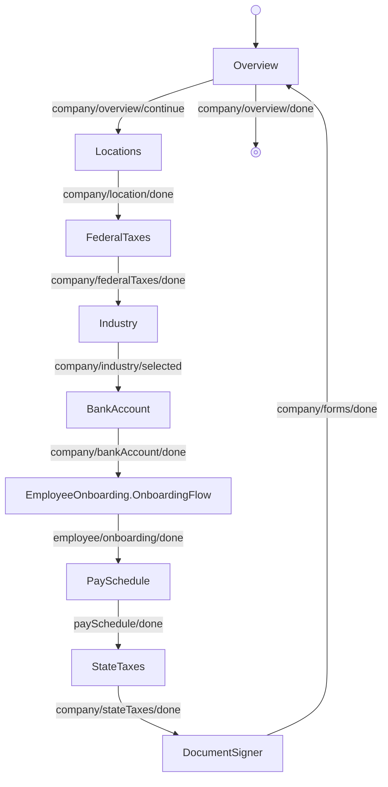

---
# Autogenerated by TypeDoc from TSDoc comments in the source code.
# To update content: edit TSDoc comments in src/.
# To update structure: edit docs-site/typedoc.config.ts or docs-site/plugins/typedoc-custom/.
# Then run `npm run docs:api:generate` to regenerate.
title: OnboardingFlow
description: OnboardingFlow reference.
sidebar_position: 2
generated_by: typedoc
custom_edit_url: null
---

# OnboardingFlow

Guided flow to onboard a company to Gusto.

## Example

```tsx title="App.tsx"
import { CompanyOnboarding, type EventType } from '@gusto/embedded-react-sdk'

function MyApp() {
  return (
    <CompanyOnboarding.OnboardingFlow
      companyId="a007e1ab-3595-43c2-ab4b-af7a5af2e365"
      onEvent={(eventType: EventType) => {
        if (eventType === 'company/overview/done') {
          // Onboarding complete — navigate to your next screen
        }
      }}
    />
  )
}
```

## Remarks

The flow begins on the overview screen and steps through locations, federal taxes, industry,
bank account, employee onboarding, pay schedule, state taxes, and document signing before
returning to the overview.

## OnboardingFlowProps

<a id="onboardingflowprops"></a>

Props for the company onboarding flow orchestrator.

| Property | Type | Description |
| ------ | ------ | ------ |
| `companyId` | `string` | The associated company identifier. |
| `onEvent` | [`OnEventType`](../../index.md#oneventtype)\<[`EventType`](../../events.md#eventtype), `unknown`\> | Callback invoked each time the component emits an event — user interactions, successful API responses, step transitions, or errors. Receives the event type constant and an optional payload whose shape varies by event. See the [Event Handling guide](https://docs.gusto.com/embedded-payroll/docs/event-handling) and each component's event table for the full list of emitted events. |
| `defaultValues?` | `RequireAtLeastOne`\<[`OnboardingFlowDefaultValues`](blocks.md#onboardingflowdefaultvalues)\> | Default values applied to individual flow step components (federal taxes, pay schedule). |

_Inherits `children`, `className`, `dictionary`, `FallbackComponent`, `LoaderComponent` from [BaseComponentInterface](../../index.md#basecomponentinterface)._

## Events

| Event | Description | Data |
| ----- | ----------- | ---- |
| `company/overview/continue` | User chose to continue to the next outstanding onboarding requirement | — |
| `company/overview/done` | User signaled they are done with the overview screen | — |
| `company/location/done` | User completed the locations step | — |
| `company/federalTaxes/done` | User completed the federal taxes step | — |
| `company/industry/selected` | User selected and saved an industry | The saved `industry` field from the update industry selection API |
| `company/bankAccount/done` | User completed the bank account step | — |
| `employee/onboarding/done` | User completed the embedded employee onboarding sub-flow | — |
| `paySchedule/done` | User completed the pay schedule step | — |
| `company/stateTaxes/done` | User completed the state taxes step | — |
| `company/forms/done` | User completed signing company documents | — |

Each step is also exported as a standalone block (see the Sub-components
table) for composing a custom workflow when this orchestration is the wrong
fit. See the
[Composition guide](https://sdk.gusto.com/docs/guides/integration-guide/composition)
for how to recompose these blocks into your own flow.

## Sub-components

| Component | Description |
| ------ | ------ |
| [OnboardingOverview](blocks.md#onboardingoverview) | Displays the company's overall onboarding status, showing completed steps alongside any remaining requirements. |
| [Locations](blocks.md#locations) | Orchestrated component for managing a company's mailing and filing addresses. |
| [FederalTaxes](blocks.md#federaltaxes) | Collects company federal tax information including EIN, tax payer type, filing form, and legal name. |
| [Industry](blocks.md#industry) | Selects and saves the company's industry classification (NAICS code). |
| [BankAccount](blocks.md#bankaccount) | Manages a company's bank account — adding, viewing, and verifying it. |
| [EmployeeOnboarding.OnboardingFlow](../../employee/onboarding/onboarding-flow.md) | Guided flow to onboard multiple employees, one at a time. |
| [PaySchedule](blocks.md#payschedule) | Manages a company's pay schedules, including listing existing schedules and creating or editing one. |
| [StateTaxes](blocks.md#statetaxes) | Orchestrated flow for managing a company's state tax setup. |
| [DocumentSigner](blocks.md#documentsigner) | Company onboarding step for reading and signing required company documents. |

<!-- guide-source: src/components/Company/OnboardingFlow/GUIDE.md (slot: appendix) -->
## Step flow

The flow opens on the overview, then runs the linear step sequence below before returning to the overview to finish. Every step is a `CompanyOnboarding` block except the Employees step, which embeds `EmployeeOnboarding.OnboardingFlow` and owns its own internal navigation.



Each step is also exported as a standalone block (see the Sub-components table) for composing a custom workflow when this orchestration is the wrong fit. See the [Composition guide](https://sdk.gusto.com/docs/guides/integration-guide/composition) for how to recompose these blocks into your own flow.
<!-- /guide-source (slot: appendix) -->
