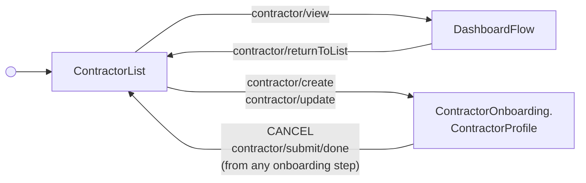

---
# Autogenerated by TypeDoc from TSDoc comments in the source code.
# To update content: edit TSDoc comments in src/.
# To update structure: edit docs-site/typedoc.config.ts or docs-site/plugins/typedoc-custom/.
# Then run `npm run docs:api:generate` to regenerate.
title: ContractorListFlow
description: ContractorListFlow reference.
sidebar_position: 2
generated_by: typedoc
custom_edit_url: null
---

# ContractorListFlow

Hub for viewing and managing a company's contractors, including onboarding new ones.

## Remarks

Drop-in entry point for browsing a company's contractors. Begins on the
management contractor list and routes into [DashboardFlow](dashboard-flow.md) when the
admin selects "View details" on a row, or directly into the Profile step
of contractor onboarding — the same Profile → Address → Payment Method →
New Hire Report → Submit sequence used by
[OnboardingFlow](../onboarding/onboarding-flow.md) — when the
admin clicks "Add contractor" or selects "Continue"/"Review" on an
onboarding-tab row. A "Back to contractors" header is added above the
dashboard; the onboarding steps show their own progress header instead,
matching `OnboardingFlow`'s own screens exactly. Submitting, or cancelling
from any step, returns to this list.

"Dismiss" and "Rehire" have no corresponding sub-flow yet and are not
handled internally — they continue to fire their documented events
(`contractor/dismiss`, `contractor/rehire`) straight through `onEvent` for
the host app to handle, exactly as they do outside this flow.

The flow forwards every event emitted by its blocks to `onEvent`;
see the events table on each block for the full set of events and
payloads observable from this flow.

## Example

```tsx title="App.tsx"
import { ContractorManagement } from '@gusto/embedded-react-sdk'

function MyApp() {
  return (
    <ContractorManagement.ContractorListFlow
      companyId="a007e1ab-3595-43c2-ab4b-af7a5af2e365"
      onEvent={() => {}}
    />
  )
}
```

## ContractorListFlowProps

<a id="contractorlistflowprops"></a>

Props for ContractorListFlow.

| Property | Type | Description |
| ------ | ------ | ------ |
| `companyId` | `string` | The associated company identifier. |
| `onEvent` | [`OnEventType`](../../events.md#oneventtype)\<[`EventType`](../../events.md#eventtype), `unknown`\> | Callback invoked each time the component emits an event — user interactions, successful API responses, step transitions, or errors. Receives the event type constant and an optional payload whose shape varies by event. See the [Event Handling guide](https://docs.gusto.com/embedded-payroll/docs/event-handling) and each component's event table for the full list of emitted events. |

_Inherits `children`, `className`, `defaultValues`, `dictionary`, `FallbackComponent`, `LoaderComponent` from [BaseComponentInterface](../../blocks.md#basecomponentinterface)._

## Sub-components

| Component | Description |
| ------ | ------ |
| [ContractorList](blocks.md#contractorlist) | Renders a tabbed list of a company's contractors split across Active, Onboarding, and Dismissed tabs, with per-row actions tailored to each tab (edit, delete, view details, dismiss, rehire, cancel a scheduled dismissal or rehire). |
| [DashboardFlow](dashboard-flow.md) | Hub for viewing and managing a single contractor's details, pay, and documents. |
| [ContractorOnboarding.ContractorProfile](../onboarding/blocks.md#contractorprofile) | Form for creating or editing a contractor profile, supporting both individual and business contractor types. |
| [ContractorOnboarding.Address](../onboarding/blocks.md#address) | Form for collecting and updating a contractor's mailing address. Renders a business or home address title based on the contractor type. |
| [ContractorOnboarding.PaymentMethod](../onboarding/blocks.md#paymentmethod) | Manages a contractor's payment method, capturing a bank account for direct deposit or recording check as the payment method. |
| [ContractorOnboarding.NewHireReport](../onboarding/blocks.md#newhirereport) | Collects new hire reporting information for a contractor and persists it to the contractor record. |
| [ContractorOnboarding.ContractorSubmit](../onboarding/blocks.md#contractorsubmit) | Finalizes contractor onboarding by updating the onboarding status, and in the self-onboarding flow can trigger an invitation to the contractor. |

<!-- guide-source: src/components/Contractor/ContractorListFlow/GUIDE.md (slot: appendix) -->
## Step flow

The flow rests on the management contractor list and routes into one of two destinations based on the row action invoked (or the "Add contractor" CTA):

- **View details** (`contractor/view`) → `DashboardFlow`
- **Add contractor** (`contractor/create`) or an onboarding-tab row's **Edit**/**Continue**/**Review** (`contractor/update`) → directly into the Profile step of contractor onboarding

The Profile-entry path reuses the exact same Profile → Address → Payment Method → New Hire Report → Submit step sequence documented in full (including its self-onboarding and new-hire-report branching) on `ContractorOnboarding.OnboardingFlow`'s own page — this flow spreads those same states into its own machine rather than mounting `OnboardingFlow` as a nested component, so there's a single header per screen (the onboarding steps' own progress header, not a second "Back to contractors" bar) and cancelling or submitting from any step returns straight to *this* list, not to `OnboardingFlow`'s separate internal one.

The dashboard is given a "Back to contractors" header that emits `contractor/returnToList` to come back to the list.

"Dismiss" (`contractor/dismiss`) and "Rehire" (`contractor/rehire`) have no corresponding sub-flow yet. They fire their documented events straight through to the host app, exactly as `ContractorList` does on its own outside this flow.


<!-- /guide-source (slot: appendix) -->

## Endpoints

| Method | Path |
| --- | --- |
| GET | [`/v1/companies/:companyUuid/contractors`](https://docs.gusto.com/embedded-payroll/v2026-06-15/reference/get-v1-companies-company_uuid-contractors) |
| POST | [`/v1/companies/:companyUuid/contractors`](https://docs.gusto.com/embedded-payroll/v2026-06-15/reference/post-v1-companies-company_uuid-contractors) |
| GET | [`/v1/contractors/:contractorUuid`](https://docs.gusto.com/embedded-payroll/v2026-06-15/reference/get-v1-contractors-contractor_uuid) |
| PUT | [`/v1/contractors/:contractorUuid`](https://docs.gusto.com/embedded-payroll/v2026-06-15/reference/put-v1-contractors-contractor_uuid) |
| DELETE | [`/v1/contractors/:contractorUuid`](https://docs.gusto.com/embedded-payroll/v2026-06-15/reference/delete-v1-contractors-contractor_uuid) |
| GET | [`/v1/contractors/:contractorUuid/address`](https://docs.gusto.com/embedded-payroll/v2026-06-15/reference/get-v1-contractors-contractor_uuid-address) |
| PUT | [`/v1/contractors/:contractorUuid/address`](https://docs.gusto.com/embedded-payroll/v2026-06-15/reference/put-v1-contractors-contractor_uuid-address) |
| GET | [`/v1/contractors/:contractorUuid/bank_accounts`](https://docs.gusto.com/embedded-payroll/v2026-06-15/reference/get-v1-contractors-contractor_uuid-bank_accounts) |
| POST | [`/v1/contractors/:contractorUuid/bank_accounts`](https://docs.gusto.com/embedded-payroll/v2026-06-15/reference/post-v1-contractors-contractor_uuid-bank_accounts) |
| GET | [`/v1/contractors/:contractorUuid/documents`](https://docs.gusto.com/embedded-payroll/v2026-06-15/reference/get-v1-contractor-documents) |
| GET | [`/v1/contractors/:contractorUuid/onboarding_status`](https://docs.gusto.com/embedded-payroll/v2026-06-15/reference/get-v1-contractors-contractor_uuid-onboarding_status) |
| PUT | [`/v1/contractors/:contractorUuid/onboarding_status`](https://docs.gusto.com/embedded-payroll/v2026-06-15/reference/put-v1-contractors-contractor_uuid-onboarding_status) |
| GET | [`/v1/contractors/:contractorUuid/payment_method`](https://docs.gusto.com/embedded-payroll/v2026-06-15/reference/get-v1-contractors-contractor_uuid-payment_method) |
| PUT | [`/v1/contractors/:contractorUuid/payment_method`](https://docs.gusto.com/embedded-payroll/v2026-06-15/reference/put-v1-contractors-contractor_id-payment_method) |
| DELETE | [`/v1/contractors/:contractorUuid/rehire`](https://docs.gusto.com/embedded-payroll/v2026-06-15/reference/delete-v1-contractors-contractor_uuid-rehire) |
| DELETE | [`/v1/contractors/:contractorUuid/termination`](https://docs.gusto.com/embedded-payroll/v2026-06-15/reference/delete-v1-contractors-contractor_uuid-termination) |
| GET | [`/v1/documents/:documentUuid/pdf`](https://docs.gusto.com/embedded-payroll/v2026-06-15/reference/get-v1-contractor-document-pdf) |
