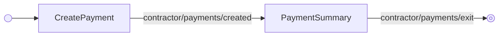

---
# Autogenerated by TypeDoc from TSDoc comments in the source code.
# To update content: edit TSDoc comments in src/.
# To update structure: edit docs-site/typedoc.config.ts or docs-site/plugins/typedoc-custom/.
# Then run `npm run docs:api:generate` to regenerate.
title: CreatePaymentFlow
description: CreatePaymentFlow reference.
sidebar_position: 2
generated_by: typedoc
custom_edit_url: null
---

# CreatePaymentFlow

Guided flow to create a contractor payment and review the resulting summary.

## Remarks

This is the inner flow that powers the create-payment spoke of `ContractorManagement.PaymentFlow`.
Render it directly when you have built your own payments landing page and want to hand the user
off to the standard create-payment experience without re-implementing it. The flow ships with
breadcrumb navigation and handles Fast ACH blockers and wire transfer requirements inline.

## Example

```tsx title="App.tsx"
import { ContractorManagement } from '@gusto/embedded-react-sdk'

function MyApp() {
  return (
    <ContractorManagement.CreatePaymentFlow
      companyId="a007e1ab-3595-43c2-ab4b-af7a5af2e365"
      onEvent={() => {}}
    />
  )
}
```

## CreatePaymentFlowProps

<a id="createpaymentflowprops"></a>

Props for CreatePaymentFlow.

| Property | Type | Description |
| ------ | ------ | ------ |
| `companyId` | `string` | The associated company identifier. |
| `onEvent` | [`OnEventType`](../../events.md#oneventtype)\<[`EventType`](../../events.md#eventtype), `unknown`\> | Callback invoked each time the component emits an event — user interactions, successful API responses, step transitions, or errors. Receives the event type constant and an optional payload whose shape varies by event. See the [Event Handling guide](https://docs.gusto.com/embedded-payroll/docs/event-handling) and each component's event table for the full list of emitted events. |

_Inherits `children`, `className`, `defaultValues`, `dictionary`, `FallbackComponent`, `LoaderComponent` from [BaseComponentInterface](../../blocks.md#basecomponentinterface)._

## Events

| Event | Description | Data |
| ----- | ----------- | ---- |
| `contractor/payments/created` | Fired when a payment group is successfully created | The created `ContractorPaymentGroup` |
| `contractor/payments/exit` | Fired when the user completes the payment flow | `{ uuid?: string \| null }` |
| `payroll/wire/form/done` | Fired when wire transfer details are submitted | `{ wireInRequest: WireInRequest, confirmationAlert: { title: string, content?: string } }` |
| `breadcrumb/navigate` | Fired when the user clicks a breadcrumb to navigate back | `{ key: string, onNavigate: (ctx) => ctx }` |

## Sub-components

| Component | Description |
| ------ | ------ |
| [CreatePayment](blocks.md#createpayment) | Form for creating a contractor payment group, including date selection, per-contractor edits, preview, and submission blockers. |
| [PaymentSummary](blocks.md#paymentsummary) | Displays a summary of a created contractor payment group, including payment totals, debit information, contractor details, and wire transfer instructions when required. |

<!-- guide-source: src/components/Contractor/Payments/CreatePaymentFlow/GUIDE.md (slot: appendix) -->
## Step flow

`CreatePaymentFlow` has no hub of its own — it's a straight line from creating a payment to reviewing the result. `CreatePayment` handles selecting a date, editing per-contractor amounts, and submitting; Fast ACH blockers and wire transfer requirements are handled inline. On success (`contractor/payments/created`) the flow hands off to `PaymentSummary`, which shows the created group, debit details, and wire instructions when required.



The breadcrumb header (`breadcrumb/navigate`) returns to the payments list; submitting wire-transfer details (`payroll/wire/form/done`) surfaces a success alert on `PaymentSummary` without leaving the step.
<!-- /guide-source (slot: appendix) -->

## Endpoints

| Method | Path |
| --- | --- |
| GET | [`/v1/companies/:companyId/bank_accounts`](https://docs.gusto.com/embedded-payroll/v2026-06-15/reference/get-v1-companies-company_id-bank-accounts) |
| POST | [`/v1/companies/:companyId/contractor_payment_groups`](https://docs.gusto.com/embedded-payroll/v2026-06-15/reference/post-v1-companies-company_id-contractor_payment_groups) |
| POST | [`/v1/companies/:companyId/contractor_payment_groups/preview`](https://docs.gusto.com/embedded-payroll/v2026-06-15/reference/post-v1-companies-company_id-contractor_payment_groups-preview) |
| GET | [`/v1/companies/:companyUuid/contractors`](https://docs.gusto.com/embedded-payroll/v2026-06-15/reference/get-v1-companies-company_uuid-contractors) |
| GET | [`/v1/companies/:companyUuid/payment_configs`](https://docs.gusto.com/embedded-payroll/v2026-06-15/reference/get-v1-company-payment-configs) |
| GET | [`/v1/contractor_payment_groups/:contractorPaymentGroupUuid`](https://docs.gusto.com/embedded-payroll/v2026-06-15/reference/get-v1-contractor_payment_groups-contractor_payment_group_id) |
