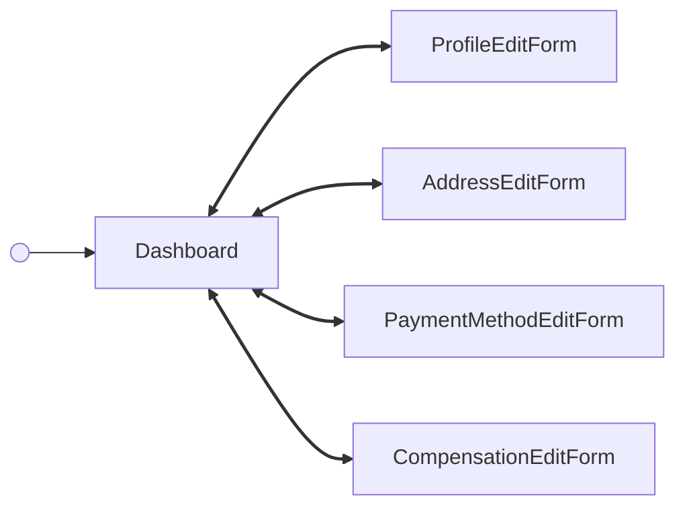

---
# Autogenerated by TypeDoc from TSDoc comments in the source code.
# To update content: edit TSDoc comments in src/.
# To update structure: edit docs-site/typedoc.config.ts or docs-site/plugins/typedoc-custom/.
# Then run `npm run docs:api:generate` to regenerate.
title: DashboardFlow
description: DashboardFlow reference.
sidebar_position: 2
generated_by: typedoc
custom_edit_url: null
---

# DashboardFlow

Hub for viewing and managing a single contractor's details, pay, and documents.

<!-- guide-source: src/components/Contractor/Dashboard/GUIDE.md (slot: overview) -->
## Tabs

The dashboard organizes a contractor's information into three tabs. Switching tabs emits `contractor/dashboard/tabChange`.

- **Details** — legal name, start date, tax ID (SSN or EIN), and email, plus the contractor's mailing address. Fields are read-only with "Edit" CTAs.
- **Pay** — payment method (Check, or a Direct Deposit bank account) and compensation (Fixed or Hourly, with the hourly rate when applicable).
- **Documents** — a read-only table of the contractor's forms with a "View" CTA per row that opens the document's PDF in a new tab.
<!-- /guide-source (slot: overview) -->

## Remarks

Renders a tabbed view of a contractor (Details, Pay, Documents), wires the
card surfaces to their corresponding edit screens via an internal state
machine, and surfaces success alerts at the top of the dashboard after
each successful edit. Wraps the dashboard in error and suspense
boundaries.

Every tab section of the dashboard is also exported as a self-contained
block that can be dropped into a custom layout without the surrounding
dashboard chrome (see the blocks below). Each block wraps its read-only
card, its edit form, and the card↔form transitions as a single drop-in.
For cases where that built-in orchestration doesn't fit — rendering a
form in a modal, driving navigation via a router, or showing a card
read-only — each block's card and form are also exported individually
(e.g. [CompensationCard](blocks.md#compensationcard), [CompensationEditForm](blocks.md#compensationeditform)). Using the
individual pieces means owning the swap, any success alerts, and
cross-component state yourself.

The dashboard composes self-fetching cards and their edit forms and
forwards every event they emit to the partner via `onEvent`; its internal
state machine also reacts to a subset of these events to swap between the
cards and edit screens and to surface success alerts. The table below is
the complete, current set of events observable from `DashboardFlow`,
grouped by the tab that emits them.

## Example

```tsx title="App.tsx"
import { ContractorManagement } from '@gusto/embedded-react-sdk'

function MyApp() {
  return (
    <ContractorManagement.DashboardFlow
      contractorId="4b3f930f-82cd-48a8-b797-798686e12e5e"
      onEvent={() => {}}
    />
  )
}
```

## DashboardFlowProps

<a id="dashboardflowprops"></a>

Props for DashboardFlow.

| Property | Type | Description |
| ------ | ------ | ------ |
| `contractorId` | `string` | The associated contractor identifier. |
| `onEvent` | [`OnEventType`](../../events.md#oneventtype)\<[`EventType`](../../events.md#eventtype), `unknown`\> | Callback invoked each time the component emits an event — user interactions, successful API responses, step transitions, or errors. Receives the event type constant and an optional payload whose shape varies by event. See the [Event Handling guide](https://docs.gusto.com/embedded-payroll/docs/event-handling) and each component's event table for the full list of emitted events. |

_Inherits `children`, `className`, `defaultValues`, `dictionary`, `FallbackComponent`, `LoaderComponent` from [BaseComponentInterface](../../blocks.md#basecomponentinterface)._

## Events

| Event | Description | Data |
| ----- | ----------- | ---- |
| `contractor/management/profile/editRequested` | Fired when "Edit" is clicked on the Profile card | `{ contractorId: string }` |
| `contractor/management/profile/updated` | Fired after the profile edit form is saved; the dashboard returns to the cards and surfaces the "Profile updated" alert | Updated `Contractor` entity |
| `contractor/management/profile/editCancelled` | Fired when the user clicks Cancel on the profile edit form; the dashboard returns to the cards | — |
| `contractor/management/address/editRequested` | Fired when "Edit" is clicked on the Address card | `{ contractorId: string }` |
| `contractor/management/address/updated` | Fired after the address edit form is saved; the dashboard returns to the cards and surfaces the "Address updated" alert | Updated `ContractorAddress` entity |
| `contractor/management/address/editCancelled` | Fired when the user clicks Cancel on the address edit form; the dashboard returns to the cards | — |
| `contractor/management/paymentMethod/card/addRequested` | Fired when "Add bank account" is clicked on the Payment card | `{ contractorId: string }` |
| `contractor/management/paymentMethod/card/editRequested` | Fired when "Edit" is chosen from the bank account row menu | `{ contractorId: string }` |
| `contractor/management/paymentMethod/card/removed` | Fired after the bank account is removed from the card; the dashboard surfaces the "Bank account removed" alert | Updated `ContractorPaymentMethod` entity |
| `contractor/management/paymentMethod/bankForm/submitted` | Fired after the bank-account form is saved; the dashboard returns to the cards and surfaces the "Bank account added" alert | Created `ContractorBankAccount` entity |
| `contractor/management/paymentMethod/bankForm/cancelled` | Fired when the user cancels the bank-account form; the dashboard returns to the cards | — |
| `contractor/management/compensation/editRequested` | Fired when "Edit" is clicked on the Compensation card | `{ contractorId: string }` |
| `contractor/management/compensation/updated` | Fired after compensation is saved; the dashboard returns to the cards and surfaces the "Compensation updated" alert | Updated `Contractor` entity |
| `contractor/management/compensation/editCancelled` | Fired when the user cancels editing compensation; the dashboard returns to the cards | — |
| `contractor/management/documents/card/viewRequested` | Fired when a document row's "View" button is clicked, before the PDF is fetched | `{ contractorId: string, documentUuid: string }` |
| `contractor/management/documents/card/viewed` | Fired after the PDF is fetched and opened in a new tab | `{ contractorId: string, documentUuid: string }` |
| `contractor/dashboard/tabChange` | Fired when the user switches dashboard tabs | `{ tab: 'details' \| 'pay' \| 'documents' }` |
| `contractor/dashboard/alertDismissed` | Fired when the user dismisses a top-of-dashboard success alert | — |

## Sub-components

| Component | Description |
| ------ | ------ |
| [Dashboard](blocks.md#dashboard) | Contractor management dashboard summarizing a single contractor's basic details, pay, and documents. |
| [ProfileEditForm](blocks.md#profileeditform) | Standalone edit form for a contractor's basic profile details. |
| [AddressEditForm](blocks.md#addresseditform) | Standalone edit form for a contractor's mailing address. |
| [PaymentMethodEditForm](blocks.md#paymentmethodeditform) | Standalone bank-account form for a contractor's payment method. |
| [CompensationEditForm](blocks.md#compensationeditform) | Standalone edit form for a contractor's compensation type and rate. |
| [DocumentsCard](blocks.md#documentscard) | Standalone read-only "Documents" card. |

<!-- guide-source: src/components/Contractor/Dashboard/GUIDE.md (slot: appendix) -->
## Step flow

The dashboard is a hub: the `Dashboard` cards view is the resting state. A card's Edit CTA opens that section's edit form; submitting or cancelling returns to the cards, and a successful save shows a dismissible success alert.



Some actions stay on the cards view without a screen swap: switching tabs (`contractor/dashboard/tabChange`), dismissing a success alert (`contractor/dashboard/alertDismissed`), removing a bank account, and viewing a document (which opens the PDF in a new tab rather than swapping the dashboard body).

## Empty states

Each section handles missing data on its own: the payment method card shows "Check" until a bank account is added; the compensation card only surfaces an hourly rate row when the contractor is paid Hourly; documents show a "No documents yet" message.
<!-- /guide-source (slot: appendix) -->

## Endpoints

| Method | Path |
| --- | --- |
| GET | [`/v1/contractors/:contractorUuid`](https://docs.gusto.com/embedded-payroll/v2026-06-15/reference/get-v1-contractors-contractor_uuid) |
| PUT | [`/v1/contractors/:contractorUuid`](https://docs.gusto.com/embedded-payroll/v2026-06-15/reference/put-v1-contractors-contractor_uuid) |
| GET | [`/v1/documents/:documentUuid/pdf`](https://docs.gusto.com/embedded-payroll/v2026-06-15/reference/get-v1-contractor-document-pdf) |
