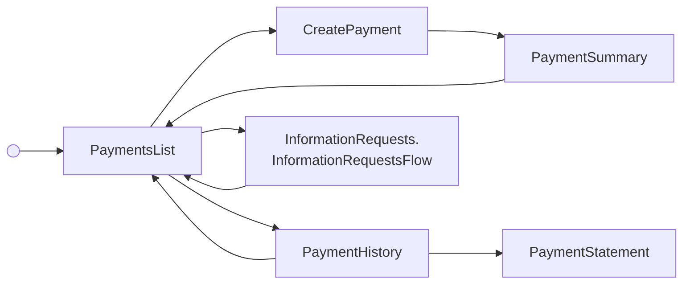

---
# Autogenerated by TypeDoc from TSDoc comments in the source code.
# To update content: edit TSDoc comments in src/.
# To update structure: edit docs-site/typedoc.config.ts or docs-site/plugins/typedoc-custom/.
# Then run `npm run docs:api:generate` to regenerate.
title: PaymentFlow
description: PaymentFlow reference.
sidebar_position: 2
generated_by: typedoc
custom_edit_url: null
---

# PaymentFlow

Hub for creating and managing contractor payments for a company.

## Example

```tsx title="App.tsx"
import { ContractorManagement } from '@gusto/embedded-react-sdk'

function MyApp() {
  return (
    <ContractorManagement.PaymentFlow
      companyId="a007e1ab-3595-43c2-ab4b-af7a5af2e365"
      onEvent={() => {}}
    />
  )
}
```

<!-- guide-source: src/components/Contractor/Payments/PaymentFlow/GUIDE.md (slot: overview) -->
## Payment Workflow

The typical step sequence when composing the blocks manually:

1. [`PaymentsList`](./blocks.md#paymentslist) — browse existing payment groups and start a new one.
2. [`CreatePayment`](./blocks.md#createpayment) — select a date, edit per-contractor amounts, preview, and submit. Handles Fast ACH blockers and wire transfer requirements inline.
3. [`PaymentSummary`](./blocks.md#paymentsummary) — review the created group, debit details, and wire instructions when required.
4. [`PaymentHistory`](./blocks.md#paymenthistory) — inspect a payment group's details and cancel individual payments.
5. [`PaymentStatement`](./blocks.md#paymentstatement) — see the full breakdown for one contractor's payment.
<!-- /guide-source (slot: overview) -->

## Remarks

Composes the contractor payment blocks into a complete experience with breadcrumb navigation between the payments list, the create-payment form, the post-creation summary, the payment-history detail view, and individual contractor payment statements. Also routes into the information-requests flow when a payment-related request needs a response, and surfaces wire-transfer confirmation alerts after a wire details submission.

Events emitted by the blocks bubble up through the single `onEvent` handler.

## PaymentFlowProps

<a id="paymentflowprops"></a>

Props for PaymentFlow.

| Property | Type | Description |
| ------ | ------ | ------ |
| `companyId` | `string` | The associated company identifier. |
| `onEvent` | [`OnEventType`](../../index.md#oneventtype)\<[`EventType`](../../events.md#eventtype), `unknown`\> | Callback invoked each time the component emits an event — user interactions, successful API responses, step transitions, or errors. Receives the event type constant and an optional payload whose shape varies by event. See the [Event Handling guide](https://docs.gusto.com/embedded-payroll/docs/event-handling) and each component's event table for the full list of emitted events. |

_Inherits `children`, `className`, `defaultValues`, `dictionary`, `FallbackComponent`, `LoaderComponent` from [BaseComponentInterface](../../index.md#basecomponentinterface)._

## Events

| Event | Description | Data |
| ----- | ----------- | ---- |
| `contractor/payments/create` | Fired when the user chooses to create a new payment | — |
| `contractor/payments/created` | Fired when a payment group is successfully created | The created `ContractorPaymentGroup` |
| `contractor/payments/view` | Fired when the user selects a payment group to view | `{ paymentId: string }` |
| `contractor/payments/view/details` | Fired when the user views a specific contractor payment | `{ contractor: Contractor, paymentGroupId: string }` |
| `contractor/payments/cancel` | Fired when a payment is cancelled | `{ paymentId: string }` |
| `contractor/payments/exit` | Fired when the user completes the payment flow | `{ uuid?: string | null }` |
| `contractor/payments/rfi/respond` | Fired when the user clicks to respond to a pending information request | — |
| `payroll/wire/form/done` | Fired when wire transfer details are submitted | `{ wireInRequest: WireInRequest, confirmationAlert: { title: string, content?: string } }` |
| `informationRequest/form/done` | Fired when the information-requests flow completes | — |
| `informationRequest/form/cancel` | Fired when the information-requests flow is cancelled | — |
| `breadcrumb/navigate` | Fired when the user clicks a breadcrumb to navigate back | `{ key: string, onNavigate: (ctx) => ctx }` |

## Sub-components

| Component | Description |
| ------ | ------ |
| [PaymentsList](blocks.md#paymentslist) | Displays a list of contractor payment groups for a company. |
| [CreatePayment](blocks.md#createpayment) | Form for creating a contractor payment group, including date selection, per-contractor edits, preview, and submission blockers. |
| [PaymentSummary](blocks.md#paymentsummary) | Displays a summary of a created contractor payment group, including payment totals, debit information, contractor details, and wire transfer instructions when required. |
| [PaymentHistory](blocks.md#paymenthistory) | Displays a contractor payment group, including each individual contractor payment, with actions to view details or cancel. |
| [PaymentStatement](blocks.md#paymentstatement) | Displays a single contractor's payment statement within a payment group, including wage breakdown, bonuses, reimbursements, and a receipt card for funded direct-deposit payments. |
| [InformationRequests.InformationRequestsFlow](../../company/information-requests/information-requests-flow.md) | Hub for viewing and responding to outstanding information requests from Gusto. |

<!-- guide-source: src/components/Contractor/Payments/PaymentFlow/GUIDE.md (slot: appendix) -->
## Step flow

The flow is a hub-and-spoke loop with no terminal state — the payments list is the landing screen, and every path returns to it:

- **Create a payment** — `PaymentsList` → `CreatePayment` → `PaymentSummary`, then back to the list.
- **View history** — `PaymentsList` → `PaymentHistory` → `PaymentStatement`; the history view can also cancel a payment and return to the list.
- **Respond to a request** — `PaymentsList` opens the embedded `InformationRequestsFlow`, returning to the list once the request is submitted or cancelled.

Breadcrumbs navigate back to any prior step, and submitting wire-transfer details surfaces a success alert on the list and summary screens. The diagram below shows the topology; the event behind each transition is listed in the events table above.



## Important Notes

### Payment Timing

- Direct deposit payments submitted before 4pm PT on a business day take 2 business days to complete
- Fast ACH (2-day) payments have threshold limits; exceeding the threshold requires wire transfer or switching to 4-day processing

### Payment Requirements

- Only active contractors with completed onboarding can receive payments
- At least one contractor payment must be included in a payment group
- Bank account must be set up for the company to process payments

### Submission Blockers

Payment submission may be blocked by:

- **Fast ACH Threshold Exceeded**: Payment amount exceeds the fast ACH limit
  - Options: Wire transfer (fastest) or switch to 4-day direct deposit
- **Needs Earned Access for Fast ACH**: Company hasn't earned access to faster payments yet
  - Must use standard 4-day processing

### Wire Transfers

When wire transfer is required:

- Instructions are provided in the payment flow
- Must be completed by specified deadline to ensure timely payment
- Confirmation workflow tracks wire transfer submission
<!-- /guide-source (slot: appendix) -->
