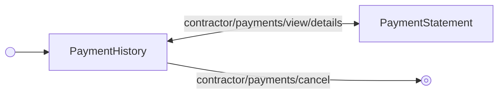

---
# Autogenerated by TypeDoc from TSDoc comments in the source code.
# To update content: edit TSDoc comments in src/.
# To update structure: edit docs-site/typedoc.config.ts or docs-site/plugins/typedoc-custom/.
# Then run `npm run docs:api:generate` to regenerate.
title: ViewHistoryFlow
description: ViewHistoryFlow reference.
sidebar_position: 2
generated_by: typedoc
custom_edit_url: null
---

# ViewHistoryFlow

Guided flow to inspect a contractor payment group's history and drill into an individual
contractor's payment statement.

## Remarks

This is the inner flow that powers the view-history spoke of `ContractorManagement.PaymentFlow`.
Render it directly when you have built your own payments landing page and want to hand the user
off to the standard history-viewing experience without re-implementing it. The flow ships with
breadcrumb navigation and lets the user cancel an individual payment from the history screen.

## Example

```tsx title="App.tsx"
import { ContractorManagement } from '@gusto/embedded-react-sdk'

function MyApp() {
  return (
    <ContractorManagement.ViewHistoryFlow
      paymentId="0987fcea-7b59-4907-a301-f232b5aff508"
      onEvent={() => {}}
    />
  )
}
```

## ViewHistoryFlowProps

<a id="viewhistoryflowprops"></a>

Props for ViewHistoryFlow.

| Property | Type | Description |
| ------ | ------ | ------ |
| `onEvent` | [`OnEventType`](../../events.md#oneventtype)\<[`EventType`](../../events.md#eventtype), `unknown`\> | Callback invoked each time the component emits an event — user interactions, successful API responses, step transitions, or errors. Receives the event type constant and an optional payload whose shape varies by event. See the [Event Handling guide](https://docs.gusto.com/embedded-payroll/docs/event-handling) and each component's event table for the full list of emitted events. |
| `paymentId` | `string` | Identifier of the payment group to inspect. |

_Inherits `children`, `className`, `defaultValues`, `dictionary`, `FallbackComponent`, `LoaderComponent` from [BaseComponentInterface](../../blocks.md#basecomponentinterface)._

## Events

| Event | Description | Data |
| ----- | ----------- | ---- |
| `contractor/payments/view/details` | Fired when the user views a specific contractor payment | `{ contractor: Contractor, paymentGroupId: string }` |
| `contractor/payments/cancel` | Fired when a payment is cancelled | `{ paymentId: string }` |
| `breadcrumb/navigate` | Fired when the user clicks a breadcrumb to navigate back | `{ key: string, onNavigate: (ctx) => ctx }` |

## Sub-components

| Component | Description |
| ------ | ------ |
| [PaymentHistory](blocks.md#paymenthistory) | Displays a contractor payment group, including each individual contractor payment, with actions to view details or cancel. |
| [PaymentStatement](blocks.md#paymentstatement) | Displays a single contractor's payment statement within a payment group, including wage breakdown, bonuses, reimbursements, and a receipt card for funded direct-deposit payments. |

<!-- guide-source: src/components/Contractor/Payments/ViewHistoryFlow/GUIDE.md (slot: appendix) -->
## Step flow

`ViewHistoryFlow` centers on `PaymentHistory` as its hub: it shows a payment group's details and can either drill into an individual contractor's statement (`contractor/payments/view/details` → `PaymentStatement`) or cancel the group outright (`contractor/payments/cancel`), which exits the flow.



The breadcrumb header (`breadcrumb/navigate`) returns from `PaymentStatement` to `PaymentHistory`, or exits the flow entirely from either step.
<!-- /guide-source (slot: appendix) -->

## Endpoints

| Method | Path |
| --- | --- |
| GET | [`/v1/companies/:companyId/bank_accounts`](https://docs.gusto.com/embedded-payroll/v2026-06-15/reference/get-v1-companies-company_id-bank-accounts) |
| POST | [`/v1/companies/:companyId/contractor_payment_groups`](https://docs.gusto.com/embedded-payroll/v2026-06-15/reference/post-v1-companies-company_id-contractor_payment_groups) |
| POST | [`/v1/companies/:companyId/contractor_payment_groups/preview`](https://docs.gusto.com/embedded-payroll/v2026-06-15/reference/post-v1-companies-company_id-contractor_payment_groups-preview) |
| DELETE | [`/v1/companies/:companyId/contractor_payments/:contractorPaymentId`](https://docs.gusto.com/embedded-payroll/v2026-06-15/reference/delete-v1-companies-company_id-contractor_payment-contractor-payment) |
| GET | [`/v1/companies/:companyUuid/contractors`](https://docs.gusto.com/embedded-payroll/v2026-06-15/reference/get-v1-companies-company_uuid-contractors) |
| GET | [`/v1/companies/:companyUuid/payment_configs`](https://docs.gusto.com/embedded-payroll/v2026-06-15/reference/get-v1-company-payment-configs) |
| GET | [`/v1/contractor_payment_groups/:contractorPaymentGroupUuid`](https://docs.gusto.com/embedded-payroll/v2026-06-15/reference/get-v1-contractor_payment_groups-contractor_payment_group_id) |
| GET | [`/v1/contractor_payments/:contractorPaymentUuid/receipt`](https://docs.gusto.com/embedded-payroll/v2026-06-15/reference/get-v1-contractor_payments-contractor_payment_uuid-receipt) |
