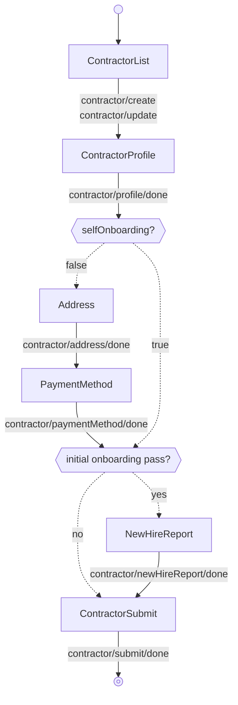

---
# Autogenerated by TypeDoc from TSDoc comments in the source code.
# To update content: edit TSDoc comments in src/.
# To update structure: edit docs-site/typedoc.config.ts or docs-site/plugins/typedoc-custom/.
# Then run `npm run docs:api:generate` to regenerate.
title: OnboardingFlow
description: OnboardingFlow reference.
sidebar_position: 2
generated_by: typedoc
custom_edit_url: null
---

# OnboardingFlow

Guided flow for admins to onboard a contractor to the company.

## Remarks

Renders a multi-step experience that collects every piece of information
required to add a contractor to a company. Begins on the contractor list
and transitions into the per-step screens when "Add contractor" or a row's
"Edit"/"Continue" action is invoked; the submit step returns to the list.
The flow is driven by an internal state machine and wraps each step in
error and suspense boundaries.

Each step of the flow is also exported as a standalone block (see the
Blocks table) for composing a custom workflow when this orchestration
is the wrong fit.

The flow forwards every event emitted by its blocks to `onEvent`;
see the events table on each block for the full set of events and
payloads observable from this flow.

## Example

```tsx title="App.tsx"
import { ContractorOnboarding, type EventType } from '@gusto/embedded-react-sdk'

function MyApp() {
  return (
    <ContractorOnboarding.OnboardingFlow
      companyId="a007e1ab-3595-43c2-ab4b-af7a5af2e365"
      onEvent={(eventType: EventType) => {
        if (eventType === 'contractor/submit/done') {
          // Contractor onboarding complete — navigate to your next screen
        }
      }}
    />
  )
}
```

## OnboardingFlowProps

<a id="onboardingflowprops"></a>

Props for OnboardingFlow.

| Property | Type | Description |
| ------ | ------ | ------ |
| `companyId` | `string` | The associated company identifier. |
| `onEvent` | [`OnEventType`](../../events.md#oneventtype)\<[`EventType`](../../events.md#eventtype), `unknown`\> | Callback invoked each time the component emits an event — user interactions, successful API responses, step transitions, or errors. Receives the event type constant and an optional payload whose shape varies by event. See the [Event Handling guide](https://docs.gusto.com/embedded-payroll/docs/event-handling) and each component's event table for the full list of emitted events. |
| `defaultValues?` | [`RequireAtLeastOne`](../../blocks.md#requireatleastone)\<[`OnboardingFlowDefaultValues`](blocks.md#onboardingflowdefaultvalues)\> | Default values for individual flow step components — `profile` and/or `address` sub-objects. |

_Inherits `children`, `className`, `dictionary`, `FallbackComponent`, `LoaderComponent` from [BaseComponentInterface](../../blocks.md#basecomponentinterface)._

## Events

| Event | Description | Data |
| ----- | ----------- | ---- |
| `contractor/create` | Fired when the user chooses to add a new contractor | — |
| `contractor/update` | Fired when the user selects a contractor to edit | `{ contractorId: string }` |
| `contractor/deleted` | Fired when a contractor is deleted | `{ contractorId: string }` |
| `contractor/onboarding/continue` | Fired when the user chooses to continue onboarding a contractor | — |
| `contractor/created` | Fired when a new contractor is created successfully | Create contractor API response |
| `contractor/updated` | Fired when an existing contractor is updated | Update contractor API response |
| `contractor/profile/done` | Fired when the contractor profile step is complete | `{ contractorId: string, onboardingStatus?: string, selfOnboarding: boolean }` |
| `contractor/address/updated` | Fired when the contractor address is updated | Create or update contractor address API response |
| `contractor/address/done` | Fired when the address step is complete | — |
| `contractor/bankAccount/created` | Fired when a bank account is created for the contractor | Create contractor bank account API response |
| `contractor/paymentMethod/updated` | Fired when the payment method is updated | Update contractor payment method API response |
| `contractor/paymentMethod/done` | Fired when the payment method step is complete | — |
| `contractor/newHireReport/updated` | Fired when the new hire report is updated | Update contractor API response |
| `contractor/newHireReport/done` | Fired when the new hire report step is complete | — |
| `contractor/onboardingStatus/updated` | Fired when the contractor's onboarding status is updated | Change contractor onboarding status API response |
| `contractor/submit/done` | Fired when the contractor submission is complete | `{ message: string }` or `{ onboardingStatus, message: string }` |
| `contractor/invite/selfOnboarding` | Fired when the contractor is invited for self-onboarding | `{ contractorId: string }` |

## Sub-components

| Component | Description |
| ------ | ------ |
| [ContractorList](blocks.md#contractorlist) | Lists a company's contractors with controls to add, edit, delete, cancel self-onboarding, and continue onboarding. |
| [ContractorProfile](blocks.md#contractorprofile) | Form for creating or editing a contractor profile, supporting both individual and business contractor types. |
| [Address](blocks.md#address) | Form for collecting and updating a contractor's mailing address. Renders a business or home address title based on the contractor type. |
| [PaymentMethod](blocks.md#paymentmethod) | Manages a contractor's payment method, capturing a bank account for direct deposit or recording check as the payment method. |
| [NewHireReport](blocks.md#newhirereport) | Collects new hire reporting information for a contractor and persists it to the contractor record. |
| [ContractorSubmit](blocks.md#contractorsubmit) | Finalizes contractor onboarding by updating the onboarding status, and in the self-onboarding flow can trigger an invitation to the contractor. |

<!-- guide-source: src/components/Contractor/OnboardingFlow/GUIDE.md (slot: appendix) -->
## Step flow

`OnboardingFlow` begins on the contractor list and steps through the per-step screens once "Add contractor" or a row's "Edit"/"Continue" action is invoked. After the profile step, the path branches on whether the contractor self-onboards:

- **Admin onboarding** (`selfOnboarding = false`) — the admin completes every step, including address and payment method.
- **Self-onboarding** (`selfOnboarding = true`) — the admin sets up the basics and the contractor completes their own address and payment method later, so those two steps are skipped here.

The new hire report step appears only on the contractor's initial onboarding pass (while its onboarding status is `admin_onboarding_incomplete` or `self_onboarding_not_invited`). Once the contractor has advanced past that — to admin review, an active self-onboarding stage, or completion — the step is skipped and the flow goes straight to submit. The flow derives this from the contractor's `onboardingStatus`, which it reads off the `onboardingStatus` carried on `contractor/profile/done`.

The progress bar's secondary button emits `CANCEL` from any step, returning to the list.


<!-- /guide-source (slot: appendix) -->

## Endpoints

| Method | Path |
| --- | --- |
| GET | [`/v1/companies/:companyUuid/contractors`](https://docs.gusto.com/embedded-payroll/v2026-06-15/reference/get-v1-companies-company_uuid-contractors) |
| POST | [`/v1/companies/:companyUuid/contractors`](https://docs.gusto.com/embedded-payroll/v2026-06-15/reference/post-v1-companies-company_uuid-contractors) |
| GET | [`/v1/contractors/:contractorUuid`](https://docs.gusto.com/embedded-payroll/v2026-06-15/reference/get-v1-contractors-contractor_uuid) |
| PUT | [`/v1/contractors/:contractorUuid`](https://docs.gusto.com/embedded-payroll/v2026-06-15/reference/put-v1-contractors-contractor_uuid) |
| DELETE | [`/v1/contractors/:contractorUuid`](https://docs.gusto.com/embedded-payroll/v2026-06-15/reference/delete-v1-contractors-contractor_uuid) |
| GET | [`/v1/contractors/:contractorUuid/address`](https://docs.gusto.com/embedded-payroll/v2026-06-15/reference/get-v1-contractors-contractor_uuid-address) |
| PUT | [`/v1/contractors/:contractorUuid/address`](https://docs.gusto.com/embedded-payroll/v2026-06-15/reference/put-v1-contractors-contractor_uuid-address) |
| GET | [`/v1/contractors/:contractorUuid/bank_accounts`](https://docs.gusto.com/embedded-payroll/v2026-06-15/reference/get-v1-contractors-contractor_uuid-bank_accounts) |
| POST | [`/v1/contractors/:contractorUuid/bank_accounts`](https://docs.gusto.com/embedded-payroll/v2026-06-15/reference/post-v1-contractors-contractor_uuid-bank_accounts) |
| GET | [`/v1/contractors/:contractorUuid/documents`](https://docs.gusto.com/embedded-payroll/v2026-06-15/reference/get-v1-contractor-documents) |
| GET | [`/v1/contractors/:contractorUuid/onboarding_status`](https://docs.gusto.com/embedded-payroll/v2026-06-15/reference/get-v1-contractors-contractor_uuid-onboarding_status) |
| PUT | [`/v1/contractors/:contractorUuid/onboarding_status`](https://docs.gusto.com/embedded-payroll/v2026-06-15/reference/put-v1-contractors-contractor_uuid-onboarding_status) |
| GET | [`/v1/contractors/:contractorUuid/payment_method`](https://docs.gusto.com/embedded-payroll/v2026-06-15/reference/get-v1-contractors-contractor_uuid-payment_method) |
| PUT | [`/v1/contractors/:contractorUuid/payment_method`](https://docs.gusto.com/embedded-payroll/v2026-06-15/reference/put-v1-contractors-contractor_id-payment_method) |
| DELETE | [`/v1/contractors/:contractorUuid/rehire`](https://docs.gusto.com/embedded-payroll/v2026-06-15/reference/delete-v1-contractors-contractor_uuid-rehire) |
| DELETE | [`/v1/contractors/:contractorUuid/termination`](https://docs.gusto.com/embedded-payroll/v2026-06-15/reference/delete-v1-contractors-contractor_uuid-termination) |
| GET | [`/v1/documents/:documentUuid/pdf`](https://docs.gusto.com/embedded-payroll/v2026-06-15/reference/get-v1-contractor-document-pdf) |
