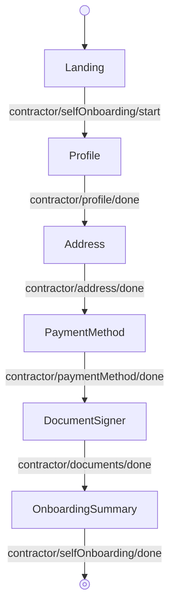

---
# Autogenerated by TypeDoc from TSDoc comments in the source code.
# To update content: edit TSDoc comments in src/.
# To update structure: edit docs-site/typedoc.config.ts or docs-site/plugins/typedoc-custom/.
# Then run `npm run docs:api:generate` to regenerate.
title: SelfOnboardingFlow
description: SelfOnboardingFlow reference.
sidebar_position: 2
generated_by: typedoc
custom_edit_url: null
---

# SelfOnboardingFlow

Guided flow for contractors to complete their own onboarding.

## Remarks

Hands the contractor responsibility for submitting their own profile, address, payment, and document-signing information. Drives a multi-step flow keyed to the contractor being self-onboarded, starting from the self-onboarding landing page and ending on a confirmation summary.

Each step is also exported as a standalone block (see the Blocks table) for composing a custom workflow when this orchestration is the wrong fit.

The flow forwards every event emitted by its blocks to `onEvent`; see the events table on each block for the full set of events and payloads observable from this flow.

## Example

```tsx title="App.tsx"
import { ContractorOnboarding, type EventType } from '@gusto/embedded-react-sdk'

function MyApp() {
  return (
    <ContractorOnboarding.SelfOnboardingFlow
      companyId="a007e1ab-3595-43c2-ab4b-af7a5af2e365"
      contractorId="4b3f930f-82cd-48a8-b797-798686e12e5e"
      onEvent={(eventType: EventType) => {
        if (eventType === 'contractor/selfOnboarding/done') {
          // Onboarding complete — navigate to your next screen
        }
      }}
    />
  )
}
```

## SelfOnboardingFlowProps

<a id="selfonboardingflowprops"></a>

Props for SelfOnboardingFlow.

| Property | Type | Description |
| ------ | ------ | ------ |
| `companyId` | `string` | The associated company identifier. |
| `contractorId` | `string` | The associated contractor identifier. |
| `onEvent` | [`OnEventType`](../../events.md#oneventtype)\<[`EventType`](../../events.md#eventtype), `unknown`\> | Callback invoked each time the component emits an event — user interactions, successful API responses, step transitions, or errors. Receives the event type constant and an optional payload whose shape varies by event. See the [Event Handling guide](https://docs.gusto.com/embedded-payroll/docs/event-handling) and each component's event table for the full list of emitted events. |

_Inherits `children`, `className`, `defaultValues`, `dictionary`, `FallbackComponent`, `LoaderComponent` from [BaseComponentInterface](../../index.md#basecomponentinterface)._

## Sub-components

| Component | Description |
| ------ | ------ |
| [Landing](blocks.md#landing) | Landing page for the contractor self-onboarding flow. Displays a welcome message and the list of onboarding steps the contractor needs to complete. |
| [ContractorProfile](blocks.md#contractorprofile) | Form for creating or editing a contractor profile, supporting both individual and business contractor types. |
| [Address](blocks.md#address) | Form for collecting and updating a contractor's mailing address. Renders a business or home address title based on the contractor type. |
| [PaymentMethod](blocks.md#paymentmethod) | Manages a contractor's payment method, capturing a bank account for direct deposit or recording check as the payment method. |
| [DocumentSigner](blocks.md#documentsigner) | Contractor onboarding step for reading and signing required contractor documents. |
| [OnboardingSummary](blocks.md#onboardingsummary) | Confirmation screen shown at the end of the contractor self-onboarding flow. Lets the contractor know their information has been submitted and emits `contractor/selfOnboarding/done` when they acknowledge it. |

<!-- guide-source: src/components/Contractor/SelfOnboardingFlow/GUIDE.md (slot: appendix) -->
## Step flow

The contractor completes their own onboarding, starting from the self-onboarding landing page.


<!-- /guide-source (slot: appendix) -->
