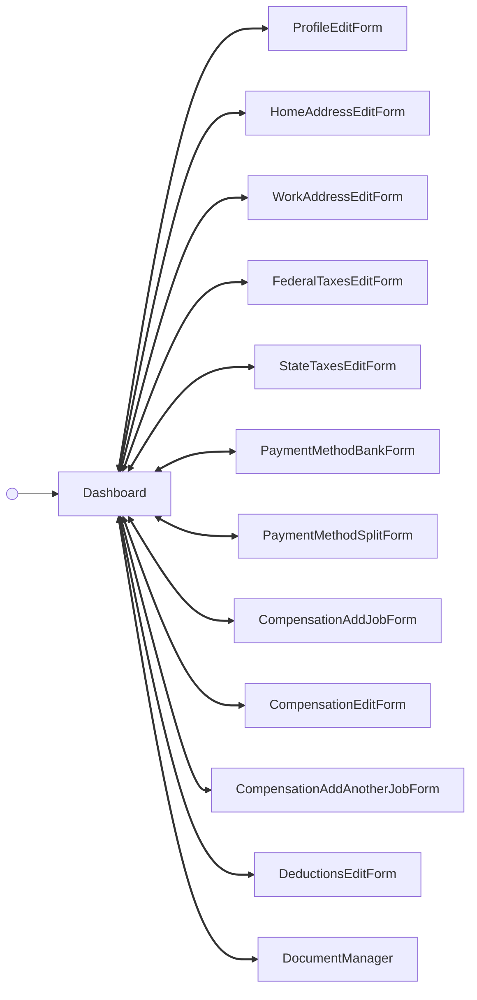

---
# Autogenerated by TypeDoc from TSDoc comments in the source code.
# To update content: edit TSDoc comments in src/.
# To update structure: edit docs-site/typedoc.config.ts or docs-site/plugins/typedoc-custom/.
# Then run `npm run docs:api:generate` to regenerate.
title: DashboardFlow
description: DashboardFlow reference.
sidebar_position: 2
generated_by: typedoc
custom_edit_url: null
---

# DashboardFlow

Hub for viewing and managing a single employee's profile, pay, and documents.

## Example

```tsx title="App.tsx"
import { EmployeeManagement } from '@gusto/embedded-react-sdk'

function MyApp() {
  return (
    <EmployeeManagement.DashboardFlow
      employeeId="4b3f930f-82cd-48a8-b797-798686e12e5e"
      onEvent={() => {}}
    />
  )
}
```

<!-- guide-source: src/components/Employee/Dashboard/GUIDE.md (slot: overview) -->
## Tabs

The dashboard organizes an employee's payroll information into four tabs. Switching tabs emits `employee/dashboard/tabChange`.

- **Basic details** — legal name, start date, SSN, date of birth, and personal email, plus home address and work address cards. Fields are read-only with "Edit"/"Manage" CTAs.
- **Job and pay** — compensation (one job, or a table of jobs when the primary job is nonexempt), payment method (direct-deposit bank accounts), deductions (garnishments), and paystub history. Lists paginate.
- **Taxes** — federal tax withholding (supports both pre-2020 and Rev 2020 W-4 versions, so the visible fields vary with the W-4 on file) and per-state tax withholding records.
- **Documents** — a read-only table of employee forms (W-2s, W-4s, direct-deposit authorizations, and other documents) with a "View" CTA per row.
<!-- /guide-source (slot: overview) -->

## Remarks

Renders a tabbed view of an employee's profile (Basic details, Job and pay,
Taxes, Documents), wires the card surfaces to their corresponding edit
screens via an internal state machine, and surfaces success alerts at the
top of the dashboard after each successful edit. Wraps the dashboard in
error and suspense boundaries.

Every tab section of the dashboard is also exported as a self-contained
block that can be dropped into a custom layout without the surrounding
dashboard chrome (see the blocks below).

Each block wraps its read-only card, its edit form, and the card↔form
transitions as a single drop-in. For cases where that built-in orchestration
doesn't fit — rendering a form in a modal, driving navigation via a router,
or showing a card read-only — each block's card and form are also exported
individually (e.g. [CompensationCard](blocks.md#compensationcard), [CompensationEditForm](blocks.md#compensationeditform)).
Using the individual pieces means owning the swap, any success alerts, and
cross-component state yourself.

The dashboard composes self-fetching cards and their edit forms and forwards
every event they emit to the partner via `onEvent`; its internal state
machine also reacts to a subset of these events to swap between the cards
and edit screens and to surface success alerts. The table below is the
complete, current set of events observable from `DashboardFlow`, grouped by
the tab that emits them.

## DashboardFlowProps

<a id="dashboardflowprops"></a>

Props for DashboardFlow.

| Property | Type | Description |
| ------ | ------ | ------ |
| `employeeId` | `string` | The associated employee identifier. |
| `onEvent` | [`OnEventType`](../../events.md#oneventtype)\<[`EventType`](../../events.md#eventtype), `unknown`\> | Callback invoked each time the component emits an event — user interactions, successful API responses, step transitions, or errors. Receives the event type constant and an optional payload whose shape varies by event. See the [Event Handling guide](https://docs.gusto.com/embedded-payroll/docs/event-handling) and each component's event table for the full list of emitted events. |

_Inherits `children`, `className`, `defaultValues`, `dictionary`, `FallbackComponent`, `LoaderComponent` from [BaseComponentInterface](../../index.md#basecomponentinterface)._

## Events

| Event | Description | Data |
| ----- | ----------- | ---- |
| `employee/management/profile/editRequested` | Fired when "Edit" is clicked on the Basic details (Profile) card | `{ employeeId: string }` |
| `employee/management/profile/updated` | Fired after the basic-details edit form is saved; the dashboard returns to the cards and surfaces the "Profile updated" alert | Updated `Employee` entity |
| `employee/management/profile/editCancelled` | Fired when the user clicks Cancel on the basic-details edit form; the dashboard returns to the cards | — |
| `employee/management/homeAddress/editRequested` | Fired when "Manage" is clicked on the Home address card | `{ employeeId: string }` |
| `employee/management/homeAddress/created` | Fired after a new home address is created on the manage screen; the manage screen stays open | Created `EmployeeAddress` entity |
| `employee/management/homeAddress/updated` | Fired after a home address is updated on the manage screen; the manage screen stays open | Updated `EmployeeAddress` entity |
| `employee/management/homeAddress/deleted` | Fired after a non-active home address is deleted on the manage screen; the manage screen stays open | Deleted `EmployeeAddress` entity |
| `employee/management/homeAddress/editCancelled` | Fired when the user clicks Back on the manage screen; the dashboard returns to the cards | — |
| `employee/management/workAddress/editRequested` | Fired when "Manage" is clicked on the Work address card | `{ employeeId: string }` |
| `employee/management/workAddress/created` | Fired after a new work address is created on the manage screen; the manage screen stays open | Created `EmployeeWorkAddress` entity |
| `employee/management/workAddress/updated` | Fired after a work address is updated on the manage screen; the manage screen stays open | Updated `EmployeeWorkAddress` entity |
| `employee/management/workAddress/deleted` | Fired after a work address is deleted on the manage screen; the manage screen stays open | Deleted `EmployeeWorkAddress` entity |
| `employee/management/workAddress/editCancelled` | Fired when the user clicks Back on the manage screen; the dashboard returns to the cards | — |
| `employee/management/compensation/card/editRequested` | Fired when an "Edit" CTA is clicked for a job on the Compensation card | `{ employeeId: string, jobId: string }` |
| `employee/management/compensation/card/addRequested` | Fired when "Add job" is clicked from the Compensation card's empty state | `{ employeeId: string }` |
| `employee/management/compensation/card/addAnotherRequested` | Fired when "Add another job" is clicked on the Compensation card | `{ employeeId: string }` |
| `employee/management/compensation/card/jobDeleted` | Fired after a non-primary job is deleted via the card's confirm dialog | `{ employeeId: string, jobId: string }` |
| `employee/management/compensation/card/changeCancelled` | Fired after a scheduled future-dated change is cancelled from the card | `{ employeeId: string, compensationId: string }` |
| `employee/management/compensation/editForm/submitted` | Fired after an edit-compensation save completes; the dashboard returns to the cards | Updated `Compensation` entity |
| `employee/management/compensation/editForm/cancelled` | Fired when the user cancels the edit-compensation form; the dashboard returns to the cards | — |
| `employee/management/compensation/addJobForm/submitted` | Fired after the first job and compensation are saved; the dashboard returns to the cards and surfaces the "Job added" alert | Updated `Compensation` entity |
| `employee/management/compensation/addJobForm/cancelled` | Fired when the user cancels the add-job form; the dashboard returns to the cards | — |
| `employee/management/compensation/addAnotherJobForm/submitted` | Fired after a secondary job and compensation are saved; the dashboard returns to the cards and surfaces the "Job added" alert | Updated `Compensation` entity |
| `employee/management/compensation/addAnotherJobForm/cancelled` | Fired when the user cancels the add-another-job form; the dashboard returns to the cards | — |
| `employee/management/paymentMethod/card/addRequested` | Fired when "Add bank account" / "Add another bank account" is clicked on the Payment card | — |
| `employee/management/paymentMethod/card/splitRequested` | Fired when "Split paycheck" is clicked on the Payment card | — |
| `employee/management/paymentMethod/card/bankAccountDeleted` | Fired after a bank account is deleted from the card; the dashboard surfaces the "Bank account deleted" alert | Response from the Delete a bank account endpoint |
| `employee/management/paymentMethod/bankForm/submitted` | Fired after a new bank account is saved; the dashboard returns to the cards and surfaces the "Bank account added" alert | Created `EmployeeBankAccount` entity |
| `employee/management/paymentMethod/bankForm/cancelled` | Fired when the user cancels the add-bank-account screen; the dashboard returns to the cards | — |
| `employee/management/paymentMethod/splitForm/submitted` | Fired after the split configuration is saved; the dashboard returns to the cards and surfaces the "Split updated" alert | Updated `EmployeePaymentMethod` entity |
| `employee/management/paymentMethod/splitForm/cancelled` | Fired when the user cancels the split-paycheck screen; the dashboard returns to the cards | — |
| `employee/management/deductions/card/addRequested` | Fired when "Add deduction" is clicked on the Deductions card | `{ employeeId: string }` |
| `employee/management/deductions/card/editRequested` | Fired when a row's "Edit" menu item is chosen on the Deductions card | The `Garnishment` row being edited |
| `employee/management/deductions/card/deleted` | Fired after the soft-delete dialog is confirmed; the dashboard surfaces the "Deduction deleted" alert | The now-inactive `Garnishment` |
| `employee/management/deductions/editForm/created` | Fired after a new deduction is created; the dashboard returns to the cards and surfaces the "Deduction added" alert | The created `Garnishment` |
| `employee/management/deductions/editForm/updated` | Fired after a deduction is updated; the dashboard returns to the cards and surfaces the "Deduction updated" alert | The updated `Garnishment` |
| `employee/management/deductions/editForm/cancelled` | Fired when the user cancels the add/edit deduction form; the dashboard returns to the cards | — |
| `employee/management/paystubs/card/downloadRequested` | Fired when a paystub row's download button is clicked, before the PDF is fetched | `{ employeeId: string, payrollUuid: string }` |
| `employee/management/paystubs/card/downloaded` | Fired after the paystub PDF is fetched and opened in a new tab | `{ employeeId: string, payrollUuid: string }` |
| `employee/management/federalTaxes/card/editRequested` | Fired when "Edit" is clicked on the Federal taxes card | `{ employeeId: string }` |
| `employee/management/federalTaxes/editForm/submitted` | Fired after a federal-taxes save succeeds; the dashboard returns to the cards and surfaces the "Federal taxes updated" alert | Updated `EmployeeFederalTax` entity |
| `employee/management/federalTaxes/editForm/cancelled` | Fired when the user cancels the federal-taxes edit form; the dashboard returns to the cards | — |
| `employee/management/stateTaxes/editRequested` | Fired when "Edit" is clicked on the State taxes card | `{ employeeId: string }` |
| `employee/management/stateTaxes/updated` | Fired after a state-taxes save succeeds; the dashboard returns to the cards and surfaces the "State taxes updated" alert | `{ employeeStateTaxesList: EmployeeStateTaxesList[] }` |
| `employee/management/stateTaxes/editCancelled` | Fired when the user cancels the state-taxes edit form; the dashboard returns to the cards | — |
| `employee/management/documents/card/viewRequested` | Fired when a document row's "View" CTA is clicked; the dashboard swaps to the read-only document viewer | `{ employeeId: string, formId: string }` |
| `CANCEL` | Fired when the user clicks Back in the document viewer; the dashboard returns to the cards | — |
| `employee/dashboard/tabChange` | Fired when the user switches dashboard tabs | `{ tab: 'basicDetails' \| 'jobAndPay' \| 'taxes' \| 'documents' }` |
| `employee/dismiss` | Fired when the user dismisses a top-of-dashboard success alert | — |

## Sub-components

| Component | Description |
| ------ | ------ |
| [Dashboard](blocks.md#dashboard) | Employee self-service dashboard summarizing a single employee's basic details, job and pay, taxes, and documents. |
| [ProfileEditForm](blocks.md#profileeditform) | Standalone edit form for an employee's basic profile details. |
| [HomeAddressEditForm](blocks.md#homeaddresseditform) | Standalone employee home address edit form for creating, updating, and deleting addresses. |
| [WorkAddressEditForm](blocks.md#workaddresseditform) | Standalone employee work address edit form for creating, updating, and deleting addresses. |
| [FederalTaxesEditForm](blocks.md#federaltaxeseditform) | Standalone form for editing an employee's federal tax (W-4) withholdings — filing status, multiple-jobs flag, dependents, other income, deductions, and extra withholding. |
| [StateTaxesEditForm](blocks.md#statetaxeseditform) | Standalone edit screen for the state-tax management flow. Renders the shared state-tax form against the `Employee.Management.StateTaxes` namespace and emits scoped management events on submit and cancel, so partner copy overrides on the management namespace do not leak into the onboarding flow. |
| [PaymentMethodBankForm](blocks.md#paymentmethodbankform) | Standalone bank-account form for the management flow. |
| [PaymentMethodSplitForm](blocks.md#paymentmethodsplitform) | Standalone split-paycheck form for the management flow. |
| [CompensationAddJobForm](blocks.md#compensationaddjobform) | Standalone form for adding an employee's first job and compensation from the management surface. |
| [CompensationEditForm](blocks.md#compensationeditform) | Standalone form that edits the compensation for a single job, branching automatically between editing the current compensation and an already-scheduled future-dated change. |
| [CompensationAddAnotherJobForm](blocks.md#compensationaddanotherjobform) | Standalone form for adding a secondary job and compensation to an employee from the management surface. |
| [DeductionsEditForm](blocks.md#deductionseditform) | Standalone add/edit surface for a single employee deduction. |
| [DocumentManager](blocks.md#documentmanager) | Read-only document viewer for the admin-facing employee dashboard. Renders the selected form's PDF — including unsigned forms, which are shown as-is. Signing is intentionally not offered here; forms are signed by the employee during onboarding, not by an admin viewing the dashboard. |

<!-- guide-source: src/components/Employee/Dashboard/GUIDE.md (slot: appendix) -->
## Step flow

The dashboard is a hub: the `Dashboard` cards view is the resting state. A card's edit/manage CTA opens that section's edit form; submitting or cancelling returns to the cards, and a successful save shows a dismissible success alert. The documents card is the exception — its View CTA opens `DocumentManager`, a read-only viewer that returns on Back; signing happens during employee onboarding, not here.



Some actions stay on the cards view without a screen swap: switching tabs (`employee/dashboard/tabChange`), dismissing a success alert (`employee/dismiss`), and deleting a bank account or deduction.

## Empty states

Each section handles missing data on its own: compensation shows an empty state whose header CTA switches from "Edit" to "Add job"; payment methods, deductions, and state taxes each show a "none on file" message with the relevant add CTA; paystubs indicate that records appear after payroll is run; documents show a "No forms" message.
<!-- /guide-source (slot: appendix) -->
