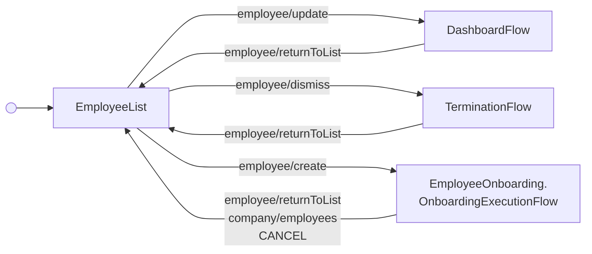

---
# Autogenerated by TypeDoc from TSDoc comments in the source code.
# To update content: edit TSDoc comments in src/.
# To update structure: edit docs-site/typedoc.config.ts or docs-site/plugins/typedoc-custom/.
# Then run `npm run docs:api:generate` to regenerate.
title: EmployeeListFlow
description: EmployeeListFlow reference.
sidebar_position: 2
generated_by: typedoc
custom_edit_url: null
---

# EmployeeListFlow

Hub for viewing and managing all employees, including onboarding new ones.

## Remarks

Drop-in entry point for managing all employees in a company. Begins on the
management employee list and routes into [DashboardFlow](dashboard-flow.md),
[TerminationFlow](termination-flow.md), or [OnboardingExecutionFlow](../onboarding/onboarding-execution-flow.md) based on the
action the admin invokes on a row (or the "Add employee" CTA). A "Back to
employees" header is added to each sub-flow so the admin can return to the
list at any time.

The flow forwards every event emitted by its blocks to `onEvent`;
see the events table on each block for the full set of events and
payloads observable from this flow.

## Example

```tsx title="App.tsx"
import { EmployeeManagement } from '@gusto/embedded-react-sdk'

function MyApp() {
  return (
    <EmployeeManagement.EmployeeListFlow
      companyId="a007e1ab-3595-43c2-ab4b-af7a5af2e365"
      onEvent={() => {}}
    />
  )
}
```

## EmployeeListFlowProps

<a id="employeelistflowprops"></a>

Props for EmployeeListFlow.

| Property | Type | Description |
| ------ | ------ | ------ |
| `companyId` | `string` | The associated company identifier. |
| `onEvent` | [`OnEventType`](../../events.md#oneventtype)\<[`EventType`](../../events.md#eventtype), `unknown`\> | Callback invoked each time the component emits an event — user interactions, successful API responses, step transitions, or errors. Receives the event type constant and an optional payload whose shape varies by event. See the [Event Handling guide](https://docs.gusto.com/embedded-payroll/docs/event-handling) and each component's event table for the full list of emitted events. |

_Inherits `children`, `className`, `defaultValues`, `dictionary`, `FallbackComponent`, `LoaderComponent` from [BaseComponentInterface](../../index.md#basecomponentinterface)._

## Sub-components

| Component | Description |
| ------ | ------ |
| [EmployeeList](blocks.md#employeelist) | Renders a tabbed list of a company's employees split across Active, Onboarding, and Dismissed tabs, with per-row actions tailored to each tab (edit, delete, dismiss, rehire). |
| [DashboardFlow](dashboard-flow.md) | Hub for viewing and managing a single employee's profile, pay, and documents. |
| [TerminationFlow](termination-flow.md) | Guided flow to terminate an employee and arrange their final paycheck. |
| [EmployeeOnboarding.OnboardingExecutionFlow](../onboarding/onboarding-execution-flow.md) | Guided flow to onboard an employee. |

<!-- guide-source: src/components/Employee/EmployeeListFlow/GUIDE.md (slot: appendix) -->
## Step flow

The flow rests on the management employee list and routes into one of three sub-flows based on the row action invoked (or the "Add employee" CTA):

- **Edit** (`employee/update`) → `DashboardFlow`
- **Dismiss** (`employee/dismiss`) → `TerminationFlow`
- **Add employee** (`employee/create`) → `OnboardingExecutionFlow`

Each sub-flow is given a "Back to employees" header that emits `employee/returnToList` to come back to the list. The onboarding sub-flow also returns to the list when it completes (`company/employees`) or is canceled (`CANCEL`).

The list itself is tabbed into Active, Onboarding, and Dismissed employees, with per-row actions tailored to each tab (edit, delete, dismiss, rehire).


<!-- /guide-source (slot: appendix) -->

## Endpoints

| Method | Path |
| --- | --- |
| GET | [`/v1/companies/:companyId/employees`](https://docs.gusto.com/embedded-payroll/v2026-02-01/reference/get-v1-companies-company_id-employees) |
| GET | [`/v1/employees/:employeeId`](https://docs.gusto.com/embedded-payroll/v2026-02-01/reference/get-v1-employees) |
| DELETE | [`/v1/employees/:employeeId`](https://docs.gusto.com/embedded-payroll/v2026-02-01/reference/delete-v1-employee) |
| PUT | [`/v1/employees/:employeeId/onboarding_status`](https://docs.gusto.com/embedded-payroll/v2026-02-01/reference/put-v1-employees-employee_id-onboarding_status) |
