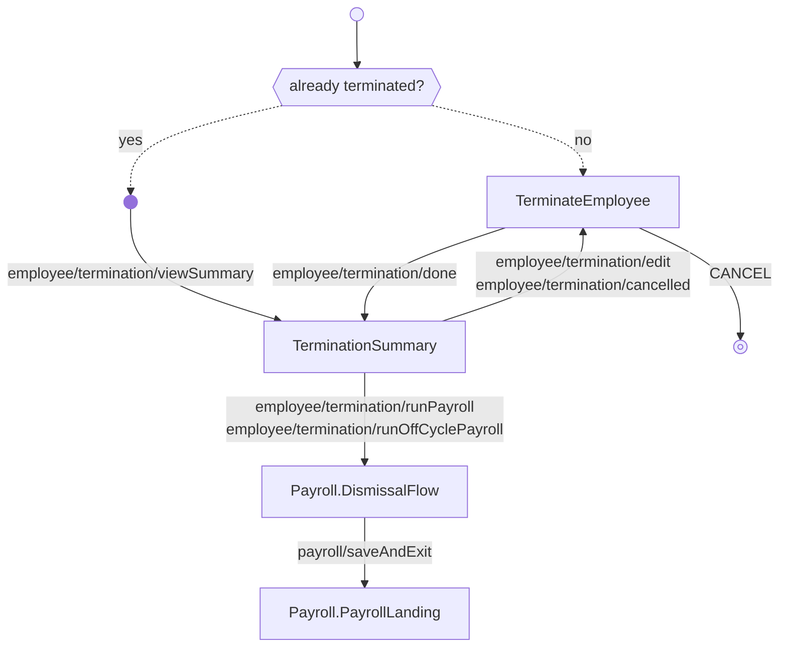

---
# Autogenerated by TypeDoc from TSDoc comments in the source code.
# To update content: edit TSDoc comments in src/.
# To update structure: edit docs-site/typedoc.config.ts or docs-site/plugins/typedoc-custom/.
# Then run `npm run docs:api:generate` to regenerate.
title: TerminationFlow
description: TerminationFlow reference.
sidebar_position: 2
generated_by: typedoc
custom_edit_url: null
---

# TerminationFlow

Guided workflow for terminating an employee — pick termination date, choose how to process final payroll, review details, and manage offboarding.

## Example

```tsx
import { EmployeeManagement } from '@gusto/embedded-react-sdk'

function MyApp() {
  return (
    <EmployeeManagement.TerminationFlow
      companyId="a007e1ab-3595-43c2-ab4b-af7a5af2e365"
      employeeId="4b3f930f-82cd-48a8-b797-798686e12e5e"
      onEvent={() => {}}
    />
  )
}
```

## Remarks

Provides a complete experience for terminating an employee — guides the user through selecting a termination date, choosing how to process final payroll, reviewing termination details, and managing the offboarding process. Drives a multi-step flow with breadcrumb navigation between the termination form, the summary, and the dismissal payroll flow (when the partner selects the dismissal payroll option).

On mount, the flow detects existing terminations: if an active termination exists, the form is pre-populated for editing; if the employee is already terminated, the user is routed to the summary view.

| Event | Description | Data |
| ----- | ----------- | ---- |
| `employee/termination/created` | Fired when a new termination is created | `{ employeeId: string, effectiveDate: string, payrollOption: PayrollOption }` |
| `employee/termination/updated` | Fired when an existing termination is updated | `{ employeeId: string, effectiveDate: string, payrollOption: PayrollOption }` |
| `employee/termination/done` | Fired when the termination process is complete | `{ employeeId: string, effectiveDate: string, payrollOption: PayrollOption, payrollUuid?: string }` |
| `employee/termination/viewSummary` | Fired when viewing an existing termination summary | `{ employeeId: string, effectiveDate: string }` |
| `employee/termination/edit` | Fired when user clicks to edit termination details | `{ employeeId: string }` |
| `employee/termination/cancelled` | Fired when a termination is cancelled | `{ employeeId: string, alert?: `TerminationFlowAlert` }` |
| `employee/termination/runPayroll` | Fired when user chooses to run termination payroll | `{ employeeId: string, companyId: string, effectiveDate: string }` |
| `employee/termination/runOffCyclePayroll` | Fired when user chooses to run an off-cycle payroll | `{ employeeId: string, companyId: string }` |
| `employee/termination/payrollCreated` | Fired when an off-cycle payroll is created for termination | `{ employeeId: string, effectiveDate: string }` |
| `employee/termination/payrollFailed` | Fired when off-cycle payroll creation fails | `{ employeeId: string }` |

The [PayrollOption](blocks.md#payrolloption) on each event identifies how the partner has chosen to handle the employee's final paycheck:

- `dismissalPayroll` — Run a dismissal payroll (the most guided option). The flow swaps the employee's last regular payroll into a dismissal payroll with the termination date as the pay-period end and makes a default PTO payout recommendation.
- `regularPayroll` — Include the final pay in the employee's next scheduled regular payroll. The termination can still be cancelled after the fact.
- `anotherWay` — Handle the final pay another way: either run an off-cycle payroll to calculate final amounts, or pay the employee outside of Gusto (reporting it separately so the amounts land on tax forms). The employee is removed from unprocessed future payrolls, and the termination can still be cancelled after the fact.

## TerminationFlowProps

<a id="terminationflowprops"></a>

Props for TerminationFlow.

| Property | Type | Description |
| ------ | ------ | ------ |
| `companyId` | `string` | The associated company identifier. |
| `employeeId` | `string` | The employee identifier to terminate. |
| `onEvent` | [`OnEventType`](../../index.md#oneventtype)\<[`EventType`](../../events.md#eventtype), `unknown`\> | Callback invoked each time the component emits an event — user interactions, successful API responses, step transitions, or errors. Receives the event type constant and an optional payload whose shape varies by event. See the [Event Handling guide](https://docs.gusto.com/embedded-payroll/docs/event-handling) and each component's event table for the full list of emitted events. |

_Inherits `children`, `className`, `defaultValues`, `dictionary`, `FallbackComponent`, `LoaderComponent` from [BaseComponentInterface](../../index.md#basecomponentinterface)._

## Sub-components

| Component | Description |
| ------ | ------ |
| [TerminateEmployee](blocks.md#terminateemployee) | Standalone form for capturing an employee's termination details — last day of work and how to process final payroll. |
| [TerminationSummary](blocks.md#terminationsummary) | Termination summary with edit, cancel, and run-payroll actions plus an offboarding checklist. |
| [Payroll.DismissalFlow](../../payroll/dismissal-flow.md) | Guided workflow for running a terminated employee's final payroll. |
| [Payroll.PayrollLanding](../../payroll/blocks.md#payrolllanding) | Main landing surface for payroll operations, with tabs for running payroll and viewing payroll history, plus inline navigation to a payroll's overview and receipt. |

<!-- guide-source: src/components/Employee/Terminations/TerminationFlow/GUIDE.md (slot: appendix) -->
## Step flow

On entry the flow checks whether the employee is already terminated. If so, it routes straight to a read-only summary (`employee/termination/viewSummary`). Otherwise it opens the termination form — blank for a new termination, or pre-populated when a pending termination exists — and submitting it saves the termination and emits `employee/termination/done` (carrying the chosen `payrollOption`). That `done` event — not anything on the summary — is the completion signal. The form's Cancel button emits `CANCEL`, the only event that leaves the flow; the machine doesn't handle it, so the partner decides where to go next. From the summary the employee can edit or cancel (returning to the form). What the summary offers next is driven by the payroll option:

- **`regularPayroll`** — no further action. The summary is a confirmation; final pay is processed in the next scheduled regular payroll.
- **`dismissalPayroll`** — the summary offers a CTA that emits `employee/termination/runPayroll`, opening the existing final payroll as a dismissal payroll.
- **`anotherWay`** — the summary offers a CTA that emits `employee/termination/runOffCyclePayroll`, removing the employee from unprocessed future payrolls and creating a new off-cycle payroll.

The last two both run `Payroll.DismissalFlow` (with an existing `payrollId` for the dismissal path, without one for the off-cycle path), which on `payroll/saveAndExit` lands on `Payroll.PayrollLanding` — the payroll surface where that payroll is run. There is no exit event from the landing; breadcrumbs navigate back to the summary or form from there (and from the dismissal flow).



## Business rules

- **Final-paycheck timing.** Some states require an employee to receive their final wages within a short window (e.g. 24 hours) of termination unless they consent otherwise. Where that applies, running a dismissal payroll may be the only compliant option. Check the relevant state's final-paycheck requirements.
- **Cancelling a termination.** A termination can be cancelled when `regularPayroll` or `anotherWay` was selected, but not once `dismissalPayroll` was selected.
- **Editing the termination date.** The effective date can be edited while it is in the future and the employee is not yet terminated; an effective date already in the past cannot be changed.
- **Concurrent updates.** Terminations use a `version` field for optimistic locking; an update with a stale version is rejected.
- **Off-cycle return path.** When `anotherWay` is selected, the employee is removed from unprocessed future payrolls and the off-cycle payroll flow runs; on success the flow returns to the summary.
<!-- /guide-source (slot: appendix) -->
