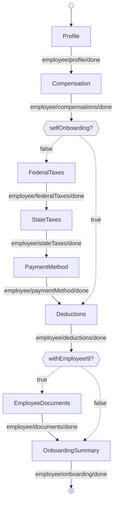

---
# Autogenerated by TypeDoc from TSDoc comments in the source code.
# To update content: edit TSDoc comments in src/.
# To update structure: edit docs-site/typedoc.config.ts or docs-site/plugins/typedoc-custom/.
# Then run `npm run docs:api:generate` to regenerate.
title: OnboardingExecutionFlow
description: OnboardingExecutionFlow reference.
sidebar_position: 2
generated_by: typedoc
custom_edit_url: null
---

# OnboardingExecutionFlow

Guided flow to onboard an employee.

## Remarks

Drives the per-employee, admin-led onboarding steps used by [OnboardingFlow](onboarding-flow.md) and [EmployeeManagement.EmployeeListFlow](../management/employee-list-flow.md). ([SelfOnboardingFlow](self-onboarding-flow.md) is the separate employee-driven flow and runs its own state machine.) Each step is also exported as a standalone block (see the Blocks table) for composing a custom workflow when this orchestration is the wrong fit.

Self-onboarding statuses cause the federal-taxes, state-taxes, and payment-method steps to be skipped (the employee fills those in themselves); the documents step is also skipped unless `withEmployeeI9` is true and the documents config has not yet been completed.

The flow forwards every event emitted by its blocks to `onEvent`; see the events table on each block for the full set of events and payloads observable from this flow.

## Example

```tsx title="App.tsx"
import { EmployeeOnboarding, type EventType } from '@gusto/embedded-react-sdk'

function MyApp() {
  return (
    <EmployeeOnboarding.OnboardingExecutionFlow
      companyId="a007e1ab-3595-43c2-ab4b-af7a5af2e365"
      onEvent={(eventType: EventType) => {
        if (eventType === 'employee/onboarding/done') {
          // Onboarding complete — navigate to your next screen
        }
      }}
    />
  )
}
```

## OnboardingExecutionFlowProps

<a id="onboardingexecutionflowprops"></a>

Props for OnboardingExecutionFlow.

| Property | Type | Description |
| ------ | ------ | ------ |
| `companyId` | `string` | The associated company identifier. |
| `onEvent` | [`OnEventType`](../../events.md#oneventtype)\<[`EventType`](../../events.md#eventtype), `unknown`\> | Callback invoked when the flow emits an event. |
| `defaultValues?` | [`OnboardingDefaultValues`](blocks.md#onboardingdefaultvalues) | Default values for individual flow step components. |
| `initialEmployeeId?` | `string` | The associated employee identifier to resume onboarding for. Omit to begin onboarding a new employee. |
| `initialOnboardingStatus?` | `"admin_onboarding_incomplete"` \| `"self_onboarding_pending_invite"` \| `"self_onboarding_invited"` \| `"self_onboarding_invited_started"` \| `"self_onboarding_invited_overdue"` \| `"self_onboarding_completed_by_employee"` \| `"self_onboarding_awaiting_admin_review"` \| `"onboarding_completed"` | The current onboarding status of the employee being onboarded. Drives skip behavior for self-onboarding and document steps. |
| `initialState?` | `"employeeProfile"` | The step the flow starts on. Defaults to `employeeProfile`. |
| `isAdmin?` | `boolean` | When true, the flow renders in the admin context. When false, it is configured for employee self-onboarding. Defaults to `true`. |
| `isSelfOnboardingEnabled?` | `boolean` | When true, presents the self-onboarding toggle on the profile step. Defaults to `true`. |
| `withEmployeeI9?` | `boolean` | When true, enables the Employee Documents step in the flow, allowing the admin to configure I-9 document requirements. Defaults to `false`. |

## Sub-components

| Component | Description |
| ------ | ------ |
| [Profile](blocks.md#profile) | Onboarding step for collecting an employee's basic profile and addresses. |
| [Compensation](blocks.md#compensation) | Onboarding step for collecting an employee's role and compensation details. |
| [FederalTaxes](blocks.md#federaltaxes) | Onboarding step for collecting an employee's federal tax (W-4) withholdings — filing status, multiple-jobs flag, dependents, other income, deductions, and extra withholding. |
| [StateTaxes](blocks.md#statetaxes) | Onboarding step that collects an employee's per-state tax withholding answers. The set of fields is driven by the API response for each state on record. |
| [PaymentMethod](blocks.md#paymentmethod) | Onboarding step for setting up an employee's payment method. |
| [Deductions](blocks.md#deductions) | Onboarding step for collecting an employee's post-tax deductions and court-ordered garnishments. |
| [EmployeeDocuments](blocks.md#employeedocuments) | Onboarding step for selecting which documents the employee must complete. |
| [OnboardingSummary](blocks.md#onboardingsummary) | Displays a summary of an employee's onboarding status, listing completed and outstanding steps. Rendered as a standalone step inside `OnboardingFlow`. |

<!-- guide-source: src/components/Employee/OnboardingExecutionFlow/GUIDE.md (slot: appendix) -->
## Step flow

`OnboardingExecutionFlow` runs the per-employee steps in order. After compensation, the path branches on the employee's self-onboarding status — set by the self-onboarding toggle the admin chooses on the Profile step, not by a flow prop:

- **Admin onboarding** — the admin completes every step, including federal taxes, state taxes, and payment method.
- **Self-onboarding** — the admin sets up the basics and the employee completes federal taxes, state taxes, and payment method themselves, so those three steps are skipped here.

The `isSelfOnboardingEnabled` prop only controls whether that toggle is offered: when `false`, the toggle is hidden and the flow always takes the admin path; when `true` (the default), the branch follows the admin's selection.

The documents step appears only when `withEmployeeI9` is set.


<!-- /guide-source (slot: appendix) -->

## Endpoints

| Method | Path |
| --- | --- |
| POST | [`/v1/companies/:companyId/employees`](https://docs.gusto.com/embedded-payroll/v2026-06-15/reference/post-v1-employees) |
| GET | [`/v1/companies/:companyId/federal_tax_details`](https://docs.gusto.com/embedded-payroll/v2026-06-15/reference/get-v1-companies-company_id-federal_tax_details) |
| GET | [`/v1/companies/:companyId/locations`](https://docs.gusto.com/embedded-payroll/v2026-06-15/reference/get-v1-companies-company_id-locations) |
| PUT | [`/v1/compensations/:compensationId`](https://docs.gusto.com/embedded-payroll/v2026-06-15/reference/put-v1-compensations-compensation_id) |
| DELETE | [`/v1/compensations/:compensationId`](https://docs.gusto.com/embedded-payroll/v2026-06-15/reference/delete-v1-compensations-compensation_id) |
| GET | [`/v1/employees/:employeeId`](https://docs.gusto.com/embedded-payroll/v2026-06-15/reference/get-v1-employees) |
| PUT | [`/v1/employees/:employeeId`](https://docs.gusto.com/embedded-payroll/v2026-06-15/reference/put-v1-employees) |
| GET | [`/v1/employees/:employeeId/garnishments`](https://docs.gusto.com/embedded-payroll/v2026-06-15/reference/get-v1-employees-employee_id-garnishments) |
| POST | [`/v1/employees/:employeeId/garnishments`](https://docs.gusto.com/embedded-payroll/v2026-06-15/reference/post-v1-employees-employee_id-garnishments) |
| GET | [`/v1/employees/:employeeId/home_addresses`](https://docs.gusto.com/embedded-payroll/v2026-06-15/reference/get-v1-employees-employee_id-home_addresses) |
| POST | [`/v1/employees/:employeeId/home_addresses`](https://docs.gusto.com/embedded-payroll/v2026-06-15/reference/post-v1-employees-employee_id-home_addresses) |
| GET | [`/v1/employees/:employeeId/jobs`](https://docs.gusto.com/embedded-payroll/v2026-06-15/reference/get-v1-employees-employee_id-jobs) |
| POST | [`/v1/employees/:employeeId/jobs`](https://docs.gusto.com/embedded-payroll/v2026-06-15/reference/post-v1-employees-employee_id-jobs) |
| PUT | [`/v1/employees/:employeeId/onboarding_documents_config`](https://docs.gusto.com/embedded-payroll/v2026-06-15/reference/put-v1-employees-employee_id-onboarding_documents_config) |
| GET | [`/v1/employees/:employeeId/onboarding_status`](https://docs.gusto.com/embedded-payroll/v2026-06-15/reference/get-v1-employees-employee_id-onboarding_status) |
| PUT | [`/v1/employees/:employeeId/onboarding_status`](https://docs.gusto.com/embedded-payroll/v2026-06-15/reference/put-v1-employees-employee_id-onboarding_status) |
| GET | [`/v1/employees/:employeeId/work_addresses`](https://docs.gusto.com/embedded-payroll/v2026-06-15/reference/get-v1-employees-employee_id-work_addresses) |
| POST | [`/v1/employees/:employeeId/work_addresses`](https://docs.gusto.com/embedded-payroll/v2026-06-15/reference/post-v1-employees-employee_id-work_addresses) |
| GET | [`/v1/employees/:employeeUuid/federal_taxes`](https://docs.gusto.com/embedded-payroll/v2026-06-15/reference/get-v1-employees-employee_id-federal_taxes) |
| PUT | [`/v1/employees/:employeeUuid/federal_taxes`](https://docs.gusto.com/embedded-payroll/v2026-06-15/reference/put-v1-employees-employee_id-federal_taxes) |
| GET | [`/v1/employees/:employeeUuid/state_taxes`](https://docs.gusto.com/embedded-payroll/v2026-06-15/reference/get-v1-employees-employee_id-state_taxes) |
| PUT | [`/v1/employees/:employeeUuid/state_taxes`](https://docs.gusto.com/embedded-payroll/v2026-06-15/reference/put-v1-employees-employee_id-state_taxes) |
| PUT | [`/v1/garnishments/:garnishmentId`](https://docs.gusto.com/embedded-payroll/v2026-06-15/reference/put-v1-garnishments-garnishment_id) |
| GET | [`/v1/garnishments/child_support`](https://docs.gusto.com/embedded-payroll/v2026-06-15/reference/get-v1-garnishments-child_support) |
| GET | [`/v1/home_addresses/:homeAddressUuid`](https://docs.gusto.com/embedded-payroll/v2026-06-15/reference/get-v1-home_addresses-home_address_uuid) |
| PUT | [`/v1/home_addresses/:homeAddressUuid`](https://docs.gusto.com/embedded-payroll/v2026-06-15/reference/put-v1-home_addresses-home_address_uuid) |
| PUT | [`/v1/jobs/:jobId`](https://docs.gusto.com/embedded-payroll/v2026-06-15/reference/put-v1-jobs-job_id) |
| DELETE | [`/v1/jobs/:jobId`](https://docs.gusto.com/embedded-payroll/v2026-06-15/reference/delete-v1-jobs-job_id) |
| POST | [`/v1/jobs/:jobId/compensations`](https://docs.gusto.com/embedded-payroll/v2026-06-15/reference/post-v1-compensations-compensation_id) |
| GET | [`/v1/locations/:locationUuid/minimum_wages`](https://docs.gusto.com/embedded-payroll/v2026-06-15/reference/get-v1-locations-location_uuid-minimum_wages) |
| GET | [`/v1/work_addresses/:workAddressUuid`](https://docs.gusto.com/embedded-payroll/v2026-06-15/reference/get-v1-work_addresses-work_address_uuid) |
| PUT | [`/v1/work_addresses/:workAddressUuid`](https://docs.gusto.com/embedded-payroll/v2026-06-15/reference/put-v1-work_addresses-work_address_uuid) |
