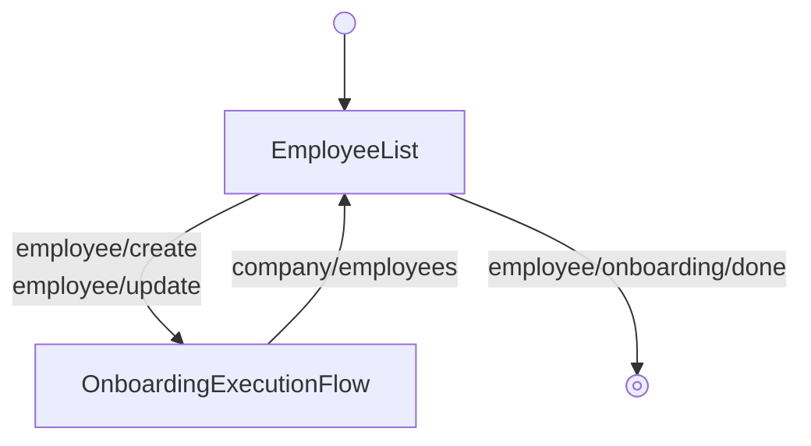

---
# Autogenerated by TypeDoc from TSDoc comments in the source code.
# To update content: edit TSDoc comments in src/.
# To update structure: edit docs-site/typedoc.config.ts or docs-site/plugins/typedoc-custom/.
# Then run `npm run docs:api:generate` to regenerate.
title: OnboardingFlow
description: OnboardingFlow reference.
sidebar_position: 2
generated_by: typedoc
custom_edit_url: null
---

# OnboardingFlow

Guided flow to onboard multiple employees, one at a time.

## Remarks

Renders a multi-step experience that collects every piece of information
required to add an employee to payroll. Begins on the employee list and
transitions into the onboarding execution flow when "Add employee" or a
row's "Edit"/"Review" action is invoked; returning from the execution flow
surfaces the list again. The flow is driven by an internal state machine
and wraps each step in error and suspense boundaries.

The per-employee steps live in [OnboardingExecutionFlow](onboarding-execution-flow.md), which is also
exported as a standalone block — along with each individual step — for
composing a custom workflow when this orchestration is the wrong fit. See the
[Composition guide](https://sdk.gusto.com/docs/guides/integration-guide/composition)
for how to recompose these blocks into your own flow.

The flow forwards every event emitted by its blocks to `onEvent`;
see the events table on each block for the full set of events and
payloads observable from this flow.

## Example

```tsx title="App.tsx"
import { EmployeeOnboarding, type EventType } from '@gusto/embedded-react-sdk'

function MyApp() {
  return (
    <EmployeeOnboarding.OnboardingFlow
      companyId="a007e1ab-3595-43c2-ab4b-af7a5af2e365"
      withEmployeeI9
      onEvent={(eventType: EventType) => {
        if (eventType === 'employee/onboarding/done') {
          // Onboarding complete — navigate to your next screen
        }
      }}
    />
  )
}
```

## OnboardingFlowProps

<a id="onboardingflowprops"></a>

Props for OnboardingFlow.

| Property | Type | Default value | Description |
| ------ | ------ | ------ | ------ |
| `companyId` | `string` | | The associated company identifier. |
| `onEvent` | [`OnEventType`](../../events.md#oneventtype)\<[`EventType`](../../events.md#eventtype), `unknown`\> | | Callback invoked each time the component emits an event — user interactions, successful API responses, step transitions, or errors. Receives the event type constant and an optional payload whose shape varies by event. See the [Event Handling guide](https://docs.gusto.com/embedded-payroll/docs/event-handling) and each component's event table for the full list of emitted events. |
| `defaultValues?` | [`RequireAtLeastOne`](../../blocks.md#requireatleastone)\<[`OnboardingDefaultValues`](blocks.md#onboardingdefaultvalues)\> | | Default values for individual flow step components. |
| `isSelfOnboardingEnabled?` | `boolean` | | When true, presents the self-onboarding toggle allowing the admin to opt the employee into self-onboarding. When false, the option to self-onboard is not available. Defaults to `true`. |
| `showContinueButton?` | `boolean` | `false` | Controls visibility of the Continue button in the employee list. When `true`, shows a Continue button allowing navigation to the next step. Use this when the employee onboarding flow is embedded as a step within a larger flow (e.g., company onboarding). When `false` (default), hides the Continue button. Use this for standalone employee onboarding where the list is the terminal screen. |
| `withEmployeeI9?` | `boolean` | | When true, enables the Employee Documents step in the onboarding flow, allowing the admin to configure I-9 document requirements. Defaults to `false`. |

_Inherits `children`, `className`, `dictionary`, `FallbackComponent`, `LoaderComponent` from [BaseComponentInterface](../../blocks.md#basecomponentinterface)._

## Sub-components

| Component | Description |
| ------ | ------ |
| [EmployeeList](blocks.md#employeelist) | Renders a paginated list of a company's employees with per-row onboarding actions (edit, delete, review, cancel self-onboarding) and an "Add employee" entry point. |
| [OnboardingExecutionFlow](onboarding-execution-flow.md) | Guided flow to onboard an employee. |

<!-- guide-source: src/components/Employee/OnboardingFlow/GUIDE.md (slot: appendix) -->
## Step flow

`OnboardingFlow` pairs the employee list with `OnboardingExecutionFlow`. Adding or editing a list row runs the per-employee onboarding steps; finishing an employee returns to the list, and completing onboarding exits the flow. The step sequence — which varies with self-onboarding and `withEmployeeI9` — is covered on `OnboardingExecutionFlow`.


<!-- /guide-source (slot: appendix) -->

## Endpoints

| Method | Path |
| --- | --- |
| GET | [`/v1/companies/:companyId/employees`](https://docs.gusto.com/embedded-payroll/v2026-06-15/reference/get-v1-companies-company_id-employees) |
| POST | [`/v1/companies/:companyId/employees`](https://docs.gusto.com/embedded-payroll/v2026-06-15/reference/post-v1-employees) |
| GET | [`/v1/companies/:companyId/federal_tax_details`](https://docs.gusto.com/embedded-payroll/v2026-06-15/reference/get-v1-companies-company_id-federal_tax_details) |
| GET | [`/v1/companies/:companyId/locations`](https://docs.gusto.com/embedded-payroll/v2026-06-15/reference/get-v1-companies-company_id-locations) |
| PUT | [`/v1/compensations/:compensationId`](https://docs.gusto.com/embedded-payroll/v2026-06-15/reference/put-v1-compensations-compensation_id) |
| DELETE | [`/v1/compensations/:compensationId`](https://docs.gusto.com/embedded-payroll/v2026-06-15/reference/delete-v1-compensations-compensation_id) |
| GET | [`/v1/employees/:employeeId`](https://docs.gusto.com/embedded-payroll/v2026-06-15/reference/get-v1-employees) |
| PUT | [`/v1/employees/:employeeId`](https://docs.gusto.com/embedded-payroll/v2026-06-15/reference/put-v1-employees) |
| DELETE | [`/v1/employees/:employeeId`](https://docs.gusto.com/embedded-payroll/v2026-06-15/reference/delete-v1-employee) |
| GET | [`/v1/employees/:employeeId/garnishments`](https://docs.gusto.com/embedded-payroll/v2026-06-15/reference/get-v1-employees-employee_id-garnishments) |
| POST | [`/v1/employees/:employeeId/garnishments`](https://docs.gusto.com/embedded-payroll/v2026-06-15/reference/post-v1-employees-employee_id-garnishments) |
| GET | [`/v1/employees/:employeeId/home_addresses`](https://docs.gusto.com/embedded-payroll/v2026-06-15/reference/get-v1-employees-employee_id-home_addresses) |
| POST | [`/v1/employees/:employeeId/home_addresses`](https://docs.gusto.com/embedded-payroll/v2026-06-15/reference/post-v1-employees-employee_id-home_addresses) |
| GET | [`/v1/employees/:employeeId/jobs`](https://docs.gusto.com/embedded-payroll/v2026-06-15/reference/get-v1-employees-employee_id-jobs) |
| POST | [`/v1/employees/:employeeId/jobs`](https://docs.gusto.com/embedded-payroll/v2026-06-15/reference/post-v1-employees-employee_id-jobs) |
| PUT | [`/v1/employees/:employeeId/onboarding_documents_config`](https://docs.gusto.com/embedded-payroll/v2026-06-15/reference/put-v1-employees-employee_id-onboarding_documents_config) |
| GET | [`/v1/employees/:employeeId/onboarding_status`](https://docs.gusto.com/embedded-payroll/v2026-06-15/reference/get-v1-employees-employee_id-onboarding_status) |
| PUT | [`/v1/employees/:employeeId/onboarding_status`](https://docs.gusto.com/embedded-payroll/v2026-06-15/reference/put-v1-employees-employee_id-onboarding_status) |
| GET | [`/v1/employees/:employeeId/work_addresses`](https://docs.gusto.com/embedded-payroll/v2026-06-15/reference/get-v1-employees-employee_id-work_addresses) |
| POST | [`/v1/employees/:employeeId/work_addresses`](https://docs.gusto.com/embedded-payroll/v2026-06-15/reference/post-v1-employees-employee_id-work_addresses) |
| GET | [`/v1/employees/:employeeUuid/federal_taxes`](https://docs.gusto.com/embedded-payroll/v2026-06-15/reference/get-v1-employees-employee_id-federal_taxes) |
| PUT | [`/v1/employees/:employeeUuid/federal_taxes`](https://docs.gusto.com/embedded-payroll/v2026-06-15/reference/put-v1-employees-employee_id-federal_taxes) |
| GET | [`/v1/employees/:employeeUuid/state_taxes`](https://docs.gusto.com/embedded-payroll/v2026-06-15/reference/get-v1-employees-employee_id-state_taxes) |
| PUT | [`/v1/employees/:employeeUuid/state_taxes`](https://docs.gusto.com/embedded-payroll/v2026-06-15/reference/put-v1-employees-employee_id-state_taxes) |
| PUT | [`/v1/garnishments/:garnishmentId`](https://docs.gusto.com/embedded-payroll/v2026-06-15/reference/put-v1-garnishments-garnishment_id) |
| GET | [`/v1/garnishments/child_support`](https://docs.gusto.com/embedded-payroll/v2026-06-15/reference/get-v1-garnishments-child_support) |
| GET | [`/v1/home_addresses/:homeAddressUuid`](https://docs.gusto.com/embedded-payroll/v2026-06-15/reference/get-v1-home_addresses-home_address_uuid) |
| PUT | [`/v1/home_addresses/:homeAddressUuid`](https://docs.gusto.com/embedded-payroll/v2026-06-15/reference/put-v1-home_addresses-home_address_uuid) |
| PUT | [`/v1/jobs/:jobId`](https://docs.gusto.com/embedded-payroll/v2026-06-15/reference/put-v1-jobs-job_id) |
| DELETE | [`/v1/jobs/:jobId`](https://docs.gusto.com/embedded-payroll/v2026-06-15/reference/delete-v1-jobs-job_id) |
| POST | [`/v1/jobs/:jobId/compensations`](https://docs.gusto.com/embedded-payroll/v2026-06-15/reference/post-v1-compensations-compensation_id) |
| GET | [`/v1/locations/:locationUuid/minimum_wages`](https://docs.gusto.com/embedded-payroll/v2026-06-15/reference/get-v1-locations-location_uuid-minimum_wages) |
| GET | [`/v1/work_addresses/:workAddressUuid`](https://docs.gusto.com/embedded-payroll/v2026-06-15/reference/get-v1-work_addresses-work_address_uuid) |
| PUT | [`/v1/work_addresses/:workAddressUuid`](https://docs.gusto.com/embedded-payroll/v2026-06-15/reference/put-v1-work_addresses-work_address_uuid) |
