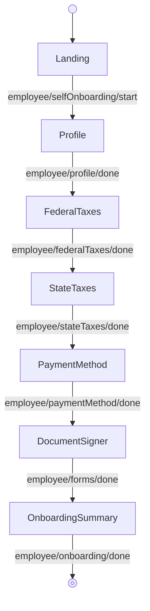

---
# Autogenerated by TypeDoc from TSDoc comments in the source code.
# To update content: edit TSDoc comments in src/.
# To update structure: edit docs-site/typedoc.config.ts or docs-site/plugins/typedoc-custom/.
# Then run `npm run docs:api:generate` to regenerate.
title: SelfOnboardingFlow
description: SelfOnboardingFlow reference.
sidebar_position: 2
generated_by: typedoc
custom_edit_url: null
---

# SelfOnboardingFlow

Guided flow for employees to complete their own onboarding.

## Remarks

Hands the employee responsibility for submitting their own profile, tax, payment, and document-signing information. Drives a multi-step flow keyed to the employee being self-onboarded; when `withEmployeeI9` is enabled, the Document Signer step checks whether the employee has I-9 enabled and, if so, routes them through the employment-eligibility form before presenting the I-9 form alongside other required documents.

Each step is also exported as a standalone block (see the Blocks table) for composing a custom workflow when this orchestration is the wrong fit.

The flow forwards every event emitted by its blocks to `onEvent`; see the events table on each block for the full set of events and payloads observable from this flow.

## Example

```tsx title="App.tsx"
import { EmployeeOnboarding, type EventType } from '@gusto/embedded-react-sdk'

function MyApp() {
  return (
    <EmployeeOnboarding.SelfOnboardingFlow
      companyId="a007e1ab-3595-43c2-ab4b-af7a5af2e365"
      employeeId="4b3f930f-82cd-48a8-b797-798686e12e5e"
      withEmployeeI9
      onEvent={(eventType: EventType) => {
        if (eventType === 'employee/onboarding/done') {
          // Onboarding complete — navigate to your next screen
        }
      }}
    />
  )
}
```

## SelfOnboardingFlowProps

<a id="selfonboardingflowprops"></a>

Props for SelfOnboardingFlow.

| Property | Type | Description |
| ------ | ------ | ------ |
| `companyId` | `string` | The associated company identifier. |
| `employeeId` | `string` | The associated employee identifier. |
| `onEvent` | [`OnEventType`](../../events.md#oneventtype)\<[`EventType`](../../events.md#eventtype), `unknown`\> | Callback invoked each time the component emits an event — user interactions, successful API responses, step transitions, or errors. Receives the event type constant and an optional payload whose shape varies by event. See the [Event Handling guide](https://docs.gusto.com/embedded-payroll/docs/event-handling) and each component's event table for the full list of emitted events. |
| `withEmployeeI9?` | `boolean` | When true, the Document Signer step checks if the employee has I-9 enabled and routes to the Employment Eligibility and I-9 signature form steps. Defaults to `false`. |

_Inherits `children`, `className`, `defaultValues`, `dictionary`, `FallbackComponent`, `LoaderComponent` from [BaseComponentInterface](../../index.md#basecomponentinterface)._

## Sub-components

| Component | Description |
| ------ | ------ |
| [Landing](blocks.md#landing) | Landing page for the employee self-onboarding flow. Displays a welcome message and the list of onboarding steps the employee needs to complete. |
| [Profile](blocks.md#profile) | Onboarding step for collecting an employee's basic profile and addresses. |
| [FederalTaxes](blocks.md#federaltaxes) | Onboarding step for collecting an employee's federal tax (W-4) withholdings — filing status, multiple-jobs flag, dependents, other income, deductions, and extra withholding. |
| [StateTaxes](blocks.md#statetaxes) | Onboarding step that collects an employee's per-state tax withholding answers. The set of fields is driven by the API response for each state on record. |
| [PaymentMethod](blocks.md#paymentmethod) | Onboarding step for setting up an employee's payment method. |
| [DocumentSigner](blocks.md#documentsigner) | Onboarding step for signing employee documents. |
| [OnboardingSummary](blocks.md#onboardingsummary) | Displays a summary of an employee's onboarding status, listing completed and outstanding steps. Rendered as a standalone step inside `OnboardingFlow`. |

<!-- guide-source: src/components/Employee/SelfOnboardingFlow/GUIDE.md (slot: appendix) -->
## Step flow

The employee completes their own onboarding, starting from the self-onboarding landing page.


<!-- /guide-source (slot: appendix) -->

## Endpoints

| Method | Path |
| --- | --- |
| GET | [`/v1/companies/:companyId`](https://docs.gusto.com/embedded-payroll/v2026-06-15/reference/get-v1-companies) |
| POST | [`/v1/companies/:companyId/employees`](https://docs.gusto.com/embedded-payroll/v2026-06-15/reference/post-v1-employees) |
| GET | [`/v1/companies/:companyId/locations`](https://docs.gusto.com/embedded-payroll/v2026-06-15/reference/get-v1-companies-company_id-locations) |
| GET | [`/v1/employees/:employeeId`](https://docs.gusto.com/embedded-payroll/v2026-06-15/reference/get-v1-employees) |
| PUT | [`/v1/employees/:employeeId`](https://docs.gusto.com/embedded-payroll/v2026-06-15/reference/put-v1-employees) |
| GET | [`/v1/employees/:employeeId/forms`](https://docs.gusto.com/embedded-payroll/v2026-06-15/reference/get-v1-employee-forms) |
| GET | [`/v1/employees/:employeeId/forms/:formId`](https://docs.gusto.com/embedded-payroll/v2026-06-15/reference/get-v1-employee-form) |
| GET | [`/v1/employees/:employeeId/forms/:formId/pdf`](https://docs.gusto.com/embedded-payroll/v2026-06-15/reference/get-v1-employee-form-pdf) |
| PUT | [`/v1/employees/:employeeId/forms/:formId/sign`](https://docs.gusto.com/embedded-payroll/v2026-06-15/reference/put-v1-employee-form-sign) |
| GET | [`/v1/employees/:employeeId/home_addresses`](https://docs.gusto.com/embedded-payroll/v2026-06-15/reference/get-v1-employees-employee_id-home_addresses) |
| POST | [`/v1/employees/:employeeId/home_addresses`](https://docs.gusto.com/embedded-payroll/v2026-06-15/reference/post-v1-employees-employee_id-home_addresses) |
| GET | [`/v1/employees/:employeeId/i9_authorization`](https://docs.gusto.com/embedded-payroll/v2026-06-15/reference/get-v1-employees-employee_id-i9_authorization) |
| PUT | [`/v1/employees/:employeeId/i9_authorization`](https://docs.gusto.com/embedded-payroll/v2026-06-15/reference/put-v1-employees-employee_id-i9_authorization) |
| GET | [`/v1/employees/:employeeId/onboarding_status`](https://docs.gusto.com/embedded-payroll/v2026-06-15/reference/get-v1-employees-employee_id-onboarding_status) |
| PUT | [`/v1/employees/:employeeId/onboarding_status`](https://docs.gusto.com/embedded-payroll/v2026-06-15/reference/put-v1-employees-employee_id-onboarding_status) |
| GET | [`/v1/employees/:employeeId/work_addresses`](https://docs.gusto.com/embedded-payroll/v2026-06-15/reference/get-v1-employees-employee_id-work_addresses) |
| POST | [`/v1/employees/:employeeId/work_addresses`](https://docs.gusto.com/embedded-payroll/v2026-06-15/reference/post-v1-employees-employee_id-work_addresses) |
| GET | [`/v1/employees/:employeeUuid/federal_taxes`](https://docs.gusto.com/embedded-payroll/v2026-06-15/reference/get-v1-employees-employee_id-federal_taxes) |
| PUT | [`/v1/employees/:employeeUuid/federal_taxes`](https://docs.gusto.com/embedded-payroll/v2026-06-15/reference/put-v1-employees-employee_id-federal_taxes) |
| GET | [`/v1/employees/:employeeUuid/state_taxes`](https://docs.gusto.com/embedded-payroll/v2026-06-15/reference/get-v1-employees-employee_id-state_taxes) |
| PUT | [`/v1/employees/:employeeUuid/state_taxes`](https://docs.gusto.com/embedded-payroll/v2026-06-15/reference/put-v1-employees-employee_id-state_taxes) |
| GET | [`/v1/home_addresses/:homeAddressUuid`](https://docs.gusto.com/embedded-payroll/v2026-06-15/reference/get-v1-home_addresses-home_address_uuid) |
| PUT | [`/v1/home_addresses/:homeAddressUuid`](https://docs.gusto.com/embedded-payroll/v2026-06-15/reference/put-v1-home_addresses-home_address_uuid) |
| GET | [`/v1/work_addresses/:workAddressUuid`](https://docs.gusto.com/embedded-payroll/v2026-06-15/reference/get-v1-work_addresses-work_address_uuid) |
| PUT | [`/v1/work_addresses/:workAddressUuid`](https://docs.gusto.com/embedded-payroll/v2026-06-15/reference/put-v1-work_addresses-work_address_uuid) |
