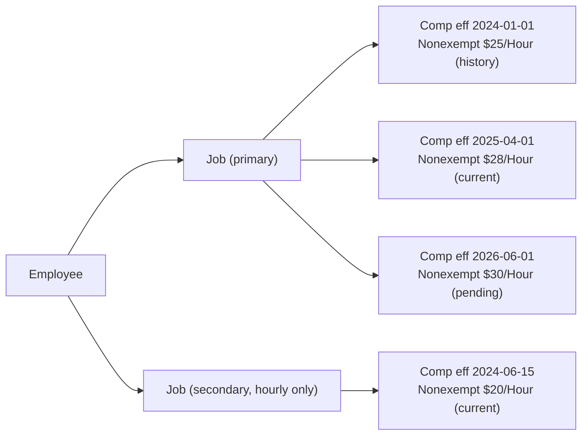
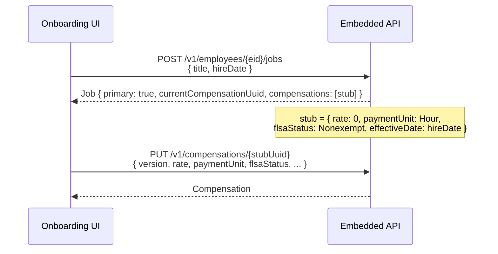

# Jobs & Compensations — Behavior Reference & Test Plan

A consolidated reference for the Embedded API's `Job` and `Compensation` resources, the lifecycle differences between **employee onboarding** and **employee management**, and the corresponding test plan derived from gws-flows' Employee Management Flow (EMF) and the underlying API/model rules.

All items in this doc are tied to verified behavior in:

- **`@gusto/embedded-api`** generated types (`JobsCreateRequestBody`, `JobsUpdateRequestBody`, `CompensationsRequestBody`, `CompensationsUpdateRequestBody`, `Job`, `Compensation`)
- **gws-flows** Rails controllers, Stimulus controllers, and ERB form views
- **zenpayroll** model code, validators, and partner facades (`JobFacade`, `CompensationFacade`)

Not from any made-up rules.

---

## 1. Mental model

A **Job** = "this employee holds this role at the company." Stable UUID, has a `title`, `hireDate`, `primary` flag, and a `currentCompensationUuid` pointer.

A **Compensation** = "while at this job, the employee was paid like this from `effectiveDate` forward." A Job has many compensations over time; the API exposes the active one as `currentCompensationUuid`. Active is whichever row's `effectiveDate <= today` is the latest.



Key consequences:

- **Title** lives conceptually on the Job but is mirrored onto each Compensation (and effective-dated via `EmployeeJobTitle`). Title-only changes mutate the Job.
- **Pay change** = a new Compensation row with a future `effectiveDate`. Don't overwrite history; insert.
- **Current** is computed (`EmployeeJob#current_compensation`) from latest `effective_date <= today`.
- **First job** is always `primary: true`; it cannot be deleted.
- **Secondary jobs** are only allowed when the primary's current FLSA is `Nonexempt` (hourly).

> **Implementation default**: when in doubt, **POST a new compensation with a future `effectiveDate`**. Only PUT the current compensation when (a) you're filling in the empty stub during onboarding, or (b) the documented `Nonexempt → non-Nonexempt with secondaries` carve-out applies. PUT-ing a compensation rewrites the row in place — including its `effective_date` — and there is **no server-side `compensation_processed_on_payroll?` check on update** (only on destroy). When in management, an unguarded PUT can silently rewrite history that has already been paid.

---

## 2. Endpoint reference

All hooks live under `@gusto/embedded-api/react-query/`. Mapping:

| HTTP / Path                                    | Purpose                                                        | React Query hook                                                                                   |
| ---------------------------------------------- | -------------------------------------------------------------- | -------------------------------------------------------------------------------------------------- |
| `GET /v1/employees/{employee_uuid}/jobs`       | List jobs. Optional `?include=all_compensations`.              | `useJobsAndCompensationsGetJobs(Suspense?)` — see `jobsAndCompensationsGetJobs.ts`.                |
| `POST /v1/employees/{employee_uuid}/jobs`      | Create job (auto-creates stub compensation).                   | `useJobsAndCompensationsCreateJobMutation` — `jobsAndCompensationsCreateJob.ts`.                   |
| `GET /v1/jobs/{job_uuid}`                      | Show job.                                                      | `useJobsAndCompensationsGetJob(Suspense?)`.                                                        |
| `PUT /v1/jobs/{job_uuid}`                      | Update job.                                                    | `useJobsAndCompensationsUpdateMutation` — `jobsAndCompensationsUpdate.ts`.                         |
| `DELETE /v1/jobs/{job_uuid}`                   | Delete a non-primary job (also subject to `ensure_deletable`). | `useJobsAndCompensationsDeleteMutation` — `jobsAndCompensationsDelete.ts`.                         |
| `GET /v1/jobs/{job_uuid}/compensations`        | List compensation history.                                     | `useJobsAndCompensationsGetCompensations(Suspense?)`.                                              |
| `POST /v1/jobs/{job_uuid}/compensations`       | Schedule a future-dated compensation (the "raise" call).       | `useJobsAndCompensationsCreateCompensationMutation` — `jobsAndCompensationsCreateCompensation.ts`. |
| `GET /v1/compensations/{compensation_uuid}`    | Show compensation.                                             | `useJobsAndCompensationsGetCompensation(Suspense?)`.                                               |
| `PUT /v1/compensations/{compensation_uuid}`    | Update an existing compensation row.                           | `useJobsAndCompensationsUpdateCompensationMutation` — `jobsAndCompensationsUpdateCompensation.ts`. |
| `DELETE /v1/compensations/{compensation_uuid}` | Delete an unprocessed compensation.                            | `useJobsAndCompensationsDeleteCompensationMutation` — `jobsAndCompensationsDeleteCompensation.ts`. |

Adjacent endpoint used in min-wage UI:

- `GET /v1/locations/{location_uuid}/minimum_wages` — feed for the minimum wage selector. SDK hook: `useLocationsGetMinimumWages(Suspense?)`.

---

## 2.5 Type contracts (copy-pasteable)

Strict string enums — case-sensitive, spaces matter:

```ts
type FlsaStatus =
  | 'Exempt'
  | 'Salaried Nonexempt'
  | 'Nonexempt'
  | 'Owner'
  | 'Commission Only Exempt'
  | 'Commission Only Nonexempt'

type PaymentUnit = 'Hour' | 'Week' | 'Month' | 'Year' | 'Paycheck'

type IsoDate = string // 'YYYY-MM-DD'
```

**Server-derived / response-only fields** (do NOT include in request bodies):

| Resource       | Read-only response fields                                                                                                                                                      |
| -------------- | ------------------------------------------------------------------------------------------------------------------------------------------------------------------------------ |
| `Job`          | `uuid`, `version`, `employeeUuid`, `primary`, `currentCompensationUuid`, `compensations[]`, `locationUuid`, `location`, `rate`, `paymentUnit` (denormalized from current comp) |
| `Compensation` | `uuid`, `version`, `jobUuid`, `employeeUuid`                                                                                                                                   |

**`version` round-trip**: every mutation response carries an updated `version`. Use that value as the `version` on the next mutation. On a 422 version-mismatch, refetch via `GET /v1/jobs/{jobUuid}?include=all_compensations` to recover the latest `version` for both the job and each compensation.

**Cascade behavior**:

- DELETE `/v1/jobs/{jobUuid}` cascades to its compensations and titles via `EmployeeJob#has_many :employee_job_compensations, dependent: :delete_all` and `:employee_job_titles, dependent: :delete_all`. Because the cascade uses `:delete_all` (not `:destroy`), the children's `before_destroy` validators (`cannot_destroy_the_only_compensation`, `cannot_destroy_the_latest_non_pending`, `compensation_processed_on_payroll?`) **do not** run. The parent job's own `before_destroy :ensure_deletable` is what gates the operation (see section 11).
- DELETE `/v1/compensations/{compUuid}` does NOT cascade (it just removes that one comp; subject to the three "cannot delete" guardrails in section 11, which run on the comp's own `before_destroy` callbacks).

---

## 3. Job request bodies

### Create — `JobsCreateRequestBody`

| Field                   | Type                  | Required | Notes                                                                                                |
| ----------------------- | --------------------- | -------- | ---------------------------------------------------------------------------------------------------- |
| `title`                 | `string \| null`      | Yes      | Display title on creation. Stored via `EmployeeJobTitle` effective from `hireDate`.                  |
| `hireDate`              | `string` (YYYY-MM-DD) | Yes      | Becomes both `Employment#hired_at` (when primary) and the auto-stub compensation's `effective_date`. |
| `twoPercentShareholder` | `boolean`             | No       | S-Corp 2% shareholder flag. Stored on `Employment`.                                                  |
| `stateWcCovered`        | `boolean \| null`     | No       | Only relevant when work address state is WA.                                                         |
| `stateWcClassCode`      | `string \| null`      | No       | Only relevant when `stateWcCovered: true` in WA.                                                     |

**Not in the create body:** `primary`, `locationUuid`, `currentCompensationUuid`, `effectiveDate`. Primary is decided server-side (first job = primary). Location is inherited from the employee's active work address. Compensation is created **implicitly as a stub** (`Nonexempt`, `0`, `Hour`, `effectiveDate = hireDate`) per `JobFacade#prepare_compensation` — the response includes `compensations: [stub]` and a populated `currentCompensationUuid`.

### Update — `JobsUpdateRequestBody`

| Field                   | Type              | Required | Notes                                                                                                                                                                           |
| ----------------------- | ----------------- | -------- | ------------------------------------------------------------------------------------------------------------------------------------------------------------------------------- |
| `version`               | `string`          | Yes      | Optimistic lock token.                                                                                                                                                          |
| `title`                 | `string \| null`  | No       | When sent, mutates current compensation's title in place via `JobFacade#update_current_compensation`. Rewrites `EmployeeJobTitle` from current comp's `effective_date` forward. |
| `hireDate`              | `string`          | No       | Updating only the primary job's hire_date affects `Employment#hired_at`.                                                                                                        |
| `twoPercentShareholder` | `boolean`         | No       | No effective-dating; immediate column mutation on `Employment`.                                                                                                                 |
| `stateWcCovered`        | `boolean \| null` | No       | No effective-dating; immediate column mutation on `EmployeeJob`.                                                                                                                |
| `stateWcClassCode`      | `string \| null`  | No       | No effective-dating; immediate column mutation on `EmployeeJob`.                                                                                                                |

### Read — `Job`

Adds read-only convenience fields: `uuid`, `version`, `employeeUuid`, `primary`, `rate`, `paymentUnit` (denormalized from current comp), `currentCompensationUuid`, `compensations[]`, `locationUuid`, `location`. Also returns `hireDate`, `title`, `twoPercentShareholder`, `stateWcCovered`, `stateWcClassCode` (all of which are also writable on create/update).

---

## 4. Compensation request bodies

### Create — `CompensationsRequestBody` (POST `/v1/jobs/{job_uuid}/compensations`)

| Field                  | Type              | Required                                              | Notes                                                                                                                                                        |
| ---------------------- | ----------------- | ----------------------------------------------------- | ------------------------------------------------------------------------------------------------------------------------------------------------------------ |
| `rate`                 | `string`          | Yes                                                   | Decimal as string.                                                                                                                                           |
| `paymentUnit`          | enum              | Yes                                                   | `Hour \| Week \| Month \| Year \| Paycheck`.                                                                                                                 |
| `flsaStatus`           | enum              | Yes                                                   | See FLSA section.                                                                                                                                            |
| `effectiveDate`        | `string`          | API-optional, **practically required** for management | If omitted on create, server defaults to `minimum_effective_date` (next unprocessed pay period) — **not** today. Must satisfy `min ≤ date ≤ today + 1 year`. |
| `title`                | `string`          | No                                                    | When set, schedules a title change to coincide with this comp's effective date.                                                                              |
| `adjustForMinimumWage` | `boolean`         | No                                                    | Only valid when `flsaStatus === 'Nonexempt'`.                                                                                                                |
| `minimumWages`         | `Array<{ uuid }>` | Required when `adjustForMinimumWage: true`            | UUIDs from `GET /v1/locations/{id}/minimum_wages`.                                                                                                           |

### Update — `CompensationsUpdateRequestBody` (PUT `/v1/compensations/{uuid}`)

| Field                                                                                                 | Type     | Required     | Notes                                     |
| ----------------------------------------------------------------------------------------------------- | -------- | ------------ | ----------------------------------------- |
| `version`                                                                                             | `string` | Yes          | Optimistic lock.                          |
| `rate`, `paymentUnit`, `flsaStatus`, `effectiveDate`, `title`, `adjustForMinimumWage`, `minimumWages` | various  | All optional | Partial update; omitted values preserved. |

**Title precedence on PUT compensation** (per `CompensationFacade#job_title`):

1. `parameters[:title]` if present.
2. `employee_job_compensation.title` (the existing record's title) if present.
3. `employee_job.current_title` (looked up from `EmployeeJobTitle`).

So omitting `title` keeps the comp's current title; sending `title: ''` is treated as missing in step 1 (presence check) and falls through, then re-trips the model's `validates :title, presence: true, if: -> { active? && !primary? }` for non-primary jobs.

**`effectiveDate` on PUT compensation**: `CompensationFacade#effective_date` returns `parameters[:effective_date]` if present, else (for new records) `minimum_effective_date`, else (for existing records) the row's current `effective_date`. The bounds validator (`effective_date_valid?`) only runs on `:create`, so a PUT can technically move an existing comp's `effective_date` to any value, including the past. Combined with the missing `compensation_processed_on_payroll?` check on `:update`, this is the silent-rewrite hazard called out below.

> **Risk:** PUT-ing the current comp **rewrites the row in place** including its `effective_date`-anchored history. There's no `compensation_processed_on_payroll?` validator on `:update` (only on `:destroy`), and `effective_date_valid?` is also `:create`-only. Use POST + future `effectiveDate` for any change to an employee with payroll history.

### Read — `Compensation`

Same fields plus `uuid`, `version`, `jobUuid`, `employeeUuid`. The `minimumWages` array returns `{ uuid, wage, effectiveDate }`.

---

## 5. FLSA × payment unit compatibility

Six valid `flsaStatus` values. The literal source-of-truth list lives in two places:

- gws-flows: `EmbeddedApiClient::Constants::Compensation::FSLA_STATUSES` (sic — `FSLA` is an actual typo in the gws-flows source; do not "fix" the spelling when grepping).
- zenpayroll: `EmployeeJobCompensation::FLSA_STATUSES` (correctly spelled), validated by `validates :flsa_status, presence: true, inclusion: { in: FLSA_STATUSES }`.

Both lists carry the same six string values:

- `Exempt` — salaried, no overtime
- `Salaried Nonexempt` — salaried + overtime
- `Nonexempt` — hourly + overtime
- `Owner` — owner's draw
- `Commission Only Exempt`
- `Commission Only Nonexempt`

Five valid `paymentUnit` values: `Hour | Week | Month | Year | Paycheck`.

| FLSA status                                            | Allowed `paymentUnit`                         | Other constraints                                                                                                                                                                                                     |
| ------------------------------------------------------ | --------------------------------------------- | --------------------------------------------------------------------------------------------------------------------------------------------------------------------------------------------------------------------- |
| `Exempt`                                               | `Hour \| Week \| Month \| Year`               | Yearly equivalent must be `≥ $35,568` (`FLSA_OVERTIME_SALARY_LIMIT`, `ExemptSalaryThresholdValidator`). The validator only fires for `Exempt` (and also short-circuits for commission-only statuses).                 |
| `Salaried Nonexempt`                                   | `Hour \| Week \| Month \| Year`               | No salary floor beyond the model's `payment_amount: numericality: { greater_than_or_equal_to: 0, less_than_or_equal_to: MAX_PAYMENT_AMOUNT }`. The SDK schema (`useCompensation.ts`) additionally rejects `rate < 1`. |
| `Nonexempt`                                            | `Hour \| Week \| Month \| Year`               | Real-world this is almost always `Hour`. **Only this status permits `adjustForMinimumWage: true`**. Same `rate ≥ 0` server / `rate ≥ 1` SDK rule.                                                                     |
| `Owner`                                                | **`Paycheck` only** (forced)                  | `before_validation :set_payment_unit_to_paycheck`. Server: `payment_amount ≥ 0`. SDK schema: `rate ≥ 1`. The Exempt threshold check does NOT run for Owner (`FLSAStatusHelpers.overtime_exempt?(Owner) == false`).    |
| `Commission Only Exempt` / `Commission Only Nonexempt` | **`Year` only**, **`rate = 0`** (both forced) | Per `Validators::CommissionOnly`. Historical artifact: pre-feature workaround was "salaried at $0/year."                                                                                                              |

> **Server vs SDK rate floor**: The zenpayroll model accepts `payment_amount: 0..MAX_PAYMENT_AMOUNT`. The SDK's `CompensationSchema` `superRefine` is stricter and surfaces a `rateMinimumError` when `rate < 1` for Exempt / Salaried Nonexempt / Nonexempt / Owner. Partners that bypass the SDK schema can submit `rate: "0"` to the API directly.

Additional structural rules:

- **Non-primary jobs** may only be `Nonexempt` or `Commission Only Nonexempt` (`validates :flsa_status, inclusion: { in: [FLSA_STATUS_NON_EXEMPT, FLSA_STATUS_COMMISSION_ONLY_NON_EXEMPT] }, unless: -> { primary? }` in `EmployeeJobCompensation`). gws-flows UI further restricts secondaries to `Nonexempt` only via the `_info_form.html.erb` `selected:` clause.
- **Adding a secondary job** is allowed only when the primary's current FLSA is `Nonexempt` (or `Unknown`). This is enforced in `JobFacade` by `validate :only_hourly_employees_can_have_multiple_jobs, if: -> { action == :create }`, which checks `employee.flsa_status_on(Time.zone.today)` against `[FLSA_STATUS_NON_EXEMPT, FLSA_STATUS_UNKNOWN]`. Note: this validation runs **only on create**, so it cannot be retroactively triggered by editing an existing job.
- **Switching primary from hourly to non-hourly** with active secondaries triggers `EmployeeJobCompensation`'s `before_validation :deactivate_other_jobs, if: -> { primary? && latest? && (switched_from_hourly? || pending_change_from_hourly?) }`, which auto-deactivates the secondaries on the comp save. There is also an `after_destroy :deactivate_other_jobs, if: -> { primary? && latest? && pending_change_to_hourly? }` for the destroy-a-pending-comp path.

**Annualization formula for the Exempt $35,568 floor** (matches SDK's `yearlyRate` helper in [src/helpers/payRateCalculator.ts](../../src/helpers/payRateCalculator.ts), constants in `src/shared/constants.ts`):

| `paymentUnit` | Annualized                                              |
| ------------- | ------------------------------------------------------- |
| `Hour`        | `rate × 2080`                                           |
| `Week`        | `rate × 52`                                             |
| `Month`       | `rate × 12`                                             |
| `Year`        | `rate × 1`                                              |
| `Paycheck`    | n/a (Owner only; Exempt threshold check does not apply) |

The denominator constants come from `HOURS_PER_PAY_PERIOD_ANNUALLY = 2080`, `_WEEKLY = 40`, `_MONTHLY = 173.333333`. The validator compares this annualized number against `FLSA_OVERTIME_SALARY_LIMIT = 35_568`.

---

## 6. Minimum wage adjustment

Only valid when **all three** are true (per `CompensationFacade#flsa_status_for_min_wage_adjustment` + `#location_is_unsupported_state_for_adjustment`). The validator runs on both `:create` and `:update`:

1. `flsaStatus === 'Nonexempt'` (strict — `Salaried Nonexempt` not eligible). Source: `FLSAStatusHelpers.hourly_non_exempt?(flsa_status)`. If false → `only_valid_for_flsa_status` error.
2. Employee has a work address with a state set on the comp's `effective_date`. If missing → `no_work_address` error: "Employee does not have a work address."
3. Work address state **NOT** in the unsupported tip-credit states list (`AK, CA, MN, NV, OR, WA`). If included → `not_supported_state` error.

The list of unsupported states is duplicated across the three repos — same content, different identifier in each:

| Repo                | Constant                                                                     |
| ------------------- | ---------------------------------------------------------------------------- |
| zenpayroll (server) | `FLSA_TIP_CREDIT_UNSUPPORTED_STATES`                                         |
| gws-flows           | `EmbeddedApiClient::Constants::Compensation::TIP_CREDITS_UNSUPPORTED_STATES` |
| embedded-react-sdk  | `TIP_CREDITS_UNSUPPORTED_STATES` (in `src/shared/constants.ts`)              |

Flow:

1. Fetch active work address → `locationUuid`.
2. `GET /v1/locations/{locationUuid}/minimum_wages` → array of `{ uuid, authority, wage, wage_type, effective_date, notes }`.
3. Render selector. On opt-in: send `adjustForMinimumWage: true` and `minimumWages: [{ uuid: <selected> }]`.
4. At payroll calc, Gusto inserts a "Minimum Wage Adjustment" earning if hourly pay falls below the chosen floor.

Both gws-flows and the SDK hide the section entirely when the FLSA or state condition fails.

---

## 7. Onboarding lifecycle



**Properties of onboarding:**

- Always **two API calls** per job (POST job + PUT compensation). Never POST `/v1/jobs/{id}/compensations` here.
- `effectiveDate` is **never sent** by the client; the stub keeps `effective_date = hireDate`.
- The PUT-on-stub pattern is safe because the stub has no payroll history.
- For each additional secondary job (only when primary FLSA is Nonexempt): same two-step pattern, plus the secondary's title is **required**.

---

## 8. Management lifecycle

```mermaid
sequenceDiagram
  participant UI as Management UI (gws-flows EMF)
  participant API as Embedded API

  rect rgb(60,60,60)
  Note over UI,API: Title-only, WC, or 2% shareholder change
  UI->>API: PUT /v1/jobs/{jobUuid}<br/>{ version, title? }
  API-->>UI: Job
  end

  rect rgb(60,60,60)
  Note over UI,API: Pay/title change with future effectiveDate (default path)
  UI->>API: POST /v1/jobs/{jobUuid}/compensations<br/>{ rate, paymentUnit, flsaStatus, effectiveDate, title? }
  API-->>UI: Compensation (becomes current on effectiveDate)
  end

  rect rgb(60,60,60)
  Note over UI,API: CARVE-OUT: primary FLSA Nonexempt → any non-Nonexempt with secondaries
  UI->>API: PUT /v1/jobs/{jobUuid} (only if title changed)<br/>{ version, title }
  UI->>API: PUT /v1/compensations/{currentUuid}<br/>{ version, flsaStatus, paymentUnit, rate, effectiveDate: today (server-injected) }
  Note over API: Server runs deactivate_other_jobs callback on the comp save
  end

  rect rgb(60,60,60)
  Note over UI,API: Cancel a scheduled future compensation
  UI->>API: DELETE /v1/compensations/{futureUuid}
  end

  rect rgb(60,60,60)
  Note over UI,API: Add a new secondary job (only when primary is Nonexempt)
  UI->>API: POST /v1/employees/{eid}/jobs<br/>{ title, hireDate }
  UI->>API: PUT /v1/compensations/{newStubUuid}<br/>{ version, rate, paymentUnit, flsaStatus: Nonexempt, ... }
  end
```



**The three update paths in gws-flows' `Company::EmployeeManagement::CompensationsController#update`:**

| Path      | Trigger                                                                                                         | API call                                              |
| --------- | --------------------------------------------------------------------------------------------------------------- | ----------------------------------------------------- |
| Default   | `creating_compensation && has_effective_date`                                                                   | POST new compensation                                 |
| Carve-out | `creating_compensation && !has_effective_date` AND `changing_from_hourly_to_non_hourly? && has_secondary_jobs?` | PUT current compensation with `effective_date: today` |
| Job-only  | `!creating_compensation` (no compensation params)                                                               | PUT job                                               |

**Exact carve-out trigger condition** (both client and server agree):

- Client (`compensation_edit_controller.js:86-90`):
  ```js
  isPrimaryJobValue &&
    secondaryJobsCountValue > 0 &&
    originalValues.flsa_status === 'Nonexempt' &&
    currentValues.flsa_status !== 'Nonexempt'
  ```
- Server (`compensations_controller.rb:377-385`): `current_flsa == 'Nonexempt' && new_flsa != 'Nonexempt'` AND `has_secondary_jobs?`.

So the trigger is **`Nonexempt → any non-Nonexempt`** — including Owner, Commission Only Exempt, Commission Only Nonexempt, Exempt, and Salaried Nonexempt. Not just "salaried."

**The carve-out's UX** (`compensation_edit_controller.js`):

- The form's `effectiveDate` field is rendered, **required** (`min: Date.tomorrow`) by default.
- When the user switches FLSA in a way that triggers `isChangingToSalariedWithSecondaryJobs`:
  - Warning panel appears: "secondary jobs will be deleted."
  - Field label changes to **"Effective date (Change will be immediate)"**.
  - Field value is cleared and the input is disabled.
  - On submit, blank `effective_date` triggers the carve-out path.
- If the user reverts FLSA to Nonexempt, the field re-enables and the original date is restored.

**The carve-out's wire behavior** (`compensations_controller.rb:174-233`):

1. **Two API calls in sequence** when title also changed:
   1. PUT `/v1/jobs/{jobUuid}` with the new title (only when `job_params[:title].present?`).
   2. PUT `/v1/compensations/{currentUuid}` with `flsaStatus`, `paymentUnit`, `rate` (and any other comp fields).
2. **Client sends blank `effective_date`**; the gws-flows controller injects `Time.zone.today` server-side at line 212 (`comp_params[:effective_date] = helpers.format_y_m_d(Time.zone.today)`). This is **gws-flows behavior, not Embedded API behavior** — direct API consumers must include `effective_date: today` themselves to mutate the current compensation in place.
3. If the comp PUT succeeds, the model's `before_validation :deactivate_other_jobs` callback removes the secondary jobs.
4. If either PUT errors, gws-flows resets `@job.current_compensation = @original_compensation` (and `@job.title = @original_title` for the comp PUT branch) and re-renders the edit page.

> **SDK risk**: if the SDK reimplements this naively by sending `effective_date: today` from the client, it will hit the **default POST path** instead of the carve-out PUT path — creating a brand-new same-day compensation row rather than mutating the current one in place. Behaviorally similar today, but it bloats compensation history and could interact badly with payroll-already-processed checks on the current comp.

---

## 8.5 Worked payload examples

One canonical request body per scenario. All examples assume `Content-Type: application/json` and authenticated calls.

**Onboarding step 1 — POST `/v1/employees/{employeeUuid}/jobs`**

```jsonc
{
  "title": "Software Engineer",
  "hireDate": "2026-06-01",
  // Server response includes compensations: [{ uuid, rate: "0", paymentUnit: "Hour", flsaStatus: "Nonexempt", effectiveDate: "2026-06-01", version: ... }]
}
```

**Onboarding step 2 — PUT `/v1/compensations/{stubUuid}`** (fill in the auto-stub):

```jsonc
{
  "version": "<from POST job response>",
  "rate": "120000",
  "paymentUnit": "Year",
  "flsaStatus": "Exempt",
  // Title is NOT sent — already set on the stub from POST job
  // effectiveDate is NOT sent — preserved at hireDate
}
```

**Management default path — POST `/v1/jobs/{jobUuid}/compensations`** (the "raise" call):

```jsonc
{
  "rate": "135000",
  "paymentUnit": "Year",
  "flsaStatus": "Exempt",
  "effectiveDate": "2026-07-01",
  "title": "Senior Software Engineer", // Optional — bundles title change with the raise
}
```

**Management job-only path — PUT `/v1/jobs/{jobUuid}`** (title only, 2% shareholder, WC fields):

```jsonc
{
  "version": "<from latest job GET>",
  "title": "Staff Software Engineer",
  "twoPercentShareholder": false,
  "stateWcCovered": true,
  "stateWcClassCode": "5301-00",
}
```

**Management carve-out — two calls** (Nonexempt → non-Nonexempt with secondaries):

```jsonc
// Call 1 (only if title also changed): PUT /v1/jobs/{jobUuid}
{
  "version": "<from latest job GET>",
  "title": "Engineering Manager"
}

// Call 2: PUT /v1/compensations/{currentCompensationUuid}
{
  "version": "<from latest comp GET, refreshed if call 1 ran>",
  "flsaStatus": "Exempt",
  "paymentUnit": "Year",
  "rate": "150000",
  "effectiveDate": "<today, e.g. 2026-05-05>"
  // Direct API consumers MUST send effective_date: today.
  // The "blank means today" behavior is gws-flows-only (see section 11).
}
```

**Add secondary job — two calls** (only when primary's current FLSA is `Nonexempt`):

```jsonc
// Call 1: POST /v1/employees/{employeeUuid}/jobs
{
  "title": "Weekend Cashier", // Required for non-primary
  "hireDate": "2026-06-01"
}

// Call 2: PUT /v1/compensations/{newStubUuid}
{
  "version": "<from POST job response>",
  "rate": "20",
  "paymentUnit": "Hour",
  "flsaStatus": "Nonexempt"
  // adjustForMinimumWage / minimumWages may also be sent if applicable
}
```

**Cancel a pending compensation — DELETE `/v1/compensations/{futureCompUuid}`** (no body).

**Min-wage opt-in — POST or PUT compensation with `adjustForMinimumWage: true`**:

```jsonc
{
  // ...other fields per path...
  "adjustForMinimumWage": true,
  "minimumWages": [{ "uuid": "<from GET /v1/locations/{locationUuid}/minimum_wages>" }],
}
```

**Min-wage opt-out — PUT compensation with `adjustForMinimumWage: false`**:

```jsonc
{
  "version": "<latest>",
  "adjustForMinimumWage": false,
  "minimumWages": [], // Send empty array to clear the prior selection
}
```

---

## 9. Job-level vs compensation-level fields (effective dating asymmetry)

| Field                                   | Lives on                                                                          | Effective dated?                |
| --------------------------------------- | --------------------------------------------------------------------------------- | ------------------------------- |
| `rate`, `paymentUnit`, `flsaStatus`     | `EmployeeJobCompensation`                                                         | Yes — POST new comp to schedule |
| `title`                                 | `EmployeeJobTitle` (effective-dated table); mirrored on `EmployeeJobCompensation` | Yes                             |
| `hireDate`                              | `Employment#hired_at` (primary only)                                              | No (mutates)                    |
| `twoPercentShareholder`                 | `Employment`                                                                      | No (mutates immediately)        |
| `stateWcCovered`                        | `EmployeeJob`                                                                     | No (mutates immediately)        |
| `stateWcClassCode`                      | `EmployeeJob`                                                                     | No (mutates immediately)        |
| `adjustForMinimumWage` / `minimumWages` | `EmployeeJobCompensation` (effective-dated)                                       | Yes                             |

**Implication for UX**: a single "edit compensation" form mixes effective-dated fields with non-effective-dated fields. gws-flows handles this by:

- Allowing a "job-only" edit (no compensation params present) to PUT just the job.
- Requiring future `effectiveDate` when any compensation field changes — except in the documented carve-out.

---

## 9.5 SDK approach: match gws-flows' compensation-change pattern

For employee-management compensation changes, the SDK adopts gws-flows' implementation as-is. Reasons documented elsewhere (§4 risk callouts, §8 carve-out, §11 guardrails) make POST-future the safe default and PUT-current acceptable only in the specific paths gws-flows has already worked out.

**Date picker bounds (management/edit flow)**:

- `min`: `today + 1 day` (matches `_info_form.html.erb` L164: `min: emf_layout ? Date.tomorrow : nil`).
- `max`: no client-side max — let the server's create-time `effective_date_valid?` validator return the 422 if the user picks beyond its accepted range. gws-flows sets `max: Gwsflows::MAX_DATE = '9999-12-31'` (`config/initializers/01_constants.rb` L12), which is effectively unbounded.

**Verb selection**:

| Path                                                                          | Verb                     | `effectiveDate`           | Source                                                                         |
| ----------------------------------------------------------------------------- | ------------------------ | ------------------------- | ------------------------------------------------------------------------------ |
| Carve-out: primary FLSA `Nonexempt` → non-`Nonexempt` with active secondaries | PUT current compensation | `today` (server-injected) | `compensations_controller.rb` L212 + `compensation_edit_controller.js` L86-111 |
| Onboarding: fill the empty stub created at job creation                       | PUT current compensation | omit (keeps `hireDate`)   | `JobFacade#prepare_compensation` (server stub)                                 |
| Any other compensation change                                                 | POST new compensation    | user-selected future date | `compensations_controller.rb#create` + `JobFacade` two-call pattern            |

**Carve-out UX in the SDK**: gws-flows' approach is to clear and disable the effective-date field on the carve-out branch (`compensation_edit_controller.js` L93-111) and re-label it `Effective date (Change will be immediate)`. The SDK should mirror this exactly. We are not changing the verb, the date-injection, or the field-disable behavior.

> **Note on TPO-27036**: there is an open ticket reporting customer pain around the date-field-disappearance UX in a different Gusto.com surface. The API itself has no FLSA-related date restriction, so the gws-flows pattern we're matching is implementing a UX-layer rule that isn't an API correctness requirement. We are not addressing that ticket in the SDK; we are matching the established flows behavior.

> **SDK roadmap context**: the [Steady-State-Management PRD](https://docs.google.com/document/d/10IY_m6F8l7j1BJ9_OjNc28I3BsNdIg4j6kGo_vHteio) flags effective-date editing/cancellation as a P0 milestone-1 deliverable. The current `useCompensationForm` (PUT-only, no date field exposed) does not yet match the flows pattern described here. Section 13 tracks the implementation work.

---

## 10. Title handling — four lenses on one timeline

| API call                                           | Effective from                        | Result                                                                                                                  |
| -------------------------------------------------- | ------------------------------------- | ----------------------------------------------------------------------------------------------------------------------- |
| POST job (with `title`)                            | `hireDate`                            | Initial title record created via auto-stub.                                                                             |
| PUT job (with `title`)                             | `current_compensation.effective_date` | Title timeline rewritten from that date forward (`JobFacade#update_current_compensation` mutates current comp's title). |
| POST compensation (with `title` + `effectiveDate`) | The provided future date              | New title record scheduled at that date.                                                                                |
| PUT compensation (with `title`)                    | That comp's `effective_date`          | Title in that effective period overwritten.                                                                             |

`EmployeeJobCompensation#after_save :update_job_titles` propagates the title to `EmployeeJobTitle` records via `JobTitles.assign_title`. Title-related model rules:

- `validates :title, presence: true, if: -> { active? && !primary? }` — non-primary jobs require a title on each compensation.
- `validate :title_is_unique` — title must be unique across an employee's active compensations.

---

## 11. Validations & guardrails (summary)

- **Optimistic locking**: every PUT requires the latest `version` from a fresh GET. Stale `version` → 422. The server uses `validate_current_version` on both `JobFacade` and `CompensationFacade`. `JobFacade#update` additionally wraps the operation in a per-employee MySQL advisory lock (`with_employee_job_lock`, `GET_LOCK` with a 5-second timeout) to serialize concurrent job creates/updates; if the lock can't be acquired the API responds with a `LockedResource` error.
- **One pending future compensation per job**: `CompensationFacade#one_pending_compensation?` rejects creating a second future-dated row when the latest persisted comp already has `effective_date > today`. Runs only on `action == :create` (POST `/v1/jobs/{id}/compensations`).
- **Effective date bounds (on create only)**: `minimum_effective_date ≤ effective_date ≤ today + 1 year` per `CompensationFacade#effective_date_valid?, if: -> { action == :create }`. Updates skip this check entirely — see the management risk callout in section 4.
- **Cannot delete a job — `EmployeeJob#ensure_deletable`**: a job can only be deleted (`destroy`, otherwise the model falls back to `deactivate` via `destroy_or_deactivate`) when ALL of the following are true:
  1. `!primary` (cannot delete the primary job).
  2. The job has not been processed on payroll (`PayrollCoreData::PayApi::HourlyWages.processed_for_employee_job?`).
  3. The job has no time-tracking shifts (`TimeTracking::Api::ShiftChecker.check_for_shifts_with_job_id`).
  4. The job has no scheduled shifts (`Scheduling::ScheduleShifts.check_for_shifts_with_job_uuid`).

  If any check fails, the job is `deactivate`d (soft delete) instead of destroyed. (When destroyed via cascade from `Employee`, the destroy is allowed unconditionally — `destroyed_by_association&.active_record == Employee`.)

- **Cannot delete the only compensation**: `cannot_destroy_the_only_compensation`. Only fires on `:destroy`, and only when the comp is destroyed directly (not via `EmployeeJob` cascade — the cascade uses `:delete_all` and bypasses these callbacks).
- **Cannot delete the latest non-pending compensation**: `cannot_destroy_the_latest_non_pending`. Same destroy-direct-only caveat.
- **Compensation processed on payroll**: `compensation_processed_on_payroll?` validator runs **only on `:destroy`** in `CompensationFacade`. There is no equivalent on `:update` — see the management risk callout in section 4.
- **Owner forces `paymentUnit: 'Paycheck'`** via `before_validation :set_payment_unit_to_paycheck, if: -> { owners_draw? }`.
- **Commission Only forces `paymentUnit: 'Year'` and `rate: '0'`** per `Validators::CommissionOnly`.
- **Non-primary jobs**: FLSA limited to `Nonexempt` or `Commission Only Nonexempt` (UI further restricts to `Nonexempt`).
- **Multi-job invariant**: secondaries only allowed when primary's current FLSA is `Nonexempt` or `Unknown`, enforced by `JobFacade`'s `only_hourly_employees_can_have_multiple_jobs` validator (runs on `action == :create` only). Switching primary away from `Nonexempt` runs the comp model's `before_validation :deactivate_other_jobs` callback.
- **Title preservation on omitted `title`**: `CompensationFacade#job_title` resolves missing `title` parameters by falling back to (a) the existing comp's title if it has one, then (b) `employee_job.current_title`. Sending `title: ''` is treated as "missing" (presence check fails) and falls through to the existing record's title. To actually clear a title, sending an empty string will trigger the model's `validates :title, presence: true, if: -> { active? && !primary? }` for non-primary comps.
- **Exempt salary threshold**: yearly equivalent must be ≥ `$35,568` (`FLSA_OVERTIME_SALARY_LIMIT`). Validator skips when FLSA is not `Exempt` (via `overtime_exempt?`) or when the status is commission-only — so in practice it only ever fires for `Exempt`.
- **Min-wage adjustment**: only when `Nonexempt`, has work address, and state ∉ `{AK, CA, MN, NV, OR, WA}`.
- **Carve-out `effective_date` injection is gws-flows-only**: the immediate-change branch is achieved by gws-flows' controller injecting `Time.zone.today` into the request before calling the API. The Embedded API itself does not have a "blank effective_date means today" affordance — direct API consumers must explicitly send `effective_date: today` (and target the current compensation via PUT, not POST) to replicate the in-place mutation.
- **Server normalizes `flsa_status: nil` to `Nonexempt`** (`compensation_params` lines 325-326 in gws-flows). This is gws-flows behavior; the Embedded API itself does NOT default `flsa_status` — `validates :flsa_status, presence: true` will reject nil. Partners hitting the API directly should always send an explicit `flsaStatus`.

---

## 11.5 Error catalog

Every observed error from the Embedded API + gws-flows pre-API checks. "Layer = client" means gws-flows rejects the form before any API call; SDK consumers must do the equivalent guard themselves.

| Error key / type                     | Trigger                                                                                                 | HTTP | Layer  | Field path                | Source                                                                                                                                                                                             |
| ------------------------------------ | ------------------------------------------------------------------------------------------------------- | ---- | ------ | ------------------------- | -------------------------------------------------------------------------------------------------------------------------------------------------------------------------------------------------- |
| Version mismatch                     | Stale `version` on PUT job/comp or POST comp                                                            | 422  | API    | top-level                 | Optimistic locking                                                                                                                                                                                 |
| `pending_change`                     | POST/PUT comp creates a 2nd future-dated row when the latest already has `effective_date > today`       | 422  | API    | `job_id`                  | `CompensationFacade#one_pending_compensation?`                                                                                                                                                     |
| `future_date_required`               | comp with `effective_date <= today` outside the carve-out                                               | 422  | client | `effective_date`          | gws-flows controller pre-API check                                                                                                                                                                 |
| `effective_date` out of bounds       | `effective_date > today + 1 year` or `< minimum_effective_date`                                         | 422  | API    | `effective_date`          | `CompensationFacade#effective_date_valid?`                                                                                                                                                         |
| `only_valid_for_flsa_status`         | `adjustForMinimumWage: true` with any FLSA other than `Nonexempt`                                       | 422  | API    | `adjust_for_minimum_wage` | `CompensationFacade#flsa_status_for_min_wage_adjustment`                                                                                                                                           |
| `not_supported_state`                | `adjustForMinimumWage: true` for work address in `{AK, CA, MN, NV, OR, WA}`                             | 422  | API    | `adjust_for_minimum_wage` | `CompensationFacade#location_is_unsupported_state_for_adjustment`                                                                                                                                  |
| `compensation_processed_on_payroll?` | DELETE comp that has been included in a processed payroll                                               | 422  | API    | base                      | `EmployeeJobCompensation` model (`:destroy` only)                                                                                                                                                  |
| Owner unit mismatch                  | FLSA `Owner` with `paymentUnit != 'Paycheck'`                                                           | 422  | API    | `payment_unit`            | `before_validation :set_payment_unit_to_paycheck` (auto-corrects); explicit error if conflict                                                                                                      |
| Commission Only mismatch             | FLSA `Commission Only *` with `rate != 0` or `paymentUnit != 'Year'`                                    | 422  | API    | `flsa_status`             | `Validators::CommissionOnly`                                                                                                                                                                       |
| Title required (non-primary)         | Active non-primary comp without `title`                                                                 | 422  | API    | `title`                   | `EmployeeJobCompensation` `validates :title, presence: true, if: !primary?`                                                                                                                        |
| Title not unique                     | Title duplicates another active comp's title for the same employee                                      | 422  | API    | `title`                   | `EmployeeJobCompensation#title_is_unique`                                                                                                                                                          |
| State WC unsupported                 | `stateWcCovered: true` for an employee whose work address state is not state-run WC (currently only WA) | 422  | API    | `state_wc_covered`        | `JobFacade#run_employee_job_validations` ("Field is not supported for this employee's work state")                                                                                                 |
| `cannot_destroy_job`                 | DELETE on a job that is primary, has been processed on payroll, or has time-tracking/scheduled shifts   | 422  | API    | base                      | `EmployeeJob#ensure_deletable` `before_destroy`. Falls through to `deactivate` when blocked, surfacing a 200 with the job marked inactive in some flows; the partners API returns the model error. |
| `cannot_destroy_only_compensation`   | DELETE the sole comp on a job                                                                           | 422  | API    | base                      | `EmployeeJobCompensation#cannot_destroy_the_only_compensation`                                                                                                                                     |
| `cannot_destroy_active_compensation` | DELETE the latest non-pending comp                                                                      | 422  | API    | base                      | `EmployeeJobCompensation#cannot_destroy_the_latest_non_pending` (i18n key resolves to "Cannot destroy this compensation: It is the currently active compensation for this Employee Job.")          |
| Exempt below threshold               | FLSA `Exempt` with annualized rate `< $35,568`                                                          | 422  | API    | base / `payment_amount`   | `ExemptSalaryThresholdValidator` (constant `FLSA_OVERTIME_SALARY_LIMIT`). Skipped for Owner because `FLSAStatusHelpers.overtime_exempt?(Owner) == false`.                                          |
| Multi-jobs not allowed               | POST job for an employee whose primary's current FLSA is not `Nonexempt` (and not `Unknown`)            | 422  | API    | base                      | `JobFacade` `validate :only_hourly_employees_can_have_multiple_jobs, if: -> { action == :create }`                                                                                                 |
| `LockedResource`                     | Concurrent POST/PUT job for the same employee while another job operation holds the advisory lock       | 423  | API    | top-level                 | `JobFacade#with_employee_job_lock` (MySQL `GET_LOCK`, 5s timeout)                                                                                                                                  |
| `no_work_address`                    | `adjustForMinimumWage: true` with no work address resolved on the comp's effective date                 | 422  | API    | `adjust_for_minimum_wage` | `CompensationFacade#location_is_unsupported_state_for_adjustment`                                                                                                                                  |

**Version-recovery loop** (recommended client behavior on a 422 version mismatch):

1. Refetch via `GET /v1/jobs/{jobUuid}?include=all_compensations`.
2. Diff the local form state against the fresh server state to detect concurrent changes.
3. Either (a) auto-merge if no conflict, retrying with the new `version`, or (b) surface the conflict to the user with the option to discard or rebase.

## 11.6 Pre-flight UI conditions cheat sheet

A consolidated checklist for what the UI should gate before issuing calls or rendering controls. Citations refer to gws-flows / API source.

| Show / allow                                   | Only when                                                                                                           | Source                                                                                                    |
| ---------------------------------------------- | ------------------------------------------------------------------------------------------------------------------- | --------------------------------------------------------------------------------------------------------- |
| "Add another job" link                         | `primary.currentCompensation.flsaStatus === 'Nonexempt'` AND no future non-Nonexempt comp pending on primary        | `Company::EmployeeManagement::CompensationsController#new` + `employee_has_future_salaried_compensation?` |
| 2% shareholder checkbox                        | `company.taxPayerType === 'S-Corporation'`                                                                          | `show_two_percent_shareholder_checkbox?`                                                                  |
| WA workers' comp fields                        | `employee.workAddress.state === 'WA'`                                                                               | `_info_form.html.erb`                                                                                     |
| WA WC class code combobox                      | WA fields visible AND `stateWcCovered === true`                                                                     | gws-flows + SDK Edit form conditional                                                                     |
| Min-wage adjustment section                    | `flsaStatus === 'Nonexempt'` AND work address state ∉ `{AK, CA, MN, NV, OR, WA}`                                    | `job_form_controller.js` + `fetch_minimum_wages`                                                          |
| "View compensation history" link               | `job.compensations.length > 1`                                                                                      | gws-flows EMF Pay page                                                                                    |
| "Cancel pending change" alert                  | Any comp on a job has `effectiveDate > today`                                                                       | gws-flows EMF Pay page                                                                                    |
| "Remove" link on a job                         | `!job.primary` (UI gate). Server additionally blocks if processed on payroll or has time-tracking/scheduled shifts. | `EmployeeJob#ensure_deletable` `before_destroy`                                                           |
| FLSA dropdown enabled (vs forced to Nonexempt) | Editing a primary job AND not creating a new job (`submit_method != :post && job.primary`)                          | `_info_form.html.erb`                                                                                     |
| `paymentUnit` dropdown enabled                 | FLSA NOT in `{Owner, Commission Only Exempt, Commission Only Nonexempt}`                                            | `compensation_edit_controller.js#setPaymentUnitByFlsaStatus`                                              |
| `rate` input enabled                           | FLSA NOT in `{Commission Only Exempt, Commission Only Nonexempt}`                                                   | `compensation_edit_controller.js#setPaymentUnitByFlsaStatus`                                              |
| `effectiveDate` field required                 | Default management path (i.e. compensation fields changed AND not in carve-out)                                     | `compensations_controller#update` rejection branch                                                        |
| `effectiveDate` field disabled (carve-out)     | Primary AND has secondaries AND original FLSA `Nonexempt` AND new FLSA `!= 'Nonexempt'`                             | `compensation_edit_controller.js#isChangingToSalariedWithSecondaryJobs`                                   |

---

## 11.7 Edge-case behaviors gws-flows handles (replicate in SDK consumers)

These are not server-enforced rules — they're UX-layer guards in gws-flows that prevent invalid states from ever reaching the API. SDK consumers building their own forms need to replicate them, or risk surfacing confusing API errors (or silent data corruption) that gws-flows users never see.

### EC-01 Pre-API redirect when entering "add new job" on a non-Nonexempt primary

`Company::EmployeeManagement::CompensationsController#new` (gws-flows L32-35) redirects with `flash[:error]` whenever `@employee.primary_job.current_compensation.flsa_status != 'Nonexempt'`. This runs before any form is rendered, so the partner never even gets to attempt a `POST /v1/employees/{eid}/jobs` that would be rejected by `JobFacade#only_hourly_employees_can_have_multiple_jobs`. A second guard (L38-41) also redirects when `creating_secondary_job? && employee_has_future_salaried_compensation?` — i.e. the primary is currently Nonexempt but has a future-dated comp that flips it to non-Nonexempt before the new secondary's effective date.

**SDK guidance:** Hide the "Add another job" CTA when either condition is true; if reached programmatically, short-circuit and show a friendly message rather than letting the API 422 bubble up.

### EC-02 Effective date field cleared and disabled when carve-out triggers mid-form

`compensation_edit_controller.js` L93-111: when the user changes a primary job's FLSA from `Nonexempt` to anything else AND the employee has secondary jobs, the controller (a) shows a "delete jobs" warning panel, (b) re-labels the effective date input to `Effective date (Change will be immediate)`, (c) **clears** the field's value, and (d) **disables** it. The form then submits with a blank `effective_date`, which `compensations_controller#update` (L212) substitutes with `Time.zone.today` before calling the API.

**SDK guidance:** Detect the same trigger conditions (`isPrimaryJobValue && secondaryJobsCountValue > 0 && originalFlsa === 'Nonexempt' && newFlsa !== 'Nonexempt'`), then on the SDK side either (a) inject `effectiveDate: today` and PUT the current compensation, or (b) deliberately mirror gws-flows' UX of disabling the field. Do **not** allow the user to pick an arbitrary future date in this branch — gws-flows treats the carve-out as an immediate change by definition.

### EC-03 Effective date restored on FLSA revert mid-form

`compensation_edit_controller.js` L117-120: if the user toggles FLSA away from `Nonexempt` (triggering EC-02's clear+disable) and then **toggles back** to `Nonexempt` before submitting, the controller re-enables the field and **restores `originalValues.effective_date`** rather than leaving it empty. Without this, a user who explored the carve-out path and changed their mind would have to manually re-enter their effective date.

**SDK guidance:** When tracking carve-out form state, snapshot the user's prior `effectiveDate` before clearing it, and restore on revert. A naive implementation that just disables/clears the field will leave users stranded.

### EC-04 Payment unit revert on FLSA change avoids cross-status traps

`compensation_edit_controller.js` L148-159 (within `setPaymentUnitByFlsaStatus`): when leaving Owner / Commission Only for a regular FLSA, if the current `paymentUnit` is `Year` or `Paycheck` and the **original** payment unit wasn't `Paycheck`, the controller reverts to the original unit. The Owner-was-original carve-out (`originalValues.payment_unit === 'Paycheck'`) skips the revert, so a user moving Owner → Salaried can pick `Year` legitimately. Symmetrically, if `rate === '0'` (a Commission Only artifact), it's restored to `originalValues.rate`.

**SDK guidance:** When auto-correcting payment unit on FLSA change, branch on `originalValues.payment_unit` to avoid trapping the user in a unit that's invalid for the new FLSA — and reset rate to its pre-Commission-Only value, not blank.

---

## 12. Test plan / UAC

Test plan rows are derived from gws-flows controller/view code, the API/model validators, or both. Each row cites its source. Existing items from the EMF UAC are preserved; additional items are derived from verified behavior surfaced during research.

### 12.1 View / navigation

| ID      | Persona  | Scenario                                             | Steps                                                                                                        | Expected                                                                                                                                                    | Source                                                                                  |
| ------- | -------- | ---------------------------------------------------- | ------------------------------------------------------------------------------------------------------------ | ----------------------------------------------------------------------------------------------------------------------------------------------------------- | --------------------------------------------------------------------------------------- |
| EMF-V01 | Employer | View employee's current compensation and job details | From the Employee Management index page, click an employee's name and navigate to the Pay page               | Then I see the payment methods section, primary job compensation details (type, job title, wage, effective date), and any additional jobs listed separately | Existing UAC                                                                            |
| EMF-V02 | Employer | View all historical compensations for a job          | From the Pay page, click "View compensation history" link (only visible when job has multiple compensations) | Then I see a table sorted by effective date (newest first), with badges indicating "Current" and "Upcoming" compensations                                   | Existing UAC                                                                            |
| EMF-V03 | Employer | Pending compensation alert visible                   | From the Pay page when a future-dated compensation exists on a job                                           | Then I see an info alert showing the upcoming compensation change, with a "Cancel change" link                                                              | Existing UAC + `compensations_controller#destroy` (deletes via `compensation_id` param) |

### 12.2 Edit job (no compensation change)

| ID      | Persona  | Scenario                                                         | Steps                                                                                                            | Expected                                                                                                                                  | Source                                                                   |
| ------- | -------- | ---------------------------------------------------------------- | ---------------------------------------------------------------------------------------------------------------- | ----------------------------------------------------------------------------------------------------------------------------------------- | ------------------------------------------------------------------------ |
| EMF-J01 | Employer | Set 2% shareholder status for S-Corp employee (no date required) | From Edit job page on primary job when company is S-Corp, ONLY change the 2% Shareholder checkbox                | The effective date field remains disabled; changes save immediately without requiring a future date                                       | Existing UAC + `compensations_controller#update` "Job-only" path         |
| EMF-J02 | Employer | 2% shareholder checkbox not shown for non-S-Corp                 | Open Edit job for any employee at a company whose `tax_payer_type !== 'S-Corporation'`                           | The 2% shareholder checkbox is not displayed                                                                                              | gws-flows `show_two_percent_shareholder_checkbox?`                       |
| EMF-J03 | Employer | WA workers' comp fields only shown for WA work addresses         | Open Edit job for an employee whose work address state is WA vs non-WA                                           | WA: state_wc_covered radio + state_wc_class_code combobox shown. Non-WA: not shown.                                                       | gws-flows `_info_form.html.erb` `if employee.work_address.state == 'WA'` |
| EMF-J04 | Employer | Update WC fields immediately (no effective date)                 | From Edit job page in WA, change `stateWcCovered` and/or `stateWcClassCode` without touching compensation fields | Effective date field stays disabled; PUT job is sent; changes take effect immediately                                                     | gws-flows "Job-only" path                                                |
| EMF-J05 | Employer | Update title only via job edit (no comp change)                  | Edit job, change only the `title`, leave compensation fields untouched                                           | PUT job with `title` is sent; mutates current compensation's title in place; rewrites EmployeeJobTitle from current comp's effective_date | `JobFacade#update_current_compensation`                                  |
| EMF-J06 | Employer | Stale version rejected                                           | Submit PUT job with an outdated `version` value                                                                  | API returns 422 with version-mismatch error                                                                                               | API optimistic locking                                                   |

### 12.3 Edit compensation (default future-dated path)

| ID      | Persona  | Scenario                                                            | Steps                                                                                                   | Expected                                                                                                                                       | Source                                                              |
| ------- | -------- | ------------------------------------------------------------------- | ------------------------------------------------------------------------------------------------------- | ---------------------------------------------------------------------------------------------------------------------------------------------- | ------------------------------------------------------------------- |
| EMF-C01 | Employer | Edit existing job title and compensation with future effective date | From the Pay page, click "Edit" on a job, modify the job title or compensation details                  | The effective date field becomes enabled, must enter a future date, after saving see an info alert showing the upcoming compensation change    | Existing UAC                                                        |
| EMF-C02 | Employer | Try to save compensation changes without future date                | Make changes to compensation and try to save without selecting a future effective date                  | Error: "You must provide a future effective date to save your changes"; changes not saved                                                      | Existing UAC + `compensations_controller#update` rejection          |
| EMF-C03 | Employer | Effective date must be tomorrow or later                            | Submit Edit compensation form with `effective_date <= today`                                            | UI validation rejects (`min: Date.tomorrow` on input); also server-side: `parsed_date <= Time.zone.today` returns `future_date_required` error | gws-flows `_info_form.html.erb` + `compensations_controller#update` |
| EMF-C04 | Employer | Effective date max one year out                                     | Attempt to enter `effective_date > today + 1 year`                                                      | Server `effective_date_valid?` validator rejects; UI `max: MAX_DATE` constrains                                                                | `CompensationFacade#effective_date_valid?`                          |
| EMF-C05 | Employer | Cancel a pending compensation change                                | From Pay page with upcoming compensation alert, click "Cancel change", confirm modal                    | DELETE compensation; flash confirms; future row removed                                                                                        | Existing UAC + `compensations_controller#destroy`                   |
| EMF-C06 | Employer | Only one pending compensation per job at a time                     | When the latest comp on a job has `effective_date > today`, attempt to POST another future compensation | API rejects via `one_pending_compensation?` validator                                                                                          | `CompensationFacade#one_pending_compensation?`                      |
| EMF-C07 | Employer | Bundled title + raise via single POST compensation                  | On Edit form, change both `title` and pay fields with a future `effective_date`                         | gws-flows merges `title` into compensation params; POST `/v1/jobs/:id/compensations` carries both                                              | `compensations_controller#update` lines 156-163                     |
| EMF-C08 | Employer | Stale `version` on POST/PUT compensation rejected                   | Submit POST `/v1/jobs/{id}/compensations` or PUT `/v1/compensations/{id}` with an outdated `version`    | API returns 422 with version-mismatch error; UI re-renders edit form with original values                                                      | API optimistic locking                                              |
| EMF-C09 | Employer | Server normalizes missing `flsa_status` to `Nonexempt`              | Submit compensation params with `flsa_status: nil` (gws-flows path)                                     | gws-flows sets `flsa_status = 'Nonexempt'` before POST/PUT; partner SDK consumers should always send an explicit value                         | `compensations_controller#compensation_params` lines 325-326        |

### 12.4 Carve-out: immediate change (Nonexempt → any non-Nonexempt with secondaries)

| ID      | Persona  | Scenario                                                                               | Steps                                                                                                                                                                     | Expected                                                                                                                                                                                                                                        | Source                                                                                                         |
| ------- | -------- | -------------------------------------------------------------------------------------- | ------------------------------------------------------------------------------------------------------------------------------------------------------------------------- | ----------------------------------------------------------------------------------------------------------------------------------------------------------------------------------------------------------------------------------------------- | -------------------------------------------------------------------------------------------------------------- |
| EMF-CO1 | Employer | Change primary job from hourly to salaried when employee has secondary jobs            | From Pay page with secondary jobs, edit primary job and change FLSA from "Paid by the hour" to any salaried type                                                          | Warning shows "secondary jobs will be deleted"; effective date field is cleared, disabled, and labeled "(Change will be immediate)"; on save: PUT current compensation with `effective_date: today`; secondary jobs are removed                 | Existing UAC + `compensation_edit_controller.js` + carve-out path                                              |
| EMF-CO2 | Employer | Reverting FLSA back to Nonexempt restores effective date field                         | After triggering carve-out, change FLSA selection back to Nonexempt                                                                                                       | Warning hides; effective date field re-enables with original date restored                                                                                                                                                                      | `compensation_edit_controller.js` `effectiveDateWasDisabled` branch                                            |
| EMF-CO3 | Employer | Carve-out only triggers when there are secondary jobs                                  | Edit primary FLSA from Nonexempt to salaried for an employee with NO secondary jobs                                                                                       | Carve-out does NOT trigger; effective date remains required (default path)                                                                                                                                                                      | `isChangingToSalariedWithSecondaryJobs` requires `secondaryJobsCountValue > 0`                                 |
| EMF-CO4 | Employer | Carve-out triggers for any non-Nonexempt FLSA, not just "salaried"                     | With secondary jobs present, edit primary and switch FLSA from Nonexempt to each of: Owner, Commission Only Exempt, Commission Only Nonexempt, Exempt, Salaried Nonexempt | Carve-out triggers for every non-Nonexempt target value (warning + disabled date field appear)                                                                                                                                                  | Server `changing_from_hourly_to_non_hourly?` (`current == 'Nonexempt' && new != 'Nonexempt'`) + client mirrors |
| EMF-CO5 | Employer | Carve-out is a two-call sequence; client must send blank `effective_date`              | In carve-out scenario, change `title` AND FLSA. Inspect network calls.                                                                                                    | (1) PUT `/v1/jobs/{jobUuid}` with new title (only when title changed). (2) PUT `/v1/compensations/{currentUuid}` with `flsaStatus`/`paymentUnit`/`rate`. Client sends blank `effective_date`; gws-flows controller injects `today` server-side. | `compensations_controller#update` lines 192-218; `comp_params[:effective_date] = ... Time.zone.today` line 212 |
| EMF-CO6 | Employer | Failed PUT in carve-out resets to original compensation/title and re-renders           | Force a 422 on either the job PUT or the comp PUT in the carve-out branch                                                                                                 | gws-flows resets `@job.current_compensation = @original_compensation` (and `@job.title = @original_title` for comp PUT) and re-renders edit page with the original values; user sees error flash                                                | `compensations_controller#update` lines 200-207 and 220-228                                                    |
| EMF-CO7 | Employer | Direct API consumers (no gws-flows): blank `effective_date` does NOT trigger carve-out | Hit the Embedded API directly: PUT `/v1/compensations/{currentUuid}` with no `effective_date` and a non-Nonexempt FLSA                                                    | API will not auto-inject `today`; partners must explicitly send `effective_date: today` and target the current compensation via PUT. Otherwise a same-day POST creates a new comp row instead of mutating the current one.                      | Embedded API has no "blank means today" affordance — gws-flows-only behavior; documented in section 11         |

### 12.5 Add secondary job

| ID      | Persona  | Scenario                                                              | Steps                                                                                                                                        | Expected                                                                                                                                          | Source                                                                            |
| ------- | -------- | --------------------------------------------------------------------- | -------------------------------------------------------------------------------------------------------------------------------------------- | ------------------------------------------------------------------------------------------------------------------------------------------------- | --------------------------------------------------------------------------------- |
| EMF-A01 | Employer | Add a secondary job for an hourly employee                            | From Pay page, click "Add another job" (only visible when primary job is "Paid by the hour"), fill out job details and compensation          | New job added to the list with "Additional job" label; employee can have multiple active jobs                                                     | Existing UAC                                                                      |
| EMF-A02 | Employer | Attempt to add job when primary is not hourly                         | From Pay page where primary job is salaried/exempt                                                                                           | Don't see the "Add another job" link; if accessing URL directly, redirect with error message about FLSA status requirement                        | Existing UAC + `compensations_controller#new`                                     |
| EMF-A03 | Employer | Attempt to add secondary job when future salaried compensation exists | From Pay page where primary job is the only job, is hourly, and has a pending future compensation change to salaried, try to add another job | Redirect with error message that secondary jobs cannot be added when future salaried compensation exists                                          | Existing UAC + `employee_has_future_salaried_compensation?`                       |
| EMF-A04 | Employer | Secondary job FLSA forced to Nonexempt                                | When adding a secondary job, the FLSA dropdown is disabled and forced to Nonexempt                                                           | The FLSA selector shows Nonexempt (disabled); cannot select any other status                                                                      | `_info_form.html.erb` `disabled: submit_method == :post \|\| !job.primary`        |
| EMF-A05 | Employer | Secondary job requires title                                          | Submit add-secondary-job form without a title                                                                                                | Server validation rejects: `title` required for non-primary                                                                                       | `EmployeeJobCompensation` model `validates :title, presence: true, if: !primary?` |
| EMF-A06 | Employer | Secondary job effective date required and must be future              | Submit add-secondary-job form with blank or past effective_date                                                                              | Reject with `future_date_required` error                                                                                                          | `compensations_controller#create`                                                 |
| EMF-A07 | Employer | Two-step API call when adding secondary job                           | Watch network: add a secondary job                                                                                                           | First call: POST `/v1/employees/{eid}/jobs` (auto-creates stub); second call: PUT `/v1/compensations/{stubUuid}` (fills in real values from form) | gws-flows `JobCreator` + `CompensationCreator`                                    |

### 12.6 Delete

| ID      | Persona  | Scenario                                          | Steps                                                                                                                                         | Expected                                                                                                                                                                                                                                         | Source                                     |
| ------- | -------- | ------------------------------------------------- | --------------------------------------------------------------------------------------------------------------------------------------------- | ------------------------------------------------------------------------------------------------------------------------------------------------------------------------------------------------------------------------------------------------ | ------------------------------------------ |
| EMF-D01 | Employer | Remove a secondary job from employee              | From Pay page with multiple jobs, click "Remove" link on an additional job (not available on primary job)                                     | Delete confirmation modal; after confirming, the job is removed from the list                                                                                                                                                                    | Existing UAC                               |
| EMF-D02 | Employer | Cannot delete primary or non-deletable jobs       | Verify "Remove" link is hidden on primary job; attempt API DELETE on primary, on a job with processed payroll, or on a job with active shifts | UI: link hidden for `primary`; API: rejected via model `before_destroy :ensure_deletable` (returns `cannot_destroy_job` error); for non-primary blocked jobs the model falls back to `deactivate` (sets `active = false`) rather than destroying | gws-flows + `EmployeeJob#ensure_deletable` |
| EMF-D03 | Employer | Cannot delete the only compensation               | Attempt to DELETE a compensation that is the sole compensation on its job                                                                     | API rejects via `cannot_destroy_the_only_compensation`                                                                                                                                                                                           | `EmployeeJobCompensation` model            |
| EMF-D04 | Employer | Cannot delete the latest non-pending compensation | Attempt to DELETE the current (most-recently-effective) compensation when there's no pending future row                                       | API rejects via `cannot_destroy_the_latest_non_pending`                                                                                                                                                                                          | `EmployeeJobCompensation` model            |

### 12.7 FLSA-driven field behavior

| ID      | Persona  | Scenario                               | Steps                                                                                        | Expected                                                                                                       | Source                                                                                                                     |
| ------- | -------- | -------------------------------------- | -------------------------------------------------------------------------------------------- | -------------------------------------------------------------------------------------------------------------- | -------------------------------------------------------------------------------------------------------------------------- |
| EMF-F01 | Employer | Owner forces payment unit to Paycheck  | Set FLSA to Owner                                                                            | `paymentUnit` auto-sets to `Paycheck` and is disabled; rate remains editable                                   | gws-flows `compensation_edit_controller.js` + server `compensation_params` + `EmployeeJobCompensation` `before_validation` |
| EMF-F02 | Employer | Commission Only forces Year and rate 0 | Set FLSA to either "Commission Only Exempt" or "Commission Only Nonexempt"                   | `paymentUnit` auto-sets to `Year` and is disabled; `rate` auto-sets to `0` and is disabled                     | gws-flows `compensation_edit_controller.js` + server `compensation_params` + `Validators::CommissionOnly`                  |
| EMF-F03 | Employer | Exempt salary below threshold rejected | Submit Exempt with annualized rate < $35,568                                                 | Server `ExemptSalaryThresholdValidator` rejects; SDK `superRefine` rejects with `rateExemptThresholdError`     | `ExemptSalaryThresholdValidator` (constant `FLSA_OVERTIME_SALARY_LIMIT = 35_568`)                                          |
| EMF-F04 | Employer | Non-Owner cannot use Paycheck          | Set FLSA to Nonexempt or Salaried Nonexempt or Exempt and try to set `paymentUnit: Paycheck` | UI prevents revert to Paycheck on FLSA change unless original was Paycheck (`compensation_edit_controller.js`) | gws-flows                                                                                                                  |

### 12.8 Minimum wage adjustment

| ID      | Persona  | Scenario                                                        | Steps                                                                                           | Expected                                                                                                 | Source                                                                                        |
| ------- | -------- | --------------------------------------------------------------- | ----------------------------------------------------------------------------------------------- | -------------------------------------------------------------------------------------------------------- | --------------------------------------------------------------------------------------------- |
| EMF-M01 | Employer | Adjust for minimum wage section only shown for Nonexempt        | View the Edit form across all FLSA values                                                       | Section visible only when `flsaStatus === 'Nonexempt'`; hidden for all other statuses                    | gws-flows `job_form_controller.js` `hideMinimumWageAdjustment`                                |
| EMF-M02 | Employer | Adjust for minimum wage hidden in unsupported tip-credit states | Open Edit form for an employee whose work address state is in `{AK, CA, MN, NV, OR, WA}`        | Section is not displayed even when FLSA is Nonexempt                                                     | gws-flows `fetch_minimum_wages` returns nil; ERB checks `@minimum_wage_for_location.present?` |
| EMF-M03 | Employer | Adjust requires minimum_wages selection                         | Toggle adjust on but submit without selecting a minimum wage                                    | Server rejects via model `validates :employee_minimum_wages, presence: true, if: minimum_wage_adjusted?` | `EmployeeJobCompensation` model                                                               |
| EMF-M04 | Employer | API rejects adjust on non-Nonexempt                             | Send `adjustForMinimumWage: true` with any FLSA other than Nonexempt                            | 422 with `only_valid_for_flsa_status` error                                                              | `CompensationFacade#flsa_status_for_min_wage_adjustment`                                      |
| EMF-M05 | Employer | API rejects adjust in unsupported state                         | Send `adjustForMinimumWage: true` for employee whose work address is in unsupported state       | 422 with `not_supported_state` error                                                                     | `CompensationFacade#location_is_unsupported_state_for_adjustment`                             |
| EMF-M06 | Employer | Adjust toggle can be flipped via PUT compensation               | PUT current comp toggling `adjustForMinimumWage` from false to true (with valid `minimumWages`) | Accepted by API; same validators apply on update as on create                                            | `CompensationFacade` validator runs on both `:create` and `:update`                           |

### 12.9 Onboarding-only behavior (for parity reference)

| ID     | Persona  | Scenario                                                 | Steps                                                                                                                             | Expected                                                                                                                            | Source                                                                 |
| ------ | -------- | -------------------------------------------------------- | --------------------------------------------------------------------------------------------------------------------------------- | ----------------------------------------------------------------------------------------------------------------------------------- | ---------------------------------------------------------------------- |
| ONB-01 | Employer | First job creation auto-creates stub compensation        | POST `/v1/employees/{eid}/jobs` with `{ title, hireDate }`                                                                        | Response includes `compensations: [stub]` with `flsaStatus: Nonexempt`, `paymentUnit: Hour`, `rate: '0'`, `effectiveDate: hireDate` | `JobFacade#prepare_compensation`                                       |
| ONB-02 | Employer | Onboarding fills in stub via PUT, no effective date sent | After POST jobs, send PUT `/v1/compensations/{stubUuid}` with `{ version, rate, paymentUnit, flsaStatus }` and no `effectiveDate` | Stub's `effective_date` preserved at `hireDate`                                                                                     | `CompensationFacade#effective_date` getter                             |
| ONB-03 | Employer | Onboarding never POSTs `/v1/jobs/{id}/compensations`     | Inspect onboarding network calls                                                                                                  | Only POST jobs + PUT compensation; no POST compensation                                                                             | gws-flows `Company::JobsController` + `CompensationCreator` PUT branch |

---

## 13. Open gaps & recommended SDK behavior

These are places where the current SDK component would need explicit handling for management:

1. **PUT compensation has no `compensation_processed_on_payroll?` validator**. The risk is silent rewrite of the current row's history. For management, the SDK should require `effectiveDate` and route to POST when in the future; only PUT for the documented carve-out.
2. **`useCompensationForm` (partner headless hook) is currently PUT-only**. Its `mode: 'create' | 'update'` flag controls validation requiredness, not API call routing. Management work needs to introduce a "create-future-comp" call (`useJobsAndCompensationsCreateCompensationMutation`).
3. **The Dashboard fires `EMPLOYEE_COMPENSATION_UPDATE`** ([src/components/Employee/Dashboard/Dashboard.tsx](../../src/components/Employee/Dashboard/Dashboard.tsx)) but the management editor itself is not yet built. Until it is, partners reusing `Compensation` for management will hit the silent-overwrite risk.
4. **No "switch primary" capability** in the public API. Both gws-flows and the SDK lack a primary-switch flow because the API itself doesn't expose one.
5. **Job-only field changes** (`twoPercentShareholder`, `stateWcCovered`, `stateWcClassCode`) should be a separate UX surface from compensation-changing fields, since they have no effective-dating semantics. Today's `useCompensationForm` mixes them.

---

## 14. References

- gws-flows controllers: [`Company::JobsController`](https://github.com/Gusto/gws-flows/blob/main/app/controllers/company/jobs_controller.rb), [`Company::EmployeeManagement::CompensationsController`](https://github.com/Gusto/gws-flows/blob/main/app/controllers/company/employee_management/compensations_controller.rb)
- gws-flows form view: [`_info_form.html.erb`](https://github.com/Gusto/gws-flows/blob/main/app/views/company/jobs/_info_form.html.erb)
- gws-flows Stimulus controllers: [`job_form_controller.js`](https://github.com/Gusto/gws-flows/blob/main/app/frontend/controllers/job_form_controller.js), [`compensation_edit_controller.js`](https://github.com/Gusto/gws-flows/blob/main/app/frontend/controllers/compensation_edit_controller.js)
- ZenPayroll models: [`EmployeeJob`](https://github.com/Gusto/zenpayroll/blob/main/packs/product_services/payroll/employee_jobs/app/models/employee_job.rb), [`EmployeeJobCompensation`](https://github.com/Gusto/zenpayroll/blob/main/packs/product_services/payroll/employee_jobs/app/models/employee_job_compensation.rb)
- ZenPayroll facades: [`JobFacade`](https://github.com/Gusto/zenpayroll/blob/main/packs/product_services/gusto_embedded/partners_api/app/services/api/v1/facades/job_facade.rb), [`CompensationFacade`](https://github.com/Gusto/zenpayroll/blob/main/packs/product_services/gusto_embedded/partners_api/app/services/api/v1/facades/compensation_facade.rb)
- ZenPayroll validators: [`Validators::CommissionOnly`](https://github.com/Gusto/zenpayroll/blob/main/packs/product_services/payroll/employee_jobs/app/services/validators/commission_only.rb), `ExemptSalaryThresholdValidator`
- SDK component: [`src/components/Employee/Compensation/Compensation.tsx`](../../src/components/Employee/Compensation/Compensation.tsx)
- SDK partner hook: [`src/components/Employee/Compensation/shared/useCompensationForm/useCompensationForm.tsx`](../../src/components/Employee/Compensation/shared/useCompensationForm/useCompensationForm.tsx)
- Public API docs: [Manage jobs and compensation](https://docs.gusto.com/embedded-payroll/docs/create-a-job-and-compensation), [Adjust for minimum wage](https://docs.gusto.com/embedded-payroll/docs/adjust-for-minimum-wage)
- Internal product docs: [Steady State Management SDK — PRD](https://docs.google.com/document/d/10IY_m6F8l7j1BJ9_OjNc28I3BsNdIg4j6kGo_vHteio), [UAC — Employee Management Flow](https://docs.google.com/spreadsheets/d/1V3yaHhflxZ7UUuQycaksR-GBuPFqVrNRfArIgJ5GWY8)
