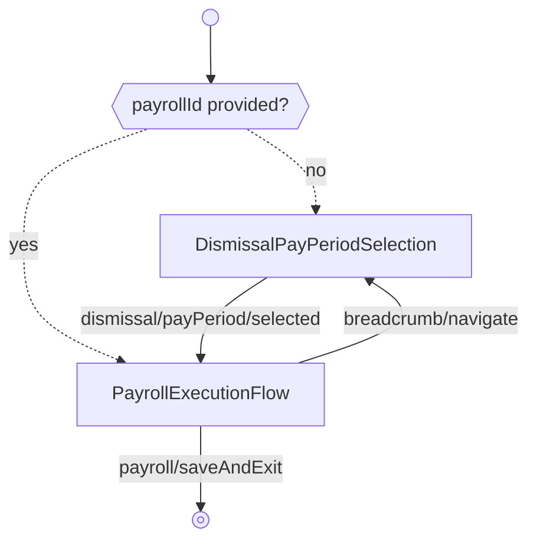

---
# Autogenerated by TypeDoc from TSDoc comments in the source code.
# To update content: edit TSDoc comments in src/.
# To update structure: edit docs-site/typedoc.config.ts or docs-site/plugins/typedoc-custom/.
# Then run `npm run docs:api:generate` to regenerate.
title: DismissalFlow
description: DismissalFlow reference.
sidebar_position: 2
generated_by: typedoc
custom_edit_url: null
---

# DismissalFlow

Guided flow to run a dismissed employee's final payroll.

## Example

```tsx title="App.tsx"
import { Payroll, type EventType } from '@gusto/embedded-react-sdk'

function MyApp() {
  return (
    <Payroll.DismissalFlow
      companyId="a007e1ab-3595-43c2-ab4b-af7a5af2e365"
      employeeId="8e5c8492-3bb3-4b6b-8003-bb8c6aefca0d"
      onEvent={(eventType: EventType) => {
        if (eventType === 'runPayroll/submitted') {
          // Payroll submitted — navigate to your next screen
        }
      }}
    />
  )
}
```

## Remarks

Presents unprocessed termination pay periods for the employee, creates an off-cycle payroll for the selected period with the `"Dismissed employee"` off-cycle reason, and then transitions into the standard payroll execution flow for configuration, review, submission, and receipts.

When `payrollId` is provided, pay period selection is skipped and the flow starts directly at execution for that payroll. When omitted, the flow starts at pay period selection.

| Event | Description | Data |
| ----- | ----------- | ---- |
| `dismissal/payPeriod/selected` | A pay period is selected and the dismissal payroll is created | `{ payrollUuid: string }` |

Once the payroll is created, all standard run-payroll events (e.g. `runPayroll/calculated`, `runPayroll/submitted`, `runPayroll/processed`) are emitted during execution.

## DismissalFlowProps

<a id="dismissalflowprops"></a>

Props for DismissalFlow.

| Property | Type | Description |
| ------ | ------ | ------ |
| `companyId` | `string` | The associated company identifier. |
| `onEvent` | [`OnEventType`](../index.md#oneventtype)\<[`EventType`](../events.md#eventtype), `unknown`\> | Handler for events emitted by the flow. See DismissalFlow for the event table. |
| `employeeId?` | `string` | The terminated employee whose final payroll is being run. |
| `payrollId?` | `string` | Optional dismissal payroll identifier. When provided, the flow skips pay period selection and starts directly at payroll execution. |

## Sub-components

| Component | Description |
| ------ | ------ |
| [DismissalPayPeriodSelection](blocks.md#dismissalpayperiodselection) | Pay period selection step for the dismissal payroll workflow. |
| [PayrollExecutionFlow](payroll-execution-flow.md) | Guided flow to configure, review, and submit a single payroll. |

<!-- guide-source: src/components/Payroll/Dismissal/GUIDE.md (slot: appendix) -->
## Step flow

The flow's entry point depends on whether `payrollId` is supplied: without it, the flow opens on pay period selection and advances into execution; with it, pay period selection is skipped and the flow starts directly in `PayrollExecutionFlow` for that payroll.



Selecting **Save & exit** during execution emits `payroll/saveAndExit`, which the flow does not handle internally — it surfaces on `onEvent` to signal that the flow has been exited.

## Pay period selection

The pay period selection step fetches the employee's unprocessed termination pay periods and presents each as an option showing its date range. When only one pay period is available, it is pre-selected automatically.

On submission, the step creates an off-cycle payroll for the selected period using the `"Dismissed employee"` off-cycle reason and the period's start and end dates, then advances to execution with `dismissal/payPeriod/selected`. During execution `PayrollExecutionFlow` runs with dismissal-specific copy and breadcrumbs.

Final-paycheck timing is regulated by state. Some states require terminated employees to receive their final wages within a short window (as little as 24 hours unless the employee consents otherwise), in which case a dismissal payroll may be the only way to pay on time.
<!-- /guide-source (slot: appendix) -->
