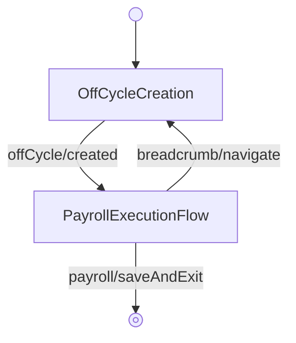

---
# Autogenerated by TypeDoc from TSDoc comments in the source code.
# To update content: edit TSDoc comments in src/.
# To update structure: edit docs-site/typedoc.config.ts or docs-site/plugins/typedoc-custom/.
# Then run `npm run docs:api:generate` to regenerate.
title: OffCycleFlow
description: OffCycleFlow reference.
sidebar_position: 2
generated_by: typedoc
custom_edit_url: null
---

# OffCycleFlow

Guided flow to create and run a bonus or correction payroll.

## Remarks

Guides the user through configuring pay period dates, selecting a reason, choosing
employees, and setting deduction and tax withholding preferences, then transitions
into the standard payroll execution experience (configuration, overview, submission,
receipts). All off-cycle payroll types share the same execution steps as regular
payrolls — only the creation step differs.

## Example

```tsx title="App.tsx"
import { Payroll, type EventType } from '@gusto/embedded-react-sdk'

function MyApp() {
  return (
    <Payroll.OffCycleFlow
      companyId="a007e1ab-3595-43c2-ab4b-af7a5af2e365"
      onEvent={(eventType: EventType) => {
        if (eventType === 'runPayroll/submitted') {
          // Payroll submitted — navigate to your next screen
        }
      }}
    />
  )
}
```

## OffCycleFlowProps

<a id="offcycleflowprops"></a>

Props for OffCycleFlow.

| Property | Type | Description |
| ------ | ------ | ------ |
| `companyId` | `string` | The associated company identifier. |
| `onEvent` | [`OnEventType`](../events.md#oneventtype)\<[`EventType`](../events.md#eventtype), `unknown`\> | Callback invoked when the flow emits an event. See the events table on OffCycleFlow. |
| `payrollType?` | [`OffCycleReason`](blocks.md#offcyclereason) | Optional pre-selected off-cycle reason. When provided, the creation form starts with this reason selected. |
| `withReimbursements?` | `boolean` | Optional flag to show/hide reimbursement fields throughout the flow. Defaults to true. |

## Events

| Event | Description | Data |
| ----- | ----------- | ---- |
| `breadcrumb/navigate` | User navigates via the flow breadcrumb header | `{ key: string }` |
| `offCycle/created` | Off-cycle payroll has been created and the flow transitions to execution | `{ payrollUuid: string }` |

Once the flow transitions to execution, all standard run-payroll events are emitted
(e.g. `runPayroll/calculated`, `runPayroll/submitted`, `runPayroll/processed`).

## Sub-components

| Component | Description |
| ------ | ------ |
| [OffCycleCreation](blocks.md#offcyclecreation) | Creation form for off-cycle (bonus or correction) payrolls. |
| [PayrollExecutionFlow](payroll-execution-flow.md) | Guided flow to configure, review, and submit a single payroll. |

<!-- guide-source: src/components/Payroll/OffCycle/GUIDE.md (slot: appendix) -->
## Step flow

The flow opens on the creation step, where the off-cycle payroll is configured (pay period dates, reason, employees, deductions, and tax withholding). Once created, it hands off to the shared `PayrollExecutionFlow` for configuration, overview, submission, and receipts.



The breadcrumb header lets the user navigate from execution back to the creation step (`breadcrumb/navigate` with `key: 'createOffCyclePayroll'`). Selecting **Save & exit** during execution emits `payroll/saveAndExit`, which the flow does not handle internally — it surfaces on `onEvent` to signal that the flow has been exited.

## Off-cycle reasons

The creation step supports two off-cycle reasons, each seeding different deduction and withholding defaults. Changing the reason updates these defaults automatically.

| Reason     | Use                                              | Default deductions         | Default withholding |
| ---------- | ------------------------------------------------ | -------------------------- | ------------------- |
| Bonus      | Pay a bonus, gift, or commission                 | Skip regular deductions    | Supplemental rate   |
| Correction | Run a correction payment outside the schedule    | Include regular deductions | Regular rate        |

When deductions are skipped, all regular deductions and contributions are blocked except 401(k); taxes are always included regardless of the selection.
<!-- /guide-source (slot: appendix) -->
