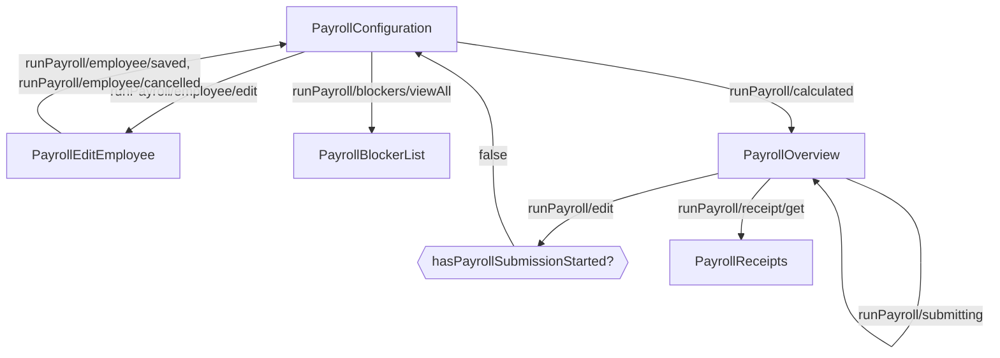

---
# Autogenerated by TypeDoc from TSDoc comments in the source code.
# To update content: edit TSDoc comments in src/.
# To update structure: edit docs-site/typedoc.config.ts or docs-site/plugins/typedoc-custom/.
# Then run `npm run docs:api:generate` to regenerate.
title: PayrollExecutionFlow
description: PayrollExecutionFlow reference.
sidebar_position: 2
generated_by: typedoc
custom_edit_url: null
---

# PayrollExecutionFlow

Shared execution flow that runs the configuration, overview, submission, and receipt steps for a
single payroll.

## Remarks

This is the inner flow that powers the back half of `Payroll.PayrollFlow`, and it is also reused
by the off-cycle, dismissal, and transition flows after they have created their respective
payrolls. Render it directly when you have built your own payroll-creation step and want to hand
the user off to the standard execution experience without re-implementing it. The flow ships
with breadcrumb navigation and the standard wire-confirmation UX.

| Event | Description | Data |
| ----- | ----------- | ---- |
| `runPayroll/edit` | Fired when user chooses to edit payroll | — |
| `runPayroll/back` | Fired when user navigates back | — |
| `runPayroll/calculated` | Fired when payroll calculation completes | `{ payrollUuid, payPeriod?, alert? }` |
| `runPayroll/employee/edit` | Fired when user opens an employee row to edit | `{ employeeId, firstName, lastName }` |
| `runPayroll/employee/saved` | Fired when employee edits are saved | — |
| `runPayroll/employee/cancelled` | Fired when employee edits are cancelled | — |
| `runPayroll/submitting` | Fired when payroll submission begins | — |
| `runPayroll/submitted` | Fired when payroll is successfully submitted | Response from the Submit payroll endpoint |
| `runPayroll/processed` | Fired when payroll processing is completed | — |
| `runPayroll/processingFailed` | Fired when payroll processing fails | Error details |
| `runPayroll/cancelled` | Fired when a payroll is cancelled | Response from the Cancel payroll endpoint |
| `runPayroll/receipt/get` | Fired when user requests payroll receipt | `{ payrollId }` |
| `runPayroll/receipt/viewed` | Fired when the receipt screen is viewed | — |
| `runPayroll/pdfPaystub/viewed` | Fired when user views employee paystub PDF | `{ employeeId }` |
| `runPayroll/blockers/viewAll` | Fired when user opens the full blockers list | — |
| `payroll/saveAndExit` | Fired when user uses the save-and-exit CTA | — |

## PayrollExecutionFlowProps

Props for PayrollExecutionFlow.

| Property | Type | Description |
| ------ | ------ | ------ |
| `companyId` | `string` | The associated company identifier. |
| `onEvent` | [`OnEventType`](../index.md#oneventtype)\<[`EventType`](../events.md#eventtype), `unknown`\> | Event handler that receives the `RUN_PAYROLL_*` events emitted during the flow. |
| `payrollId` | `string` | The identifier of the payroll to execute. The payroll must already exist (e.g. created by a prior creation step or by the standard `PayrollFlow` selection). |
| `ConfirmWireDetailsComponent?` | [`ConfirmWireDetailsComponentType`](blocks.md#confirmwiredetailscomponenttype) | Optional custom component to replace the default wire details confirmation UI. |
| `initialPayPeriod?` | `PayrollPayPeriodType` | Optional pay period metadata used to seed breadcrumb labels and date context. |
| `initialState?` | [`PayrollExecutionInitialState`](blocks.md#payrollexecutioninitialstate) | Where the flow starts. Use `'overview'` when you want to drop the user directly on the review screen (e.g. resuming an already-calculated payroll). Defaults to `'configuration'`. |
| `isDismissalPayroll?` | `boolean` | When true, surfaces dismissal-specific copy and breadcrumbs (used by `Payroll.DismissalFlow`). Defaults to `false`. |
| `prefixBreadcrumbs?` | `FlowBreadcrumb`[] | Optional breadcrumbs prepended to the flow's own breadcrumb trail. Useful when embedding inside a parent flow (e.g. an off-cycle creation step) so the breadcrumb history remains coherent. |
| `withReimbursements?` | `boolean` | Optional flag to show or hide reimbursement fields throughout the flow. Defaults to `true`. |

## Sub-components

| Component | Description |
| ------ | ------ |
| [PayrollConfiguration](blocks.md#payrollconfiguration) | Handles the configuration phase of payroll processing, allowing users to review and modify employee compensation before calculating the payroll. |
| [PayrollOverview](blocks.md#payrolloverview) | Final review screen for a calculated payroll before submission, with submit, cancel, and edit controls. After submission, tracks processing status and surfaces the receipt and per-employee paystub downloads once complete. |
| [PayrollEditEmployee](blocks.md#payrolleditemployee) | Editor for an individual employee's compensation within a payroll run. |
| [PayrollReceipts](blocks.md#payrollreceipts) | Displays a detailed receipt for a completed payroll, including the debited total, per-category breakdown, tax breakdown, and a per-employee summary of payment method, garnishments, reimbursements, taxes, and net pay. |
| [PayrollBlockerList](blocks.md#payrollblockerlist) | Displays the list of blockers preventing payroll from being processed for a company. |

<!-- guide-source: src/components/Payroll/PayrollExecutionFlow/GUIDE.md (slot: appendix) -->
## Step flow

The execution flow runs a single payroll from configuration through receipts. It starts on the configuration step by default, or directly on the overview step when `initialState` is `'overview'`. Once submission begins, the flow can no longer return to configuration.

Editing an employee (`runPayroll/employee/edit`) opens that employee's row; saving or cancelling returns to configuration. The `runPayroll/edit` action returns to configuration only while the payroll has not started submitting (`hasPayrollSubmissionStarted` is false); after `runPayroll/submitting` fires, the configuration step is hidden and the flow stays on the overview through submission and processing.
<!-- /guide-source (slot: appendix) -->
