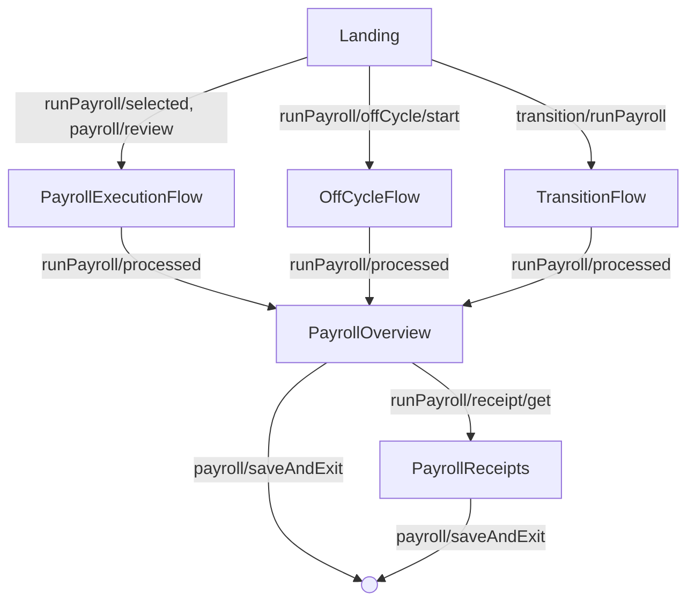
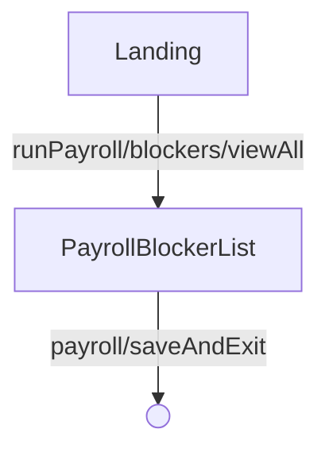

---
# Autogenerated by TypeDoc from TSDoc comments in the source code.
# To update content: edit TSDoc comments in src/.
# To update structure: edit docs-site/typedoc.config.ts or docs-site/plugins/typedoc-custom/.
# Then run `npm run docs:api:generate` to regenerate.
title: PayrollFlow
description: PayrollFlow reference.
sidebar_position: 2
generated_by: typedoc
custom_edit_url: null
---

# PayrollFlow

Guided workflow for selecting and running a company's payroll end to end.

## Example

```tsx
import { Payroll } from '@gusto/embedded-react-sdk'

function RunPayrollPage() {
  return <Payroll.PayrollFlow companyId="company-uuid" onEvent={() => {}} />
}
```

## Remarks

Renders the payroll landing page and orchestrates the full run-payroll experience: selecting a payroll, configuring earnings and reimbursements, reviewing totals, submitting, and viewing receipts. Off-cycle, transition, and edit-employee steps are reachable from the same flow.

| Event | Description | Data |
| ----- | ----------- | ---- |
| `runPayroll/selected` | A payroll is selected to run | `{ payrollId: string }` |
| `payroll/review` | A calculated payroll is opened for review | `{ payrollId: string }` |
| `runPayroll/calculated` | Payroll calculations complete | — |
| `runPayroll/edit` | The user returns to configuration to make changes | — |
| `runPayroll/employee/edit` | An employee row is opened for editing | `{ employeeId: string, firstName: string, lastName: string }` |
| `runPayroll/employee/saved` | Employee payroll changes are saved | `{ payrollPrepared: object, employee: object }` |
| `runPayroll/employee/cancelled` | Employee editing is cancelled | — |
| `runPayroll/submitted` | Payroll is successfully submitted | Response from the submit payroll endpoint |
| `runPayroll/processed` | Payroll processing completes | — |
| `runPayroll/processingFailed` | Payroll processing fails | Error details |
| `runPayroll/cancelled` | A submitted payroll is cancelled | `{ payrollId: string, result: object }` |
| `runPayroll/summary/viewed` | The summary screen is opened | `{ payrollId: string }` |
| `runPayroll/receipt/viewed` | The receipt screen is opened | `{ payrollId: string }` |
| `runPayroll/offCycle/start` | The user starts an off-cycle payroll | — |
| `transition/runPayroll` | The user starts a pending transition payroll | — |
| `payroll/saveAndExit` | The user clicks Save and Exit | — |

## PayrollFlowProps

<a id="payrollflowprops"></a>

Props accepted by PayrollFlow.

| Property | Type | Description |
| ------ | ------ | ------ |
| `companyId` | `string` | Identifier of the company whose payroll is being run. |
| `onEvent` | [`OnEventType`](../index.md#oneventtype)\<[`EventType`](../events.md#eventtype), `unknown`\> | Callback invoked each time the component emits an event — user interactions, successful API responses, step transitions, or errors. Receives the event type constant and an optional payload whose shape varies by event. See the [Event Handling guide](https://docs.gusto.com/embedded-payroll/docs/event-handling) and each component's event table for the full list of emitted events. |
| `ConfirmWireDetailsComponent?` | [`ConfirmWireDetailsComponentType`](blocks.md#confirmwiredetailscomponenttype) | Optional custom component that replaces the default wire-details confirmation UI. |
| `withReimbursements?` | `boolean` | Whether reimbursement fields are shown in the payroll configuration and overview. Defaults to `true`. |

_Inherits `children`, `className`, `defaultValues`, `dictionary`, `FallbackComponent`, `LoaderComponent` from [BaseComponentInterface](../index.md#basecomponentinterface)._

## Sub-components

| Component | Description |
| ------ | ------ |
| [PayrollLanding](blocks.md#payrolllanding) | Main landing surface for payroll operations, with tabs for running payroll and viewing payroll history, plus inline navigation to a payroll's overview and receipt. |
| [PayrollExecutionFlow](payroll-execution-flow.md) | Shared execution flow that runs the configuration, overview, submission, and receipt steps for a single payroll. |
| [OffCycleFlow](off-cycle-flow.md) | Multi-step flow for creating and running an off-cycle payroll (bonus or correction). |
| [TransitionFlow](transition-flow.md) | Multi-step flow for running a transition payroll that covers the gap between an old and new pay schedule. |
| [PayrollBlockerList](blocks.md#payrollblockerlist) | Displays the list of blockers preventing payroll from being processed for a company. |
| [PayrollOverview](blocks.md#payrolloverview) | Final review screen for a calculated payroll before submission, with submit, cancel, and edit controls. After submission, tracks processing status and surfaces the receipt and per-employee paystub downloads once complete. |
| [PayrollReceipts](blocks.md#payrollreceipts) | Displays a detailed receipt for a completed payroll, including the debited total, per-category breakdown, tax breakdown, and a per-employee summary of payment method, garnishments, reimbursements, taxes, and net pay. |

<!-- guide-source: src/components/Payroll/PayrollFlow/GUIDE.md (slot: appendix) -->
## Step flow

`PayrollFlow` opens on the landing page, where pending and calculated payrolls are listed. From there it routes into one of several payrolls, each of which runs the shared `PayrollExecutionFlow` (configuration, overview, submission, receipts) before returning to the submitted overview.

### Running, off-cycle, transition, and dismissal payrolls

Selecting a payroll to run, reviewing a calculated payroll, starting an off-cycle payroll, or starting a pending transition payroll all hand off to an execution flow. When processing completes, the flow lands on the submitted overview and can drill into receipts.



### Resolving blockers

When a payroll has blockers, the landing page can open the full blocker list. Resolving them and exiting returns to the landing page.



A submitted payroll that is later cancelled (`runPayroll/cancelled`) routes back to the landing page, where a cancellation alert is shown.
<!-- /guide-source (slot: appendix) -->
