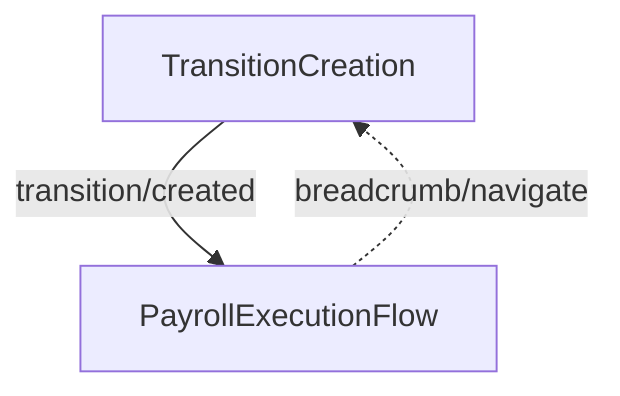
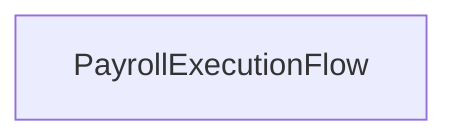

---
# Autogenerated by TypeDoc from TSDoc comments in the source code.
# To update content: edit TSDoc comments in src/.
# To update structure: edit docs-site/typedoc.config.ts or docs-site/plugins/typedoc-custom/.
# Then run `npm run docs:api:generate` to regenerate.
title: TransitionFlow
description: TransitionFlow reference.
sidebar_position: 2
generated_by: typedoc
custom_edit_url: null
---

# TransitionFlow

Multi-step flow for running a transition payroll that covers the gap between an old and new pay schedule.

## Remarks

Starts on the creation step (configure check date, deductions, and tax withholding for the
transition pay period). After the payroll is created, the flow hands off to the standard
payroll execution experience — configure compensation, review, submit, and view receipts.

If a `payrollUuid` is supplied, the flow skips creation and resumes directly in execution.

| Event | Description | Data |
| ----- | ----------- | ---- |
| `breadcrumb/navigate` | Fired when the user navigates back to the creation step via breadcrumbs | `{ key: string }` |
| `transition/created` | Fired when the transition payroll is created and the flow advances to execution | `{ payrollUuid: string }` |

Once execution begins, all standard run-payroll events are emitted as well.

## TransitionFlowProps

Props for TransitionFlow.

| Property | Type | Description |
| ------ | ------ | ------ |
| `companyId` | `string` | Company running the transition payroll. |
| `endDate` | `string` | End date of the transition pay period (YYYY-MM-DD). |
| `onEvent` | [`OnEventType`](../index.md#oneventtype)\<[`EventType`](../events.md#eventtype), `unknown`\> | Callback invoked for each event emitted by the flow and its child steps. |
| `payScheduleUuid` | `string` | UUID of the pay schedule the transition is associated with. |
| `startDate` | `string` | Start date of the transition pay period (YYYY-MM-DD). |
| `payrollUuid?` | `string` | UUID of an existing transition payroll. When provided, the flow skips creation and resumes in execution. |

## Sub-components

| Component | Description |
| ------ | ------ |
| [TransitionCreation](blocks.md#transitioncreation) | Creation form for transition payrolls covering the gap between an old and new pay schedule. |
| [PayrollExecutionFlow](payroll-execution-flow.md) | Shared execution flow that runs the configuration, overview, submission, and receipt steps for a single payroll. |

<!-- guide-source: src/components/Payroll/Transition/GUIDE.md (slot: appendix) -->
## Step flow

A transition payroll covers the workdays that fall between the end of an old pay schedule and the start of a new one, so employees are paid for the gap. The flow's entry point depends on whether `payrollUuid` is supplied. Without it, the flow opens on the creation step. With it, creation is skipped and the flow resumes directly in execution.

### Without `payrollUuid`

### With `payrollUuid`

## Creation step

The creation step shows the transition pay period (`startDate`–`endDate`) and the associated pay schedule name as read-only context, then collects:

- **Check date** — when employees are paid. For ACH processing this must be at least 2 business days out.
- **Deductions and contributions** — include or skip regular deductions. Defaults to including deductions.
- **Tax withholding rates** — withholding pay period frequency and rate type (regular or supplemental). Defaults to the regular rate with an every-other-week frequency.

On submission the step creates an off-cycle payroll with the `"Transition from old pay schedule"` reason and advances to execution with `transition/created`.

Transition pay periods should be resolved — run or skipped — before regular payrolls are run. The Gusto API may reject regular payrolls while unresolved transition periods exist.
<!-- /guide-source (slot: appendix) -->
