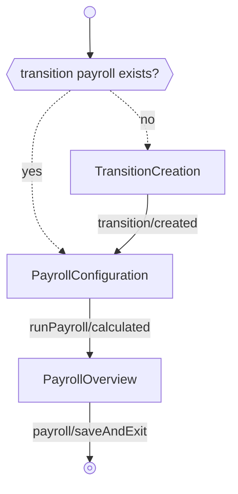

---
# Autogenerated by TypeDoc from TSDoc comments in the source code.
# To update content: edit TSDoc comments in src/.
# To update structure: edit docs-site/typedoc.config.ts or docs-site/plugins/typedoc-custom/.
# Then run `npm run docs:api:generate` to regenerate.
title: TransitionFlow
description: TransitionFlow reference.
sidebar_position: 2
generated_by: typedoc
custom_edit_url: null
---

# TransitionFlow

Macro flow that runs a transition payroll end to end: resolve or create the payroll, then
configure, review, submit, and view receipts.

## Remarks

Composes [TransitionPayroll](blocks.md#transitionpayroll) (which owns the resolve/create decision and the
creation + configuration screens) with the shared payroll-execution states. The entry step
renders [TransitionPayroll](blocks.md#transitionpayroll); the events its configuration screen emits
(`runPayroll/calculated`, `runPayroll/employee/edit`, `runPayroll/blockers/viewAll`, etc.) bubble
up and route into the reused overview / edit-employee / receipts / blockers states.

Unlike [TransitionPayroll](blocks.md#transitionpayroll) used on its own, this flow owns the breadcrumb chrome and the
back-navigation between execution screens. It re-runs the same (cached) resolve lookup as
[TransitionPayroll](blocks.md#transitionpayroll) to seed its initial breadcrumb and payroll context.

There is no terminal state (SDK-1169). Completion events (`runPayroll/submitted`,
`runPayroll/processed`, `payroll/saveAndExit`) bubble via `onEvent`; the parent decides what to do
next (in `Payroll.PayrollFlow` the parent machine handles them).

## Example

```tsx title="App.tsx"
import { Payroll, type EventType } from '@gusto/embedded-react-sdk'

function MyApp() {
  return (
    <Payroll.TransitionFlow
      companyId="a007e1ab-3595-43c2-ab4b-af7a5af2e365"
      startDate="2025-01-16"
      endDate="2025-01-31"
      payScheduleUuid="c75c1ef6-2ec0-4cca-94a5-8b4cf7e5ea21"
      onEvent={(eventType: EventType) => {
        if (eventType === 'runPayroll/submitted') {
          // Payroll submitted — navigate to your next screen
        }
      }}
    />
  )
}
```

## TransitionFlowProps

<a id="transitionflowprops"></a>

Props for TransitionFlow.

| Property | Type | Description |
| ------ | ------ | ------ |
| `companyId` | `string` | Company running the transition payroll. |
| `endDate` | `string` | End date of the transition pay period (YYYY-MM-DD). |
| `onEvent` | [`OnEventType`](../events.md#oneventtype)\<[`EventType`](../events.md#eventtype), `unknown`\> | Callback invoked for each event emitted by the flow and its child steps. |
| `payScheduleUuid` | `string` | UUID of the pay schedule the transition is associated with. |
| `startDate` | `string` | Start date of the transition pay period (YYYY-MM-DD). |
| `withReimbursements?` | `boolean` | Whether reimbursement fields are shown throughout the flow. Defaults to `true`. |

## Events

| Event | Description | Data |
| ----- | ----------- | ---- |
| `transition/created` | Fired when the transition payroll is created and the flow advances to configuration | `{ payrollUuid: string }` |
| `breadcrumb/navigate` | Fired when the user navigates via the breadcrumb header | `{ key: string }` |

All standard run-payroll events are emitted once configuration begins.

## Sub-components

| Component | Description |
| ------ | ------ |
| [TransitionPayroll](blocks.md#transitionpayroll) | Resolves and runs a transition payroll for a pay-schedule change, picking up an existing unprocessed transition payroll when one exists and creating one otherwise. |
| [PayrollOverview](blocks.md#payrolloverview) | Final review screen for a calculated payroll before submission, with submit, cancel, and edit controls. After submission, tracks processing status and surfaces the receipt and per-employee paystub downloads once complete. |
| [PayrollEditEmployee](blocks.md#payrolleditemployee) | Editor for an individual employee's compensation within a payroll run. |
| [PayrollReceipts](blocks.md#payrollreceipts) | Displays a detailed receipt for a completed payroll, including the debited total, per-category breakdown, tax breakdown, and a per-employee summary of payment method, garnishments, reimbursements, taxes, and net pay. |
| [PayrollBlockerList](blocks.md#payrollblockerlist) | Displays the list of blockers preventing payroll from being processed for a company. |

<!-- guide-source: src/components/Payroll/Transition/GUIDE.md (slot: appendix) -->
## Step flow

A transition payroll covers the workdays that fall between the end of an old pay schedule and the start of a new one, so employees are paid for the gap. Supply the pay period (`startDate`, `endDate`, `payScheduleUuid`); the flow resolves whether an unprocessed transition payroll already exists for it. If one exists, the flow opens directly on configuration; otherwise it opens on the creation step and advances to configuration once the payroll is created. From configuration it continues into the standard review, submit, and receipts steps.


```mermaid
flowchart
  start@{ shape: sm-circ } --> resolve{{"transition payroll exists?"}}
  resolve -.->|"no"| CreateTransitionPayroll["TransitionCreation"]
  resolve -.->|"yes"| Configuration["PayrollConfiguration"]
  CreateTransitionPayroll -->|"transition/created"| Configuration
  Configuration -->|"runPayroll/calculated"| Overview["PayrollOverview"]
  Overview -->|"payroll/saveAndExit"| done@{ shape: fr-circ, label: " " }
  class resolve branch
  class Configuration flow
  class Overview flow
```

The resolve/resume decision lives in `TransitionPayroll`, which you can also render on its own. Selecting **Save & exit** during execution emits `payroll/saveAndExit`, which the flow does not handle internally — it surfaces on `onEvent` to signal that the flow has been exited.

## Creation step

The creation step shows the transition pay period (`startDate`–`endDate`) and the associated pay schedule name as read-only context, then collects:

- **Check date** — when employees are paid. For ACH processing this must be at least 2 business days out.
- **Deductions and contributions** — include or skip regular deductions. Defaults to including deductions.
- **Tax withholding rates** — withholding pay period frequency and rate type (regular or supplemental). Defaults to the regular rate with an every-other-week frequency.

On submission the step creates an off-cycle payroll with the `"Transition from old pay schedule"` reason and advances to execution with `transition/created`.

Transition pay periods should be resolved — run or skipped — before regular payrolls are run. The Gusto API may reject regular payrolls while unresolved transition periods exist.
<!-- /guide-source (slot: appendix) -->

## Endpoints

| Method | Path |
| --- | --- |
| GET | [`/v1/companies/:companyId/payrolls`](https://docs.gusto.com/embedded-payroll/v2026-06-15/reference/get-v1-companies-company_id-payrolls) |
| GET | [`/v1/companies/:companyId/payrolls/:payrollId`](https://docs.gusto.com/embedded-payroll/v2026-06-15/reference/get-v1-companies-company_id-payrolls-payroll_id) |
