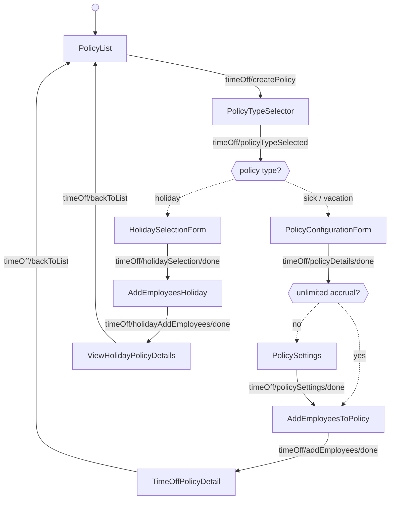
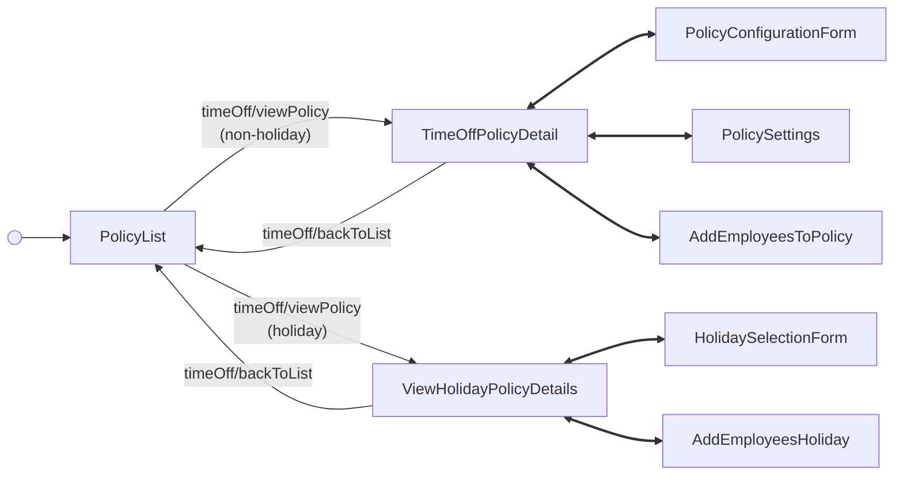

---
# Autogenerated by TypeDoc from TSDoc comments in the source code.
# To update content: edit TSDoc comments in src/.
# To update structure: edit docs-site/typedoc.config.ts or docs-site/plugins/typedoc-custom/.
# Then run `npm run docs:api:generate` to regenerate.
title: TimeOffFlow
description: TimeOffFlow reference.
sidebar_position: 2
generated_by: typedoc
custom_edit_url: null
---

# TimeOffFlow

Hub for creating and managing a company's time off policies.

## Remarks

Composes the time off list, policy-type selection, configuration, settings, employee assignment, and policy detail screens into a single multi-step flow. Sick and vacation policies share a common creation path (configure → settings → add employees); holiday policies follow a separate path (select federal holidays → add employees). All policy types can be viewed, edited, and removed from the unified policy list.

The flow emits these events as users navigate:

## Example

```tsx title="App.tsx"
import { TimeOff } from '@gusto/embedded-react-sdk'

function MyApp() {
  return (
    <TimeOff.TimeOffFlow
      companyId="a007e1ab-3595-43c2-ab4b-af7a5af2e365"
      onEvent={() => {}}
    />
  )
}
```

## TimeOffFlowProps

<a id="timeoffflowprops"></a>

Props for TimeOffFlow.

| Property | Type | Description |
| ------ | ------ | ------ |
| `companyId` | `string` | The associated company identifier. |
| `onEvent` | [`OnEventType`](../events.md#oneventtype)\<[`EventType`](../events.md#eventtype), `unknown`\> | Callback invoked each time the component emits an event — user interactions, successful API responses, step transitions, or errors. Receives the event type constant and an optional payload whose shape varies by event. See the [Event Handling guide](https://docs.gusto.com/embedded-payroll/docs/event-handling) and each component's event table for the full list of emitted events. |

_Inherits `children`, `className`, `defaultValues`, `dictionary`, `FallbackComponent`, `LoaderComponent` from [BaseComponentInterface](../workflows-and-blocks.md#basecomponentinterface)._

## Events

| Event | Description | Data |
| ----- | ----------- | ---- |
| `timeOff/createPolicy` | User initiates policy creation | — |
| `timeOff/viewPolicy` | User selects a policy to view | `{ policyId: string, policyType: string }` |
| `timeOff/policyTypeSelected` | User selects a policy type | `{ policyType: 'sick' \| 'vacation' \| 'holiday' }` |
| `timeOff/policyDetails/done` | Policy details form is submitted | `{ policyId: string, accrualMethod: string }` |
| `timeOff/policySettings/done` | Policy settings are saved | TimeOffPolicy response |
| `timeOff/policySettings/back` | User navigates back from settings | — |
| `timeOff/addEmployees/done` | Employees are added to a sick/vacation policy | TimeOffPolicy response |
| `timeOff/addEmployees/back` | User navigates back from employee selection | — |
| `timeOff/holidaySelection/done` | Holiday selection completed (create) | — |
| `timeOff/holidaySelection/editDone` | Holiday selection completed (edit) | — |
| `timeOff/holidayAddEmployees/done` | Employees added to holiday policy | HolidayPayPolicy response |
| `timeOff/backToList` | User navigates back to the policy list | — |
| `timeOff/editPolicy` | User edits a sick/vacation policy | `{ policyId: string }` |
| `timeOff/changeSettings` | User edits policy settings | `{ policyId: string }` |
| `timeOff/addEmployeesToPolicy` | User adds employees from a policy detail | `{ policyId: string }` |
| `timeOff/holidayAddEmployees` | User adds employees from holiday detail | — |
| `timeOff/editHolidayPolicy` | User edits the holiday policy | — |
| `timeOff/policyCreate/error` | Policy creation fails | `{ alert?: { type, title, content? } }` |
| `timeOff/policySettings/error` | Policy settings update fails | `{ alert?: { type, title, content? } }` |
| `timeOff/addEmployees/error` | Adding employees to a policy fails | `{ alert?: { type, title, content? } }` |
| `timeOff/holidayCreate/error` | Holiday policy creation fails | `{ alert?: { type, title, content? } }` |
| `timeOff/holidayAddEmployees/error` | Adding employees to the holiday policy fails | `{ alert?: { type, title, content? } }` |
| `CANCEL` | User cancels the current step | — |

Only one holiday policy can exist per company; the policy-type selector disables the holiday option once one is configured.

## Sub-components

| Component | Description |
| ------ | ------ |
| [PolicyList](blocks.md#policylist) | Displays all active time off policies (sick, vacation, and holiday) for a company. |
| [PolicyTypeSelector](blocks.md#policytypeselector) | Selection screen for choosing which kind of time-off policy to create — sick, vacation, or holiday. |
| [PolicyConfigurationForm](blocks.md#policyconfigurationform) | Form for creating or editing the details of a sick or vacation time off policy — its name and accrual configuration. |
| [PolicySettings](blocks.md#policysettings) | Configures additional policy limits and rules for a sick or vacation policy. This step is skipped for policies with unlimited accrual. |
| [AddEmployeesToPolicy](blocks.md#addemployeestopolicy) | Employee selection screen for assigning employees to a sick or vacation time off policy. |
| [TimeOffPolicyDetail](blocks.md#timeoffpolicydetail) | Detail view for a sick or vacation time-off policy. |
| [HolidaySelectionForm](blocks.md#holidayselectionform) | Lets a user select which US federal holidays are observed by the company's holiday pay policy. |
| [AddEmployeesHoliday](blocks.md#addemployeesholiday) | Employee selection screen for assigning employees to a company's holiday pay policy. |
| [ViewHolidayPolicyDetails](blocks.md#viewholidaypolicydetails) | Displays the holiday pay policy for a company with tabbed views of the included holidays and the enrolled employees. |

<!-- guide-source: src/components/TimeOff/TimeOffFlow/GUIDE.md (slot: appendix) -->
## Step flow

The flow opens on the policy list (`PolicyList`), which acts as the hub: creating or opening a policy launches from it, and every step returns to it (`timeOff/backToList`, or cancel from a create step). There is no terminal step.

### Create a policy

Selecting a type branches the path: sick and vacation share the configuration-and-settings path, while holiday follows its own. A policy with an unlimited accrual method skips the settings step, since there is no balance to cap or carry over. (Only one holiday policy can exist per company; the type selector disables holiday once one is configured.)



### Manage an existing policy

Opening a policy routes by type to its detail view, which acts as a sub-hub. From the non-holiday detail view you can edit the policy (`timeOff/editPolicy`), change its settings (`timeOff/changeSettings`), or add employees (`timeOff/addEmployeesToPolicy`).

The holiday detail view (`ViewHolidayPolicyDetails`) presents the observed holidays and enrolled employees as two tabs; switching tabs is internal to the view and emits no flow event. From it you can edit the holiday selection (`timeOff/editHolidayPolicy`) or add employees (`timeOff/holidayAddEmployees`). Each action returns to its detail view; `timeOff/backToList` returns to the list.



## Policy types

| Type     | Description                                                   | API family           |
| -------- | ------------------------------------------------------------- | -------------------- |
| Sick     | Sick leave policy with configurable accrual and balance rules | Time Off Policies    |
| Vacation | Vacation policy with configurable accrual and balance rules   | Time Off Policies    |
| Holiday  | Paid holiday policy based on US federal holidays              | Holiday Pay Policies |

## Accrual methods

Sick and vacation policies support the following accrual methods. The accrual
method drives whether the settings step appears (unlimited policies skip it) and
which reset rules apply.

| Method               | Description                                                                                |
| -------------------- | ------------------------------------------------------------------------------------------ |
| Unlimited            | Employees have unlimited time off. No balance tracking or settings configuration required. |
| Per hour worked      | Accrues at a rate per hours worked. Optionally includes overtime and/or all paid hours.    |
| Per pay period       | Fixed amount accrues each pay period.                                                       |
| Per calendar year    | Fixed amount accrues once per year, resetting on a specified calendar date.                 |
| Per anniversary year | Fixed amount accrues once per year, resetting on each employee's hire anniversary.          |

## Federal holidays

The holiday selection form includes all 11 US federal holidays. In create mode,
all are selected by default.

| Holiday          | Observed Date               |
| ---------------- | --------------------------- |
| New Year's Day   | January 1                   |
| MLK Day          | Third Monday in January     |
| Presidents' Day  | Third Monday in February    |
| Memorial Day     | Last Monday in May          |
| Juneteenth       | June 19                     |
| Independence Day | July 4                      |
| Labor Day        | First Monday in September   |
| Columbus Day     | Second Monday in October    |
| Veterans Day     | November 11                 |
| Thanksgiving     | Fourth Thursday in November |
| Christmas Day    | December 25                 |
<!-- /guide-source (slot: appendix) -->

## Endpoints

| Method | Path |
| --- | --- |
| GET | [`/v1/companies/:companyId/employees`](https://docs.gusto.com/embedded-payroll/v2026-06-15/reference/get-v1-companies-company_id-employees) |
| GET | [`/v1/companies/:companyUuid/holiday_pay_policy`](https://docs.gusto.com/embedded-payroll/v2026-06-15/reference/get-v1-companies-company_uuid-holiday_pay_policy) |
| POST | [`/v1/companies/:companyUuid/holiday_pay_policy`](https://docs.gusto.com/embedded-payroll/v2026-06-15/reference/post-v1-companies-company_uuid-holiday_pay_policy) |
| PUT | [`/v1/companies/:companyUuid/holiday_pay_policy`](https://docs.gusto.com/embedded-payroll/v2026-06-15/reference/put-v1-companies-company_uuid-holiday_pay_policy) |
| DELETE | [`/v1/companies/:companyUuid/holiday_pay_policy`](https://docs.gusto.com/embedded-payroll/v2026-06-15/reference/delete-v1-companies-company_uuid-holiday_pay_policy) |
| PUT | [`/v1/companies/:companyUuid/holiday_pay_policy/add`](https://docs.gusto.com/embedded-payroll/v2026-06-15/reference/put-v1-companies-company_uuid-holiday_pay_policy-add) |
| PUT | [`/v1/companies/:companyUuid/holiday_pay_policy/remove`](https://docs.gusto.com/embedded-payroll/v2026-06-15/reference/put-v1-companies-company_uuid-holiday_pay_policy-remove) |
| GET | [`/v1/companies/:companyUuid/time_off_policies`](https://docs.gusto.com/embedded-payroll/v2026-06-15/reference/get-v1-companies-company_uuid-time_off_policies) |
| POST | [`/v1/companies/:companyUuid/time_off_policies`](https://docs.gusto.com/embedded-payroll/v2026-06-15/reference/post-v1-companies-company_uuid-time_off_policies) |
| GET | [`/v1/time_off_policies/:timeOffPolicyUuid`](https://docs.gusto.com/embedded-payroll/v2026-06-15/reference/get-v1-time_off_policies-time_off_policy_uuid) |
| PUT | [`/v1/time_off_policies/:timeOffPolicyUuid`](https://docs.gusto.com/embedded-payroll/v2026-06-15/reference/put-v1-time_off_policies-time_off_policy_uuid) |
| PUT | [`/v1/time_off_policies/:timeOffPolicyUuid/add_employees`](https://docs.gusto.com/embedded-payroll/v2026-06-15/reference/put-v1-time_off_policies-time_off_policy_uuid-add_employees) |
| PUT | [`/v1/time_off_policies/:timeOffPolicyUuid/balance`](https://docs.gusto.com/embedded-payroll/v2026-06-15/reference/put-v1-time_off_policies-time_off_policy_uuid-balance) |
| PUT | [`/v1/time_off_policies/:timeOffPolicyUuid/deactivate`](https://docs.gusto.com/embedded-payroll/v2026-06-15/reference/put-v1-time_off_policies-time_off_policy_uuid-deactivate) |
| PUT | [`/v1/time_off_policies/:timeOffPolicyUuid/remove_employees`](https://docs.gusto.com/embedded-payroll/v2026-06-15/reference/put-v1-time_off_policies-time_off_policy_uuid-remove_employees) |
