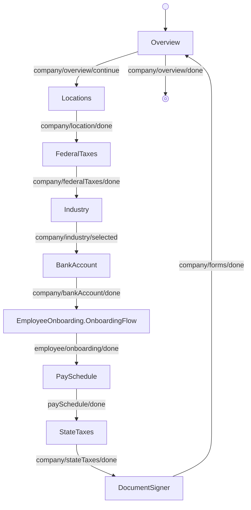

<!-- Partner-facing guide content, published to the SDK docs site. -->

# OnboardingFlow

## Step flow <!-- slot: appendix -->

The flow opens on the overview, then runs the linear step sequence below before returning to the overview to finish. Every step is a `CompanyOnboarding` block except the Employees step, which embeds `EmployeeOnboarding.OnboardingFlow` and owns its own internal navigation.

Each step is also exported as a standalone block (see the Sub-components table) for composing a custom workflow when this orchestration is the wrong fit. See the [Composition guide](https://sdk.gusto.com/docs/integration-guide/composition) for how to recompose these blocks into your own flow.
