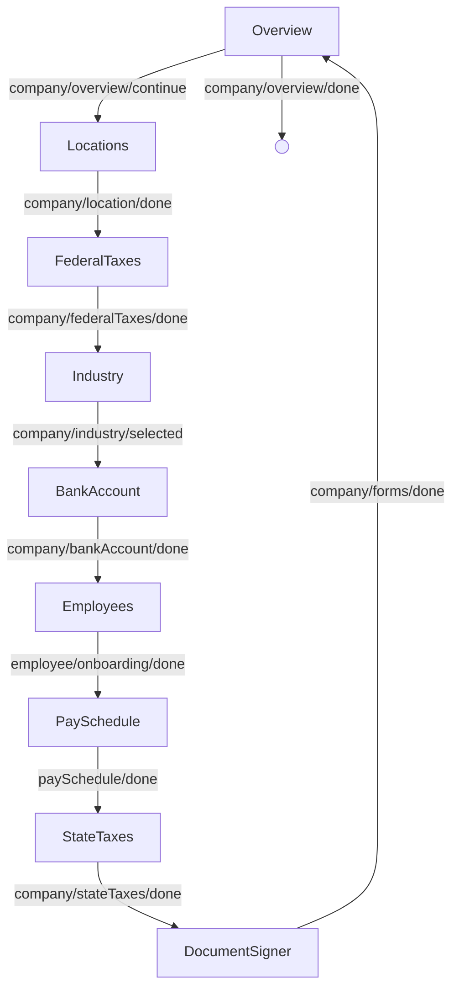

<!-- Partner-facing guide content, published to the SDK docs site. -->

# OnboardingFlow

## Step flow <!-- slot: appendix -->

The flow opens on the overview screen, which summarizes completed steps and remaining requirements. Continuing from the overview enters the linear sequence of onboarding steps; completing the final document-signing step returns to the overview. From the overview, signaling done routes away from the flow.

The employee step embeds the employee onboarding sub-flow, which has its own internal navigation between the employee list and the per-employee onboarding steps.

Each step is also exported as a standalone block (see the Sub-components table) for composing a custom workflow when this orchestration is the wrong fit. See the [Composition guide](https://sdk.gusto.com/docs/integration-guide/composition) for how to recompose these blocks into your own flow.
