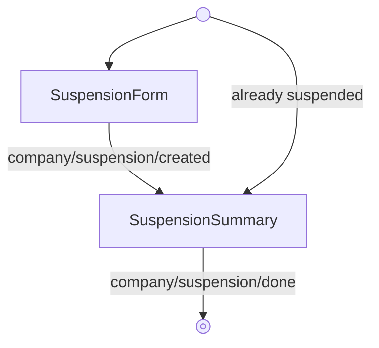

<!-- Partner-facing guide content, published to the SDK docs site. -->

# SuspensionFlow

`SuspensionFlow` guides a company through suspending ("cancelling") their Gusto account and then confirms the outcome. It is an alpha feature — enable it by passing `unstableFeatures={{ companySuspension: true }}` to `GustoProvider`.

## Step flow <!-- slot: appendix -->

The flow opens on the suspension form, where the company selects a reason for leaving and how Gusto should reconcile taxes already collected. Submitting creates the suspension and transitions to a read-only summary of what Gusto will handle next. When the company is already suspended, the flow opens directly on the summary of the latest suspension.

Completion is signalled via `company/suspension/done` on `onEvent` — the flow does not transition anywhere internally, so the summary stays interactive if the host keeps it mounted.

## Conditional fields <!-- slot: appendix -->

The suspension form adapts to the selections:

| Selection | Effect |
| --------- | ------ |
| Reason is "switching to a new provider" | Shows the provider (`leavingFor`) field |
| Provider is "Other" | `comments` becomes required and its label updates |
| Reason is "changing FEIN or entity type" | Shows a warning to contact Customer Support (this reason must be handled by Support) |
| Provider is "Gusto" | Shows a warning to contact Customer Support |
| Reconcile method is "pay taxes" | Shows the quarterly / yearly tax-filing checkboxes |
| Reconcile method is "refund taxes" | Hides and clears the checkboxes and shows a future-filings responsibility warning |

## Summary <!-- slot: appendix -->

The summary is derived entirely from the created suspension: the tax year and quarter come from its effective date, the "what we'll handle" list reflects the filing and reconciliation choices, and — when taxes are refunded — a table itemizes the refundable taxes with a total.
