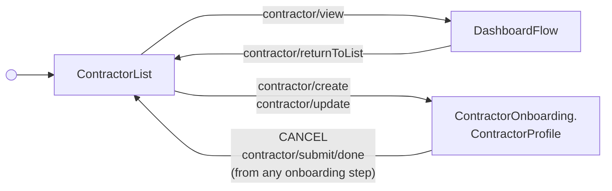

<!-- Partner-facing guide content, published to the SDK docs site. -->

# ContractorListFlow

## Step flow <!-- slot: appendix -->

The flow rests on the management contractor list and routes into one of two destinations based on the row action invoked (or the "Add contractor" CTA):

- **View details** (`contractor/view`) → `DashboardFlow`
- **Add contractor** (`contractor/create`) or an onboarding-tab row's **Edit**/**Continue**/**Review** (`contractor/update`) → directly into the Profile step of contractor onboarding

The Profile-entry path reuses the exact same Profile → Address → Payment Method → New Hire Report → Submit step sequence documented in full (including its self-onboarding and new-hire-report branching) on `ContractorOnboarding.OnboardingFlow`'s own page — this flow spreads those same states into its own machine rather than mounting `OnboardingFlow` as a nested component, so there's a single header per screen (the onboarding steps' own progress header, not a second "Back to contractors" bar) and cancelling or submitting from any step returns straight to *this* list, not to `OnboardingFlow`'s separate internal one.

The dashboard is given a "Back to contractors" header that emits `contractor/returnToList` to come back to the list.

"Rehire" (`contractor/rehire`) has no corresponding sub-flow yet — it fires its documented event straight through to the host app, exactly as `ContractorList` does on its own outside this flow. The Active tab's "Dismiss" row action isn't offered at all until a dismissal flow exists to hand it off to.

