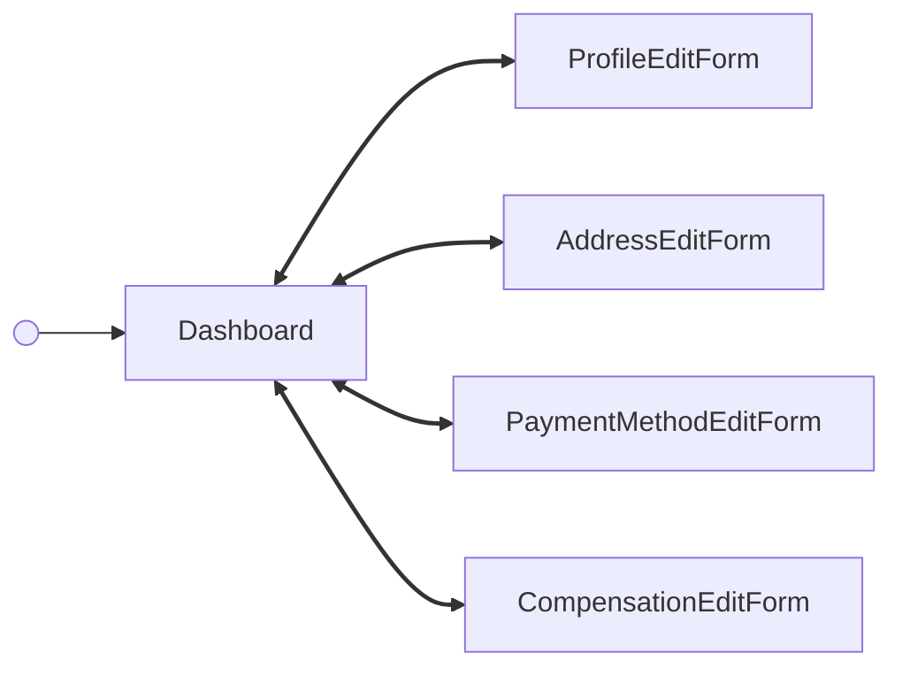

<!-- Partner-facing guide content, published to the SDK docs site. -->

# DashboardFlow

## Tabs <!-- slot: overview -->

The dashboard organizes a contractor's information into three tabs. Switching tabs emits `contractor/dashboard/tabChange`.

- **Details** — legal name, start date, tax ID (SSN or EIN), and email, plus the contractor's mailing address. Fields are read-only with "Edit" CTAs.
- **Pay** — payment method (Check, or a Direct Deposit bank account) and compensation (Fixed or Hourly, with the hourly rate when applicable).
- **Documents** — a read-only table of the contractor's forms with a "View" CTA per row that opens the document's PDF in a new tab.

## Step flow <!-- slot: appendix -->

The dashboard is a hub: the `Dashboard` cards view is the resting state. A card's Edit CTA opens that section's edit form; submitting or cancelling returns to the cards, and a successful save shows a dismissible success alert.

Some actions stay on the cards view without a screen swap: switching tabs (`contractor/dashboard/tabChange`), dismissing a success alert (`contractor/dashboard/alertDismissed`), removing a bank account, and viewing a document (which opens the PDF in a new tab rather than swapping the dashboard body).

## Empty states <!-- slot: appendix -->

Each section handles missing data on its own: the payment method card shows "Check" until a bank account is added; the compensation card only surfaces an hourly rate row when the contractor is paid Hourly; documents show a "No documents yet" message.
