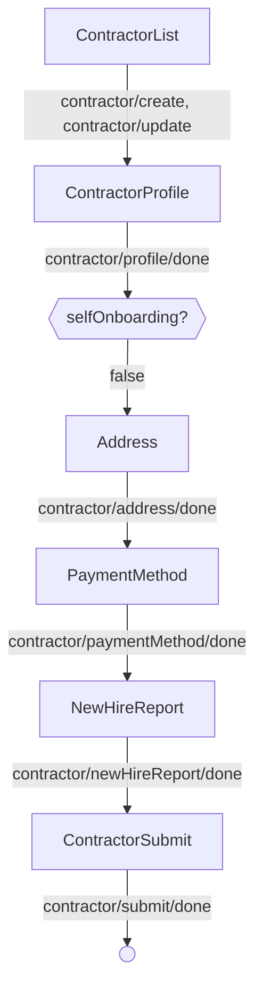
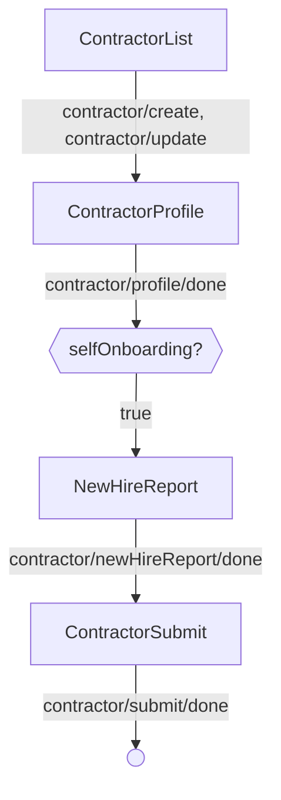

<!-- Partner-facing guide content, published to the SDK docs site. -->

# OnboardingFlow

## Step flow <!-- slot: appendix -->

`OnboardingFlow` begins on the contractor list and steps through the per-step screens once "Add contractor" or a row's "Edit"/"Continue" action is invoked. After the profile step, the path branches on whether the contractor self-onboards, so each path is shown on its own. The progress bar's secondary button emits `CANCEL` from any step, returning to the list.

### Admin onboarding

The admin completes every step. This is the five-step default path.

### Self-onboarding

The admin sets up the basics; the contractor completes their own address and payment method. The address and payment method steps are skipped, giving a three-step path.

