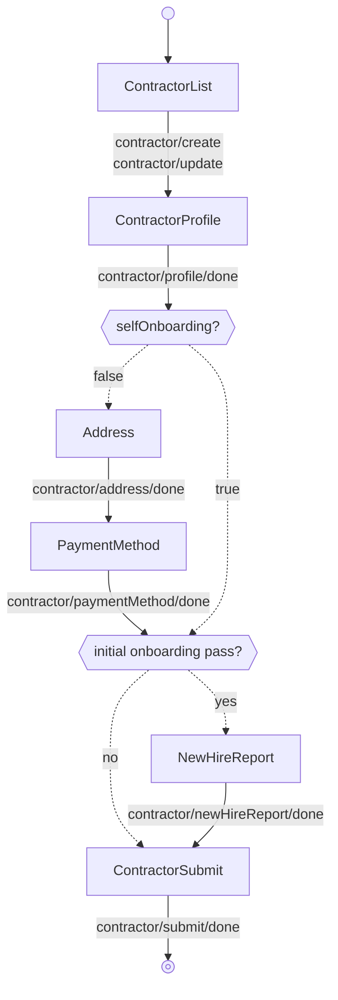

<!-- Partner-facing guide content, published to the SDK docs site. -->

# OnboardingFlow

## Step flow <!-- slot: appendix -->

`OnboardingFlow` begins on the contractor list and steps through the per-step screens once "Add contractor" or a row's "Edit"/"Continue" action is invoked. After the profile step, the path branches on whether the contractor self-onboards:

- **Admin onboarding** (`selfOnboarding = false`) — the admin completes every step, including address and payment method.
- **Self-onboarding** (`selfOnboarding = true`) — the admin sets up the basics and the contractor completes their own address and payment method later, so those two steps are skipped here.

The new hire report step appears only on the contractor's initial onboarding pass (while its onboarding status is `admin_onboarding_incomplete` or `self_onboarding_not_invited`). Once the contractor has advanced past that — to admin review, an active self-onboarding stage, or completion — the step is skipped and the flow goes straight to submit. The flow derives this from the contractor's `onboardingStatus`, which it reads off the `onboardingStatus` carried on `contractor/profile/done`.

The progress bar's secondary button emits `CANCEL` from any step, returning to the list.

