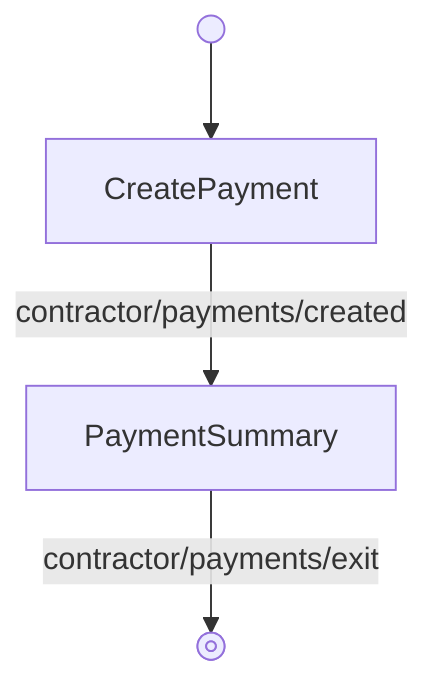

<!-- Partner-facing guide content, published to the SDK docs site. -->

# CreatePaymentFlow

## Step flow <!-- slot: appendix -->

`CreatePaymentFlow` has no hub of its own — it's a straight line from creating a payment to reviewing the result. `CreatePayment` handles selecting a date, editing per-contractor amounts, and submitting; Fast ACH blockers and wire transfer requirements are handled inline. On success (`contractor/payments/created`) the flow hands off to `PaymentSummary`, which shows the created group, debit details, and wire instructions when required.

The breadcrumb header (`breadcrumb/navigate`) returns to the payments list; submitting wire-transfer details (`payroll/wire/form/done`) surfaces a success alert on `PaymentSummary` without leaving the step.
