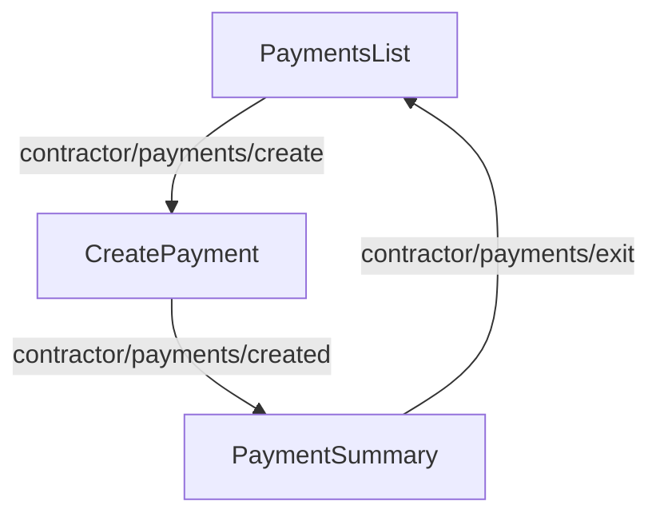
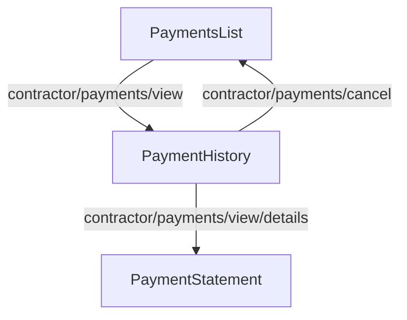
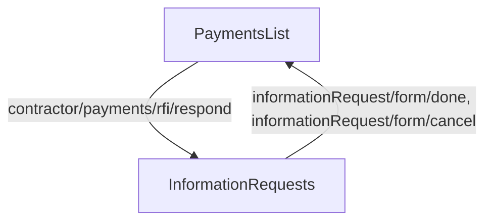

<!-- Partner-facing guide content, published to the SDK docs site. -->

# PaymentFlow

## Payment Workflow <!-- slot: overview -->

The typical step sequence when composing the subcomponents manually:

1. [`PaymentsList`](./blocks.md#paymentslist) — browse existing payment groups and start a new one.
2. [`CreatePayment`](./blocks.md#createpayment) — select a date, edit per-contractor amounts, preview, and submit. Handles Fast ACH blockers and wire transfer requirements inline.
3. [`PaymentSummary`](./blocks.md#paymentsummary) — review the created group, debit details, and wire instructions when required.
4. [`PaymentHistory`](./blocks.md#paymenthistory) — inspect a payment group's details and cancel individual payments.
5. [`PaymentStatement`](./blocks.md#paymentstatement) — see the full breakdown for one contractor's payment.

The flow is a hub: the payments list is the landing screen, and each action branches into its own path before returning to the list. Breadcrumbs navigate back to any prior step. The three paths are shown separately below.

### Create a payment

### View payment history

### Respond to an information request

## Important Notes <!-- slot: appendix -->

### Payment Timing

- Direct deposit payments submitted before 4pm PT on a business day take 2 business days to complete
- Fast ACH (2-day) payments have threshold limits; exceeding the threshold requires wire transfer or switching to 4-day processing

### Payment Requirements

- Only active contractors with completed onboarding can receive payments
- At least one contractor payment must be included in a payment group
- Bank account must be set up for the company to process payments

### Submission Blockers

Payment submission may be blocked by:

- **Fast ACH Threshold Exceeded**: Payment amount exceeds the fast ACH limit
  - Options: Wire transfer (fastest) or switch to 4-day direct deposit
- **Needs Earned Access for Fast ACH**: Company hasn't earned access to faster payments yet
  - Must use standard 4-day processing

### Wire Transfers

When wire transfer is required:

- Instructions are provided in the payment flow
- Must be completed by specified deadline to ensure timely payment
- Confirmation workflow tracks wire transfer submission
