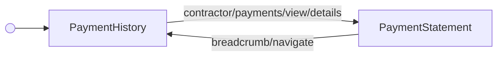

<!-- Partner-facing guide content, published to the SDK docs site. -->

# ViewHistoryFlow

## Step flow <!-- slot: appendix -->

`ViewHistoryFlow` centers on `PaymentHistory` as its hub: it shows a payment group's details, lets you cancel an individual contractor's payment in place (`contractor/payments/cancel`), and can drill into an individual contractor's statement (`contractor/payments/view/details` → `PaymentStatement`). There's no exit from this flow — cancelling refreshes the group's details without leaving the step.

Cancelling a contractor's payment (`contractor/payments/cancel`, fired from `PaymentHistory`) removes it from the group and refreshes the view without leaving the step.
