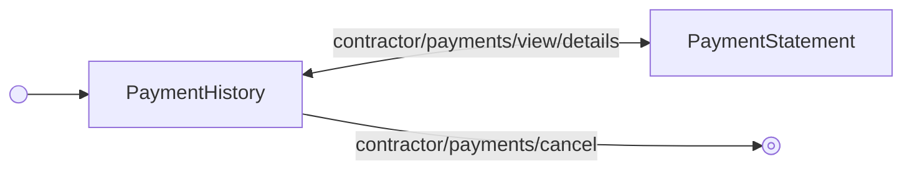

<!-- Partner-facing guide content, published to the SDK docs site. -->

# ViewHistoryFlow

## Step flow <!-- slot: appendix -->

`ViewHistoryFlow` centers on `PaymentHistory` as its hub: it shows a payment group's details and can either drill into an individual contractor's statement (`contractor/payments/view/details` → `PaymentStatement`) or cancel the group outright (`contractor/payments/cancel`), which exits the flow.

The breadcrumb header (`breadcrumb/navigate`) returns from `PaymentStatement` to `PaymentHistory`, or exits the flow entirely from either step.
