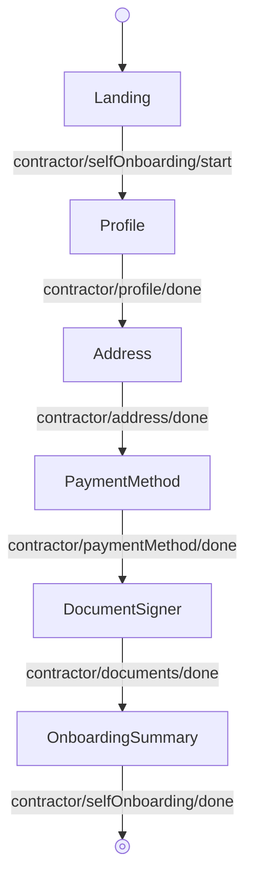

<!-- Partner-facing guide content, published to the SDK docs site. -->

# SelfOnboardingFlow

## Step flow <!-- slot: appendix -->

The contractor completes their own onboarding, starting from the self-onboarding landing page.

Each step above is also exported as a standalone block. When composing these blocks directly instead of using this flow, render the profile step with `isAdmin={false}`: [`ContractorProfile`](blocks.md#contractorprofile) defaults to the admin create/edit form, so omitting the prop renders the wrong screen for self-onboarding. This flow sets `isAdmin={false}` for you. The remaining steps (Address, PaymentMethod, DocumentSigner, OnboardingSummary) take no self-onboarding-specific props.
