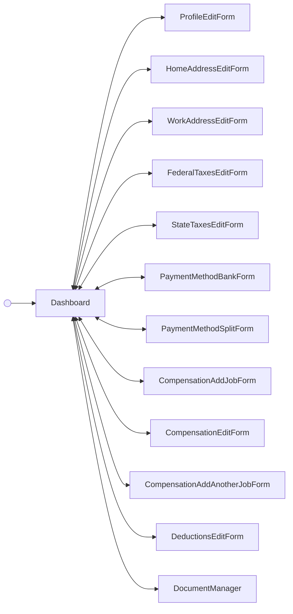

<!-- Partner-facing guide content, published to the SDK docs site. -->

# DashboardFlow

## Tabs <!-- slot: overview -->

The dashboard organizes an employee's payroll information into four tabs. Switching tabs emits `employee/dashboard/tabChange`.

- **Basic details** — legal name, start date, SSN, date of birth, and personal email, plus home address and work address cards. Fields are read-only with "Edit"/"Manage" CTAs.
- **Job and pay** — compensation (one job, or a table of jobs when the primary job is nonexempt), payment method (direct-deposit bank accounts), deductions (garnishments), and paystub history. Lists paginate.
- **Taxes** — federal tax withholding (supports both pre-2020 and Rev 2020 W-4 versions, so the visible fields vary with the W-4 on file) and per-state tax withholding records.
- **Documents** — a read-only table of employee forms (W-2s, W-4s, direct-deposit authorizations, and other documents) with a "View" CTA per row.

## Step flow <!-- slot: appendix -->

The dashboard is a hub: the `Dashboard` cards view is the resting state. A card's edit/manage CTA opens that section's edit form; submitting or cancelling returns to the cards, and a successful save shows a dismissible success alert. The documents card is the exception — its View CTA opens `DocumentManager`, a read-only viewer that returns on Back; signing happens during employee onboarding, not here.

Some actions stay on the cards view without a screen swap: switching tabs (`employee/dashboard/tabChange`), dismissing a success alert (`employee/dismiss`), and deleting a bank account or deduction.

## Empty states <!-- slot: appendix -->

Each section handles missing data on its own: compensation shows an empty state whose header CTA switches from "Edit" to "Add job"; payment methods, deductions, and state taxes each show a "none on file" message with the relevant add CTA; paystubs indicate that records appear after payroll is run; documents show a "No forms" message.
