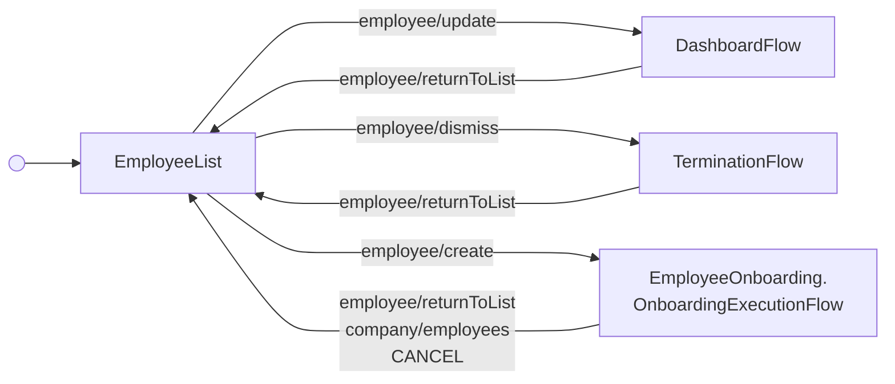

<!-- Partner-facing guide content, published to the SDK docs site. -->

# EmployeeListFlow

## Step flow <!-- slot: appendix -->

The flow rests on the management employee list and routes into one of three sub-flows based on the row action invoked (or the "Add employee" CTA):

- **Edit** (`employee/update`) → `DashboardFlow`
- **Dismiss** (`employee/dismiss`) → `TerminationFlow`
- **Add employee** (`employee/create`) → `OnboardingExecutionFlow`

Each sub-flow is given a "Back to employees" header that emits `employee/returnToList` to come back to the list. The onboarding sub-flow also returns to the list when it completes (`company/employees`) or is canceled (`CANCEL`).

The list itself is tabbed into Active, Onboarding, and Dismissed employees, with per-row actions tailored to each tab (edit, delete, dismiss, rehire).

