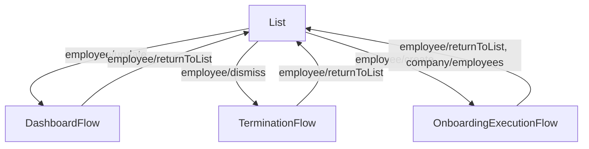

<!-- Partner-facing guide content, published to the SDK docs site. -->

# EmployeeListFlow

## Step flow <!-- slot: appendix -->

The flow rests on the management employee list and routes into one of three sub-flows based on the row action the admin invokes (or the "Add employee" CTA). Each sub-flow is given a "Back to employees" header that emits `employee/returnToList` to come back to the list.

The list itself is tabbed into Active, Onboarding, and Dismissed employees, with per-row actions tailored to each tab (edit, delete, dismiss, rehire).

