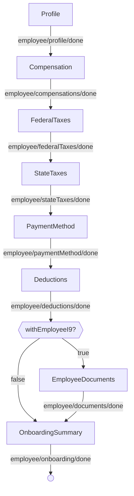
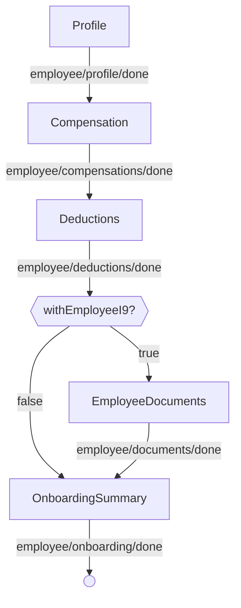

<!-- Partner-facing guide content, published to the SDK docs site. -->

# OnboardingExecutionFlow

## Step flow <!-- slot: appendix -->

The execution steps differ by whether the employee self-onboards, so each path is shown on its own. (The documents step appears only when `withEmployeeI9` is set.)

### Without self-onboarding

The admin completes every step.

### With self-onboarding

The admin sets up the basics; the employee completes taxes and payment method themselves.

