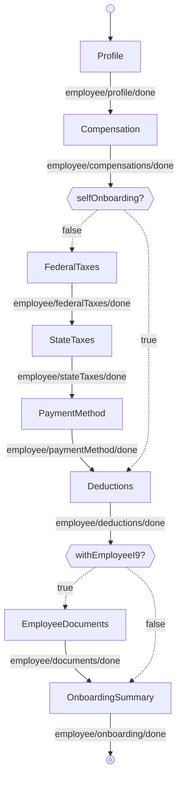

<!-- Partner-facing guide content, published to the SDK docs site. -->

# OnboardingExecutionFlow

## Step flow <!-- slot: appendix -->

`OnboardingExecutionFlow` runs the per-employee steps in order. After compensation, the path branches on the employee's self-onboarding status — set by the self-onboarding toggle the admin chooses on the Profile step, not by a flow prop:

- **Admin onboarding** — the admin completes every step, including federal taxes, state taxes, and payment method.
- **Self-onboarding** — the admin sets up the basics and the employee completes federal taxes, state taxes, and payment method themselves, so those three steps are skipped here.

The `isSelfOnboardingEnabled` prop only controls whether that toggle is offered: when `false`, the toggle is hidden and the flow always takes the admin path; when `true` (the default), the branch follows the admin's selection.

The documents step appears only when `withEmployeeI9` is set.

