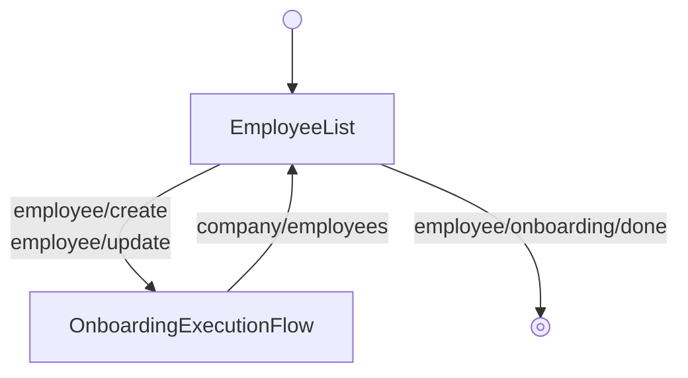

<!-- Partner-facing guide content, published to the SDK docs site. -->

# OnboardingFlow

## Step flow <!-- slot: appendix -->

`OnboardingFlow` pairs the employee list with `OnboardingExecutionFlow`. Adding or editing a list row runs the per-employee onboarding steps; finishing an employee returns to the list, and completing onboarding exits the flow. The step sequence — which varies with self-onboarding and `withEmployeeI9` — is covered on `OnboardingExecutionFlow`.

