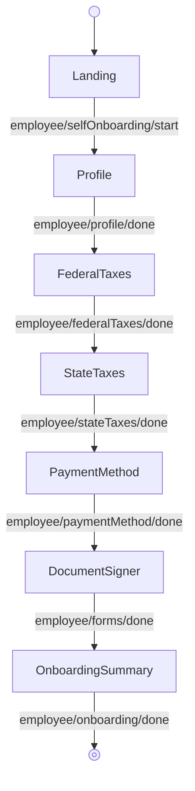

<!-- Partner-facing guide content, published to the SDK docs site. -->

# SelfOnboardingFlow

## Step flow <!-- slot: appendix -->

The employee completes their own onboarding, starting from the self-onboarding landing page.

