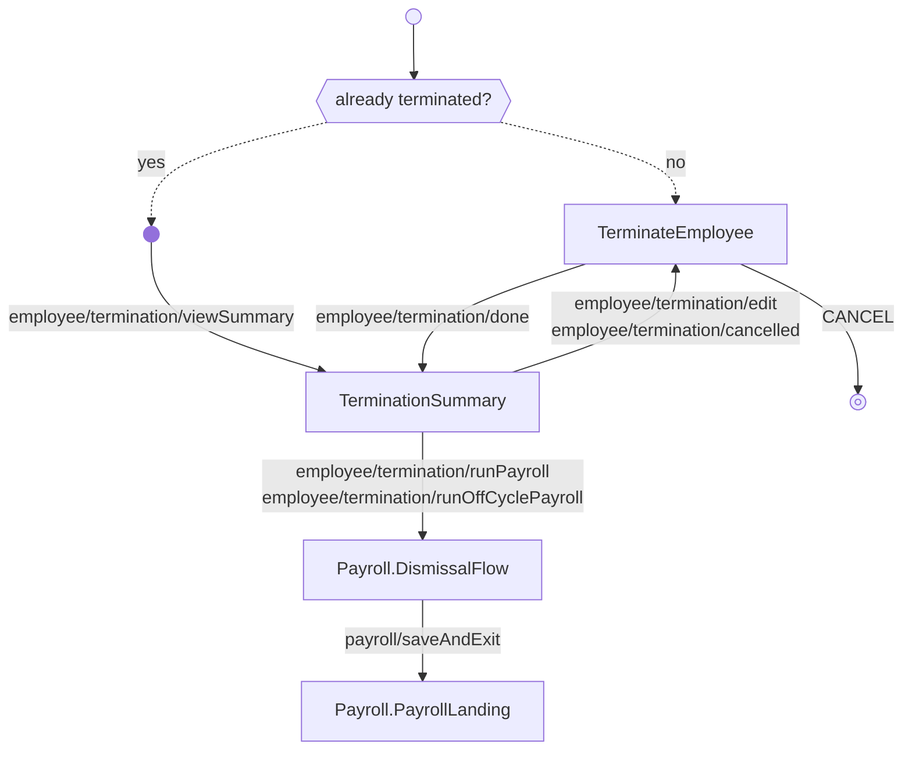

<!-- Partner-facing guide content, published to the SDK docs site. -->

# TerminationFlow

## Step flow <!-- slot: appendix -->

On entry the flow checks whether the employee is already terminated. If so, it routes straight to a read-only summary (`employee/termination/viewSummary`). Otherwise it opens the termination form — blank for a new termination, or pre-populated when a pending termination exists — and submitting it saves the termination and emits `employee/termination/done` (carrying the chosen `payrollOption`). That `done` event — not anything on the summary — is the completion signal. The form's Cancel button emits `CANCEL`, the only event that leaves the flow; the machine doesn't handle it, so the partner decides where to go next. From the summary the employee can edit or cancel (returning to the form). What the summary offers next is driven by the payroll option:

- **`regularPayroll`** — no further action. The summary is a confirmation; final pay is processed in the next scheduled regular payroll.
- **`dismissalPayroll`** — the summary offers a CTA that emits `employee/termination/runPayroll`, opening the existing final payroll as a dismissal payroll.
- **`anotherWay`** — the summary offers a CTA that emits `employee/termination/runOffCyclePayroll`, removing the employee from unprocessed future payrolls and creating a new off-cycle payroll.

The last two both run `Payroll.DismissalFlow` (with an existing `payrollId` for the dismissal path, without one for the off-cycle path), which on `payroll/saveAndExit` lands on `Payroll.PayrollLanding` — the payroll surface where that payroll is run. There is no exit event from the landing; breadcrumbs navigate back to the summary or form from there (and from the dismissal flow).

## Business rules <!-- slot: appendix -->

- **Final-paycheck timing.** Some states require an employee to receive their final wages within a short window (e.g. 24 hours) of termination unless they consent otherwise. Where that applies, running a dismissal payroll may be the only compliant option. Check the relevant state's final-paycheck requirements.
- **Cancelling a termination.** A termination can be cancelled when `regularPayroll` or `anotherWay` was selected, but not once `dismissalPayroll` was selected.
- **Editing the termination date.** The effective date can be edited while it is in the future and the employee is not yet terminated; an effective date already in the past cannot be changed.
- **Concurrent updates.** Terminations use a `version` field for optimistic locking; an update with a stale version is rejected.
- **Off-cycle return path.** When `anotherWay` is selected, the employee is removed from unprocessed future payrolls and the off-cycle payroll flow runs; on success the flow returns to the summary.
