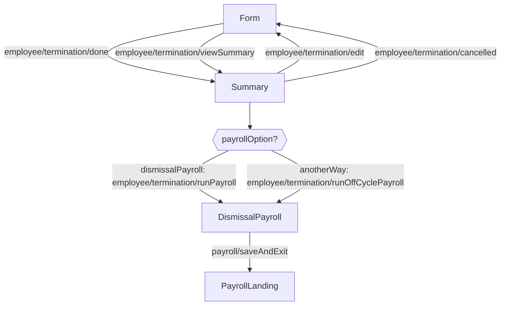
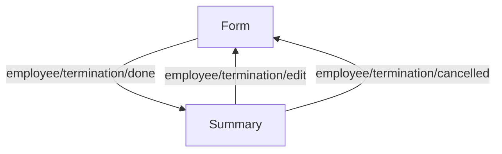

<!-- Partner-facing guide content, published to the SDK docs site. -->

# TerminationFlow

## Step flow <!-- slot: appendix -->

The flow opens on the termination form, advances to the summary, and — depending on how the final paycheck is handled — branches into the dismissal payroll flow. On mount it detects existing terminations: an active termination pre-populates the form for editing, and an already-terminated employee is routed straight to the summary.

The route out of the summary is driven by the payroll option chosen on the form.

### Run a dismissal payroll or handle it another way

### Include in the regular payroll

The summary is the final screen; final pay is processed in the next scheduled regular payroll. The termination can still be edited or cancelled from here.

## Business rules <!-- slot: appendix -->

- **Final-paycheck timing.** Some states require an employee to receive their final wages within a short window (e.g. 24 hours) of termination unless they consent otherwise. Where that applies, running a dismissal payroll may be the only compliant option. Check the relevant state's final-paycheck requirements.
- **Cancelling a termination.** A termination can be cancelled when `regularPayroll` or `anotherWay` was selected, but not once `dismissalPayroll` was selected.
- **Editing the termination date.** The effective date can be edited while it is in the future and the employee is not yet terminated; an effective date already in the past cannot be changed.
- **Concurrent updates.** Terminations use a `version` field for optimistic locking; an update with a stale version is rejected.
- **Off-cycle return path.** When `anotherWay` is selected, the employee is removed from unprocessed future payrolls and the off-cycle payroll flow runs; on success the flow returns to the summary.
