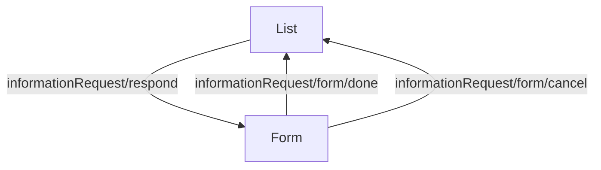

<!-- Partner-facing guide content, published to the SDK docs site. -->

# InformationRequestsFlow

## Step flow <!-- slot: appendix -->

The flow opens on the list of open and submitted information requests for the company, each open request carrying a "Respond" action. Selecting "Respond" opens the response form in a modal over the list. Submitting the form returns to the list (and, when `withAlert` is `true`, shows a dismissible success alert at the top); cancelling closes the modal and returns to the list without submitting.

The response form is rendered dynamically from the request's required questions. Supported response types and their input behavior are documented on the `InformationRequestForm` block.

Each piece is also exported as a standalone block (see the Sub-components table) for composing a custom workflow when this orchestration is the wrong fit. See the [Composition guide](https://sdk.gusto.com/docs/integration-guide/composition) for how to recompose these blocks into your own flow.
