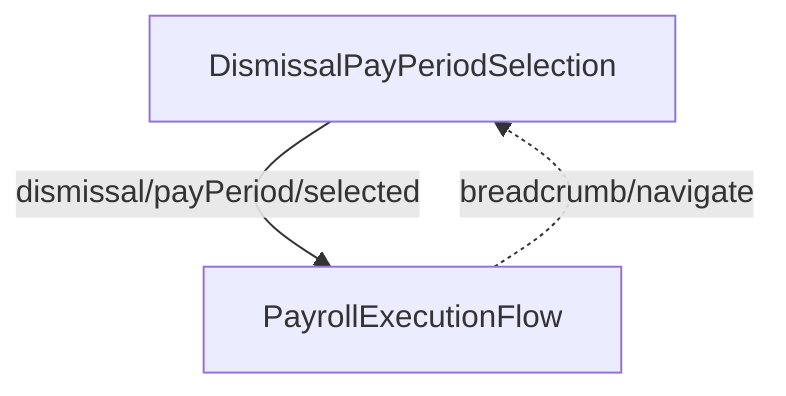

<!-- Partner-facing guide content, published to the SDK docs site. -->

# DismissalFlow

## Step flow <!-- slot: appendix -->

The flow's entry point depends on whether `payrollId` is supplied. Without it, the flow opens on pay period selection and advances into execution, as shown below. With it, pay period selection is skipped and the flow starts directly in `PayrollExecutionFlow` for that payroll.

## Pay period selection <!-- slot: appendix -->

The pay period selection step fetches the employee's unprocessed termination pay periods and presents each as an option showing its date range. When only one pay period is available, it is pre-selected automatically.

On submission, the step creates an off-cycle payroll for the selected period using the `"Dismissed employee"` off-cycle reason and the period's start and end dates, then advances to execution with `dismissal/payPeriod/selected`. During execution `PayrollExecutionFlow` runs with dismissal-specific copy and breadcrumbs.

Final-paycheck timing is regulated by state. Some states require terminated employees to receive their final wages within a short window (as little as 24 hours unless the employee consents otherwise), in which case a dismissal payroll may be the only way to pay on time.
