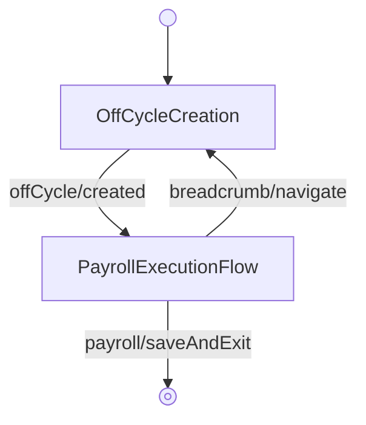

<!-- Partner-facing guide content, published to the SDK docs site. -->

# OffCycleFlow

## Step flow <!-- slot: appendix -->

The flow opens on the creation step, where the off-cycle payroll is configured (pay period dates, reason, employees, deductions, and tax withholding). Once created, it hands off to the shared `PayrollExecutionFlow` for configuration, overview, submission, and receipts.

The breadcrumb header lets the user navigate from execution back to the creation step (`breadcrumb/navigate` with `key: 'createOffCyclePayroll'`). Selecting **Save & exit** during execution emits `payroll/saveAndExit`, which the flow does not handle internally — it surfaces on `onEvent` to signal that the flow has been exited.

## Off-cycle reasons <!-- slot: appendix -->

The creation step supports two off-cycle reasons, each seeding different deduction and withholding defaults. Changing the reason updates these defaults automatically.

| Reason     | Use                                              | Default deductions         | Default withholding |
| ---------- | ------------------------------------------------ | -------------------------- | ------------------- |
| Bonus      | Pay a bonus, gift, or commission                 | Skip regular deductions    | Supplemental rate   |
| Correction | Run a correction payment outside the schedule    | Include regular deductions | Regular rate        |

When deductions are skipped, all regular deductions and contributions are blocked except 401(k); taxes are always included regardless of the selection.
