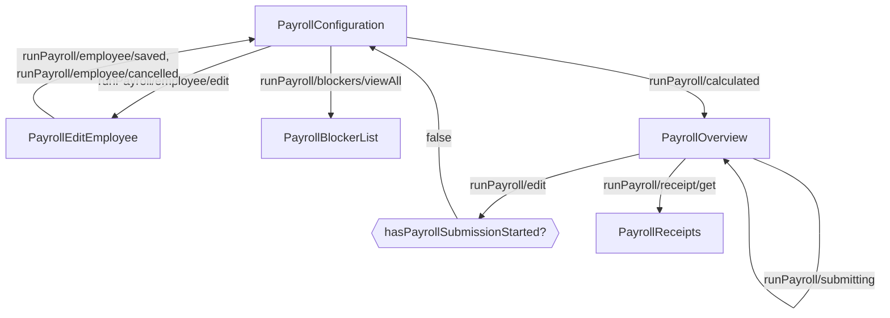

<!-- Partner-facing guide content, published to the SDK docs site. -->

# PayrollExecutionFlow

## Step flow <!-- slot: appendix -->

The execution flow runs a single payroll from configuration through receipts. It starts on the configuration step by default, or directly on the overview step when `initialState` is `'overview'`. Once submission begins, the flow can no longer return to configuration.

Editing an employee (`runPayroll/employee/edit`) opens that employee's row; saving or cancelling returns to configuration. The `runPayroll/edit` action returns to configuration only while the payroll has not started submitting (`hasPayrollSubmissionStarted` is false); after `runPayroll/submitting` fires, the configuration step is hidden and the flow stays on the overview through submission and processing.
