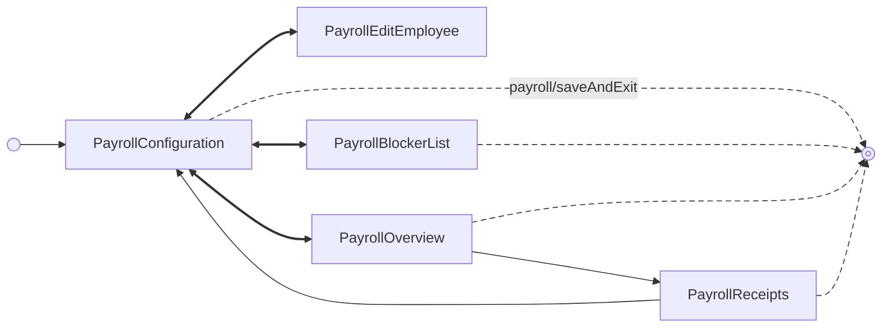

<!-- Partner-facing guide content, published to the SDK docs site. -->

# PayrollExecutionFlow

## Step flow <!-- slot: appendix -->

The execution flow centers on the configuration step (`PayrollConfiguration`) as a hub: from there you can edit an employee, view all blockers, or calculate the payroll to reach the overview, and each of those returns to configuration. The one spoke-to-spoke move is overview → receipts (`runPayroll/receipt/get`); receipts then also returns to the hub. The entry point depends on the `initialState` prop: `'configuration'` (the default) or `'overview'` (drop directly onto the review screen for an already-calculated payroll).

Edge labels are dropped for legibility (see the events table above); each spoke's events are: edit an employee (`runPayroll/employee/edit`, returning on `runPayroll/employee/saved` / `runPayroll/employee/cancelled`), view all blockers (`runPayroll/blockers/viewAll`), and calculate to reach the overview (`runPayroll/calculated`, returning on `runPayroll/edit` before submission). Overview reaches receipts on `runPayroll/receipt/get`.

`runPayroll/submitting` flips a one-way latch: `runPayroll/edit` returns to configuration only before submission has started, after which the configuration step is hidden and the flow stays on the overview through submission and processing.

The breadcrumb header (`breadcrumb/navigate`) returns to an earlier step, and **Save & exit** (`payroll/saveAndExit`, the dashed edges to the exit node) is available from every step except employee editing. Neither that event nor the status events emitted during the run (`runPayroll/submitted`, `runPayroll/processed`, `runPayroll/processingFailed`, `runPayroll/cancelled`) is handled internally — each surfaces on `onEvent`, with `payroll/saveAndExit` signalling that the flow has been exited.
