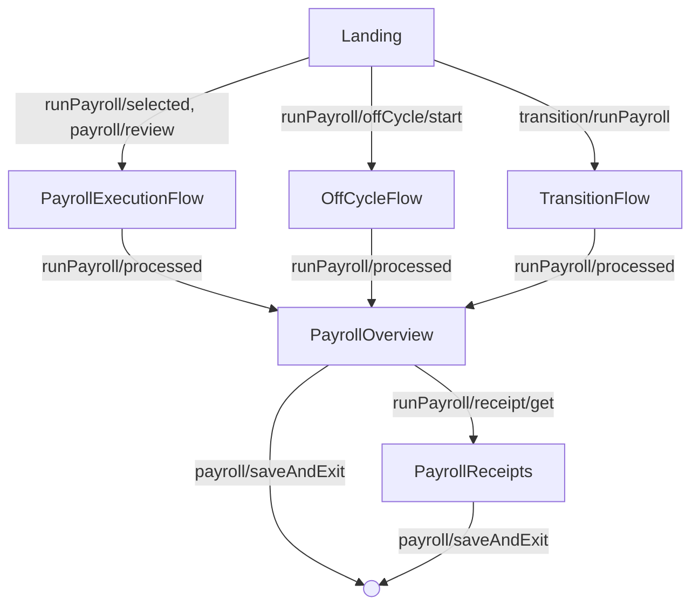
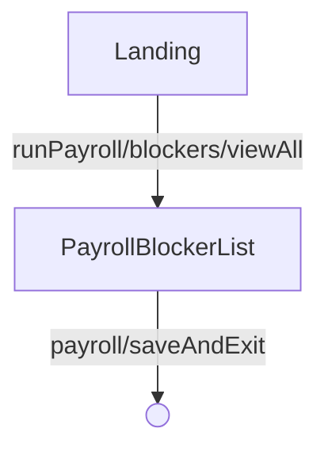

<!-- Partner-facing guide content, published to the SDK docs site. -->

# PayrollFlow

## Step flow <!-- slot: appendix -->

`PayrollFlow` opens on the landing page, where pending and calculated payrolls are listed. From there it routes into one of several payrolls, each of which runs the shared `PayrollExecutionFlow` (configuration, overview, submission, receipts) before returning to the submitted overview.

### Running, off-cycle, transition, and dismissal payrolls

Selecting a payroll to run, reviewing a calculated payroll, starting an off-cycle payroll, or starting a pending transition payroll all hand off to an execution flow. When processing completes, the flow lands on the submitted overview and can drill into receipts.

### Resolving blockers

When a payroll has blockers, the landing page can open the full blocker list. Resolving them and exiting returns to the landing page.

A submitted payroll that is later cancelled (`runPayroll/cancelled`) routes back to the landing page, where a cancellation alert is shown.
